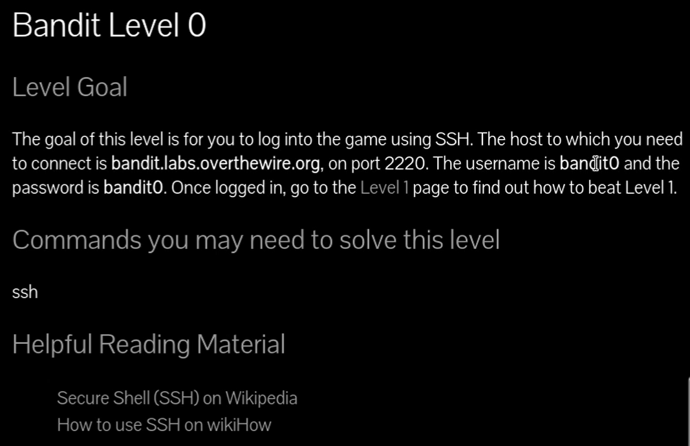
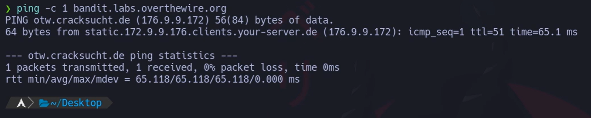
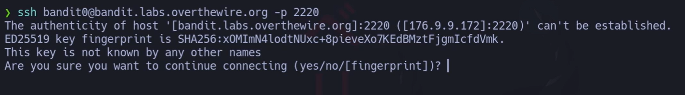

https://overthewire.org/wargames/

# Siempre poner al conectarse a una maquina por SSH : -export TERM=xterm

## 📄 Enunciado del nivel

El objetivo de este nivel es que te conectes al juego usando **SSH**.  
Los datos de conexión son:

- ## **Servidor (host)**: `bandit.labs.overthewire.org`
    
- ## **Puerto**: `2220`
    
- ## **Usuario**: `bandit0`
    
- ## **Contraseña**: `bandit0`
    

Una vez que hayas iniciado sesión, deberás ir a la página del **Nivel 1** para continuar.

---

## 🔎 Objetivo del nivel

Aprender a conectarse a un servidor remoto de forma segura con **SSH**, usando usuario, contraseña y un puerto específico.

---

## 🪜 Paso a paso (consola real)

### 1. Verificar la conectividad con `ping`

# {Comando}

## `ping -c 1 bandit.labs.overthewire.org`

# {Desglose del comando}

- **Binario**: `ping` → Comando que envía paquetes ICMP para comprobar si un host responde.
    
- **Opción**: `-c 1` → Indica que solo se enviará 1 paquete.
    
- **Parámetro**: `bandit.labs.overthewire.org` → Dirección del servidor al que queremos comprobar acceso.
    

## 💬{Comentario del profe}  

Usar `ping` es como tocar el timbre de una casa: si responde, sabemos que hay alguien dentro.

---

### 2. Conectarse al servidor con `ssh`

# {Comando}

## `ssh bandit0@bandit.labs.overthewire.org -p 2220`

# {Salida}

## `The authenticity of host '[bandit.labs.overthewire.org]:2220' can't be established. ED25519 key fingerprint is SHA256:... Are you sure you want to continue connecting (yes/no/[fingerprint])? yes`

# {Desglose del comando}

- **Binario**: `ssh` → Cliente de conexión segura a servidores.
    
- **Usuario@host**: `bandit0@bandit.labs.overthewire.org` → Usuario y servidor de destino.
    
- **Opción**: `-p 2220` → Puerto por el que se realizará la conexión (por defecto sería 22).
    

# 💬{Comentario del profe}  

El parámetro `-p` es como indicar qué puerta usar: si no lo pones, intentará entrar siempre por la puerta principal (22).

---

## 🧰 Opciones más usadas de `ssh`

- **Uso básico**:
    
    `ssh usuario@host`
    
    Conecta al puerto 22 por defecto.
    
- **`-p PUERTO`** → Conexión a un puerto distinto.  
    Ejemplo: `ssh user@host -p 2200`
    
- **`-i clave.pem`** → Autenticarse con una clave privada.  
    Ejemplo: `ssh -i id_rsa user@host`
    
- **`-v`** → Modo detallado (debug).  
    Ejemplo: `ssh -v user@host`
    
- **`-L local:remoto`** → Crear túneles SSH (redirección de puertos).  
    Ejemplo: `ssh -L 8080:localhost:80 user@host`
    

## 💬{Comentario del profe}  

SSH es como un pasadizo secreto: puedes entrar tú mismo, dar llaves diferentes o incluso abrir túneles para pasar datos escondidos.

---

## ❌ Errores comunes y soluciones

- ❌ Olvidar poner `-p 2220` → intentará usar el puerto 22 y fallará.
    
- ❌ Escribir mal el usuario (`bandit0` ≠ `bandito`).
    
- ❌ No aceptar la huella del servidor → no se podrá guardar en `known_hosts`.
    

---

## 🧾 Chuleta final

|Comando|Propósito|Uso mínimo|
|---|---|---|
|`ping -c 1 host`|Verificar conectividad|`ping -c 1 bandit.labs.overthewire.org`|
|`ssh usuario@host -p puerto`|Conectarse por SSH|`ssh bandit0@bandit.labs.overthewire.org -p 2220`|

---

## 🧩 Script final completo

`#!/usr/bin/env bash set -euo pipefail 
`# Verificar conectividad con el servidor ping -c 1 bandit.labs.overthewire.org 
`# Conectarse al servidor usando SSH en el puerto 2220 ssh bandit0@bandit.labs.overthewire.org -p 2220`

---

## 🗒️ Notas adicionales

✔️ **Versión manual**: Ejecutar `ssh` y escribir la contraseña.  
✔️ **Versión intermedia**: Guardar la huella del servidor en `~/.ssh/known_hosts` para no volver a confirmarla.  
✔️ **Versión avanzada**: Usar autenticación por clave pública en lugar de contraseña.
