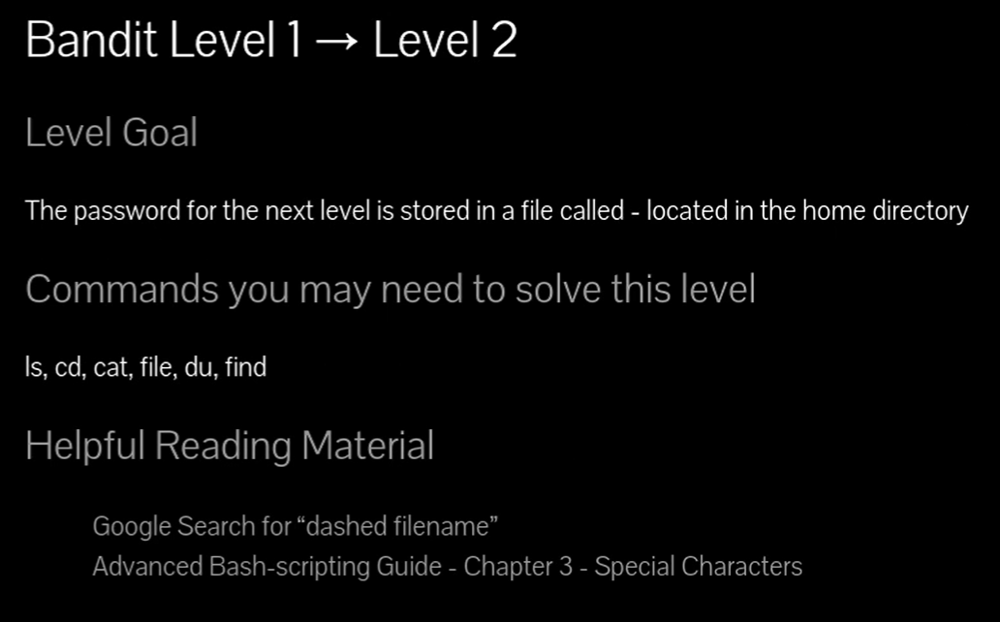
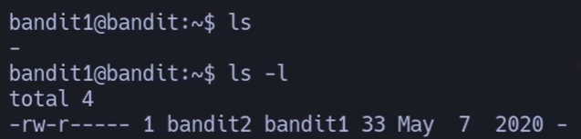

# Siempre poner al conectarse a una maquina por SSH : -export TERM=xterm

## 📄 Enunciado del nivel

La contraseña para el siguiente nivel se encuentra en un archivo llamado **-** (guion).  
El archivo está en el directorio **home** del usuario `bandit1`.

Tu tarea es leer ese archivo y usar su contenido para conectarte como `bandit2` en el siguiente nivel (puerto 2220).

---

## 🔎 Objetivo del nivel

Aprender a manejar un archivo cuyo nombre comienza con un guion (`-`).  
Esto es un problema porque muchos comandos interpretan `-` como una opción.

---

## 🪜 Paso a paso (consola real)

### 1. Listar archivos en el home 

## {Comando}

## `ls -l`

## {Salida}
## `-rw-r----- 1 bandit2 bandit1 33 May  7  2020 -`

## {Desglose}

- **Binario**: `ls` → Lista archivos.
    
- **Opción**: `-l` → Muestra permisos, propietario y más detalles.
    
- **Resultado**: hay un archivo llamado `-`.
    

## 💬{Comentario del profe} 

 Ese guion es como un archivo “tramposo”: si lo usas directo, Linux cree que es una opción del comando.

---

### 2. Intentar leer el archivo (falla)

# {Comando}

## `cat -`

# {Salida}  

El comando queda esperando entrada desde teclado (porque `-` en `cat` significa **leer de la entrada estándar**).

---

### 3. Solución: especificar ruta completa

# {Comando}

## `cat ./-`

# {Salida}

## `CV1DtqXWVFXTvM2F0k09SHz0YwRINYA9`

# {Desglose}

- **Binario**: `cat` → Muestra el contenido de archivos.
    
- **Ruta**: `./-` → El prefijo `./` obliga a interpretar “-” como nombre de archivo y no como opción.
    

## 💬{Comentario del profe}  

El `./` es como decir: “búscalo aquí mismo, como archivo normal, no como parámetro especial”.

---

### 4. Otras formas de leer el archivo

# {Comando}

## `cat /home/bandit1/-`

# {Comando alternativo}

## `cat $(pwd)/-`

# {Salida en ambos casos}

## `CV1DtqXWVFXTvM2F0k09SHz0YwRINYA9`

## 💬{Comentario del profe}  

Cuando un archivo tiene un nombre raro, la ruta absoluta o `./` son tus mejores aliados.

---

## ❌ Errores comunes y soluciones

- ❌ Usar `cat -` directamente → se queda esperando entrada.
    
- ❌ Olvidar `./` o la ruta absoluta → el sistema interpreta `-` como opción.
    
- ❌ Confundir archivo `-` con opciones de otro comando (`ls -` da error).
    

---

## 🧾 Chuleta final

| Comando             | Propósito                             | Uso mínimo            |
| ------------------- | ------------------------------------- | --------------------- |
| `ls -l`             | Listar archivos con permisos y dueños | `ls -l`               |
| `cat ./-`           | Leer archivo llamado “-” usando ruta  | `cat ./-`             |
| `cat /ruta/archivo` | Leer archivo con ruta absoluta        | `cat /home/bandit1/-` |

---

## 🧩 Script final completo

`#!/usr/bin/env bash set -euo pipefail 
`# Mostrar archivos en el home ls -l
`# Leer archivo con nombre especial "-" cat ./-`

---

## 🗒️ Notas adicionales

✔️ **Versión manual**: Abrir con `cat ./-` directamente.  
✔️ **Versión intermedia**: Usar `cat $(pwd)/-` para mayor claridad.  
✔️ **Versión avanzada**: Usar redirecciones raras o `find . -name "-" -exec cat {} \;`.
