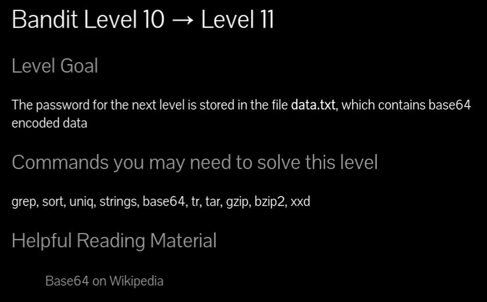
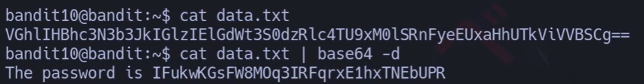
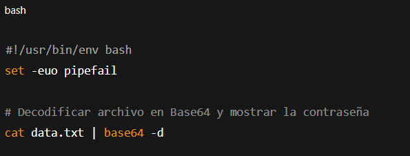



### Base 64

# Siempre poner al conectarse a una maquina por SSH : -export TERM=xterm

## 📄 Enunciado del nivel

La contraseña para el siguiente nivel está almacenada en el archivo **data.txt**, que contiene datos codificados en **Base64**.

---

## 🔎 Objetivo del nivel

Aprender a usar `base64 -d` para decodificar contenido y extraer la contraseña.

---

## 🪜 Paso a paso (con consola real)

### 1. Ver el archivo

# {Comando}

## `cat data.txt`

# {Salida}

## `VGhlIHBhc3N3b3JkIGlzIF...==`

## 💬{Comentario del profe}  

El contenido se ve como texto extraño con `=` al final: típico de Base64.

---

### 2. Decodificar con base64

# {Comando}

## `cat data.txt | base64 -d`

# {Salida}

## `The password is IFukwKGsFW8M0q3IRFqrxE1hxTNEbUPR`

## 💬{Comentario del profe}  

La opción `-d` de `base64` significa **decode**. Aquí aparece la contraseña.

---

## ❌ Errores comunes y soluciones

- ❌ Usar `cat data.txt` sin decodificar → solo se ve texto cifrado.
    
- ❌ Confundir `base64 archivo` con `base64 -d archivo` → el primero codifica, no decodifica.
    
- ❌ Olvidar la tubería `|` → no se pasa el contenido al decodificador.
    

---

## 🧾 Chuleta final

|Comando|Propósito|Uso mínimo|
|---|---|---|
|`cat archivo`|Ver contenido del archivo|`cat data.txt`|
|`base64 -d`|Decodificar Base64|`cat data.txt \| base64 -d`|
|`base64 archivo`|Codificar en Base64|`base64 data.txt`|

---

## 🧩 Script final completo

`#!/usr/bin/env bash set -euo pipefail
`# Decodificar archivo en Base64 y mostrar la contraseña cat data.txt | base64 -d`

---

## 🗒️ Notas adicionales

✔️ **Versión manual**: copiar el contenido y usar un decodificador online.  
✔️ **Versión intermedia**: `base64 -d data.txt`.  
✔️ **Versión avanzada**: usar la tubería `cat data.txt | base64 -d` (más claro en cadenas de comandos).

