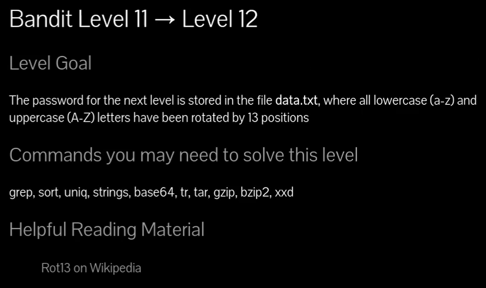
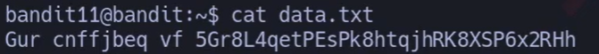
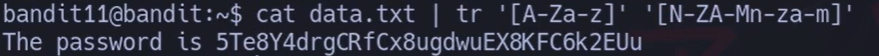
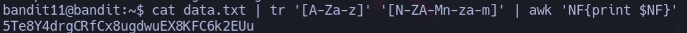
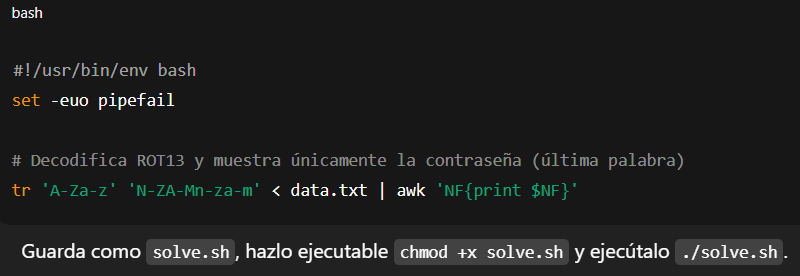

# Siempre poner al conectarse a una maquina por SSH : -export TERM=xterm

### Rotación de números 

## 📄 Enunciado del nivel

La contraseña está en **data.txt**, pero el texto está cifrado con **ROT13** (todas las letras se rotan 13 posiciones).  
Ej.: `a ↔ n`, `b ↔ o`, `A ↔ N`, `B ↔ O`, etc.

---

## 🧠 Mini-teoría (qué es ROT13)

- Es un **cifrado por sustitución** muy simple: rota letras del alfabeto 13 posiciones.
    
- Es **simétrico**: si aplicas ROT13 dos veces vuelves al texto original.
    
- Solo afecta a **letras** (`A–Z`, `a–z`). Números y símbolos **no cambian**.
    

---

## 🪜 Paso a paso (terminal)

### 1) Ver el archivo cifrado

# {Comando}

## `bandit11@bandit:~$ cat data.txt`

# {Salida}

## `Gur cnffjbeq vf 5Te8Y4drgCRfCx8ugdwEX8KFC6k2EUu`

## {Desglose del comando}

- **Binario:** `cat` → muestra el contenido de un archivo.
    
- **Parámetros:** `data.txt` → el fichero con el texto cifrado.  
    💬 \Tag{Comentario del profe}  
    Si ves palabras raras como “Gur cnffjbeq vf…”, huele a ROT13: “Gur” ⇄ “The”.
    

---

### 2) Decodificar con `tr` (ROT13)

# {Comando}

## `bandit11@bandit:~$ cat data.txt | tr '[A-Za-z]' '[N-ZA-Mn-za-m]'`

# {Salida}

## `The password is 5Te8Y4drgCRfCx8ugdwEX8KFC6k2EUu`

## {Desglose del comando}

- **Binario:** `tr` → “translate”, traduce caracteres.
    
- **Conjuntos:**
    
    - `'[A-Za-z]'` → todas las letras (mayúsculas y minúsculas).
        
    - `'[N-ZA-Mn-za-m]'` → el mismo conjunto **rotado 13** posiciones.
        
- **Tubería:** `|` → pasa la salida de `cat` a `tr`.  
    💬 \Tag{Comentario del profe}  
    ROT13 es su propio inverso, así que **este mismo comando cifra y descifra**.
    

> Alternativa equivalente:
> 
> `bandit11@bandit:~$ tr 'A-Za-z' 'N-ZA-Mn-za-m' < data.txt`
> 
> (Usa **redirección** en lugar de `cat |`).

---

### 3) Sacar solo la contraseña (limpio)

# {Comando}

## `bandit11@bandit:~$ cat data.txt | tr '[A-Za-z]' '[N-ZA-Mn-za-m]' | awk 'NF{print $NF}'`

# {Salida}

## `5Te8Y4drgCRfCx8ugdwEX8KFC6k2EUu`

## {Desglose del comando}

- **`awk 'NF{print $NF}'`** → si la línea tiene campos, imprime el **último** (la contraseña).  
    💬 \Tag{Comentario del profe}  
    Atajo útil cuando la frase viene como “The password is …”.
    

---

## 🌐 Método web (rot13.com)

Sí, también se puede **sin terminal**:

1. Abre **rot13.com**.
    
2. Copia el contenido de `data.txt` (por ejemplo: `Gur cnffjbeq vf 5Te8Y4drgCRfCx8ugdwEX8KFC6k2EUu`).
    
3. Pégalo en la caja de texto.
    
4. Pulsa el botón para **aplicar ROT13** (suele decir “ROT13”, “Decode/Encode”, o se aplica automáticamente).
    
5. Lee el resultado:
    
    `The password is 5Te8Y4drgCRfCx8ugdwEX8KFC6k2EUu`
    

🔏 **Privacidad:** evita pegar datos sensibles en sitios web aleatorios. Aquí es un reto público, pero en la vida real mejor **decodifica localmente** con `tr` o herramientas offline.

---

## ❌ Errores comunes y soluciones

- **Usar rangos mal escritos.**  
    ❌ `tr '[A-Za-z]' '[N-ZA-Mn-za-]'` → set desbalanceado.  
    ✅ Asegura **dos conjuntos del mismo tamaño**: `'[A-Za-z]'` y `'[N-ZA-Mn-za-m]'`.
    
- **Olvidar las comillas.**  
    ❌ `tr [A-Za-z] [N-ZA-Mn-za-m]` → el shell podría expandir corchetes.  
    ✅ **Pon comillas simples** alrededor de los conjuntos.
    
- **Cambiar el orden de sets pensando que “descifra”.**  
    ROT13 es simétrico, pero los dos conjuntos **siempre** deben abarcar el mismo universo: letras A–Z y a–z con su **rotación**.
    
- **Usar herramientas que cambian espacios o saltos de línea.**  
    Si rediriges, usa `tr` tal cual; no uses filtros que formateen texto (p. ej., `fmt`) entre medias.
    

---

## 🧾 Chuleta rápida

|Tarea|Comando|
|---|---|
|Ver el fichero|`cat data.txt`|
|ROT13 con `tr`|`tr 'A-Za-z' 'N-ZA-Mn-za-m' < data.txt`|
|ROT13 con tubería|`cat data.txt \| tr '[A-Za-z]' '[N-ZA-Mn-za-m]'`|
|Solo la contraseña|`cat data.txt \| tr '[A-Za-z]' '[N-ZA-Mn-za-m]' \| awk 'NF{print $NF}'`|
|Método web|Pegar texto en **rot13.com** y decodificar|

---

## 🧩 Script final (automatiza todo)

`#!/usr/bin/env bash set -euo pipefail 
`# Decodifica ROT13 y muestra únicamente la contraseña (última palabra) tr 'A-Za-z' 'N-ZA-Mn-za-m' < data.txt | awk 'NF{print $NF}'`

> Guarda como `solve.sh`, hazlo ejecutable `chmod +x solve.sh` y ejecútalo `./solve.sh`.

