
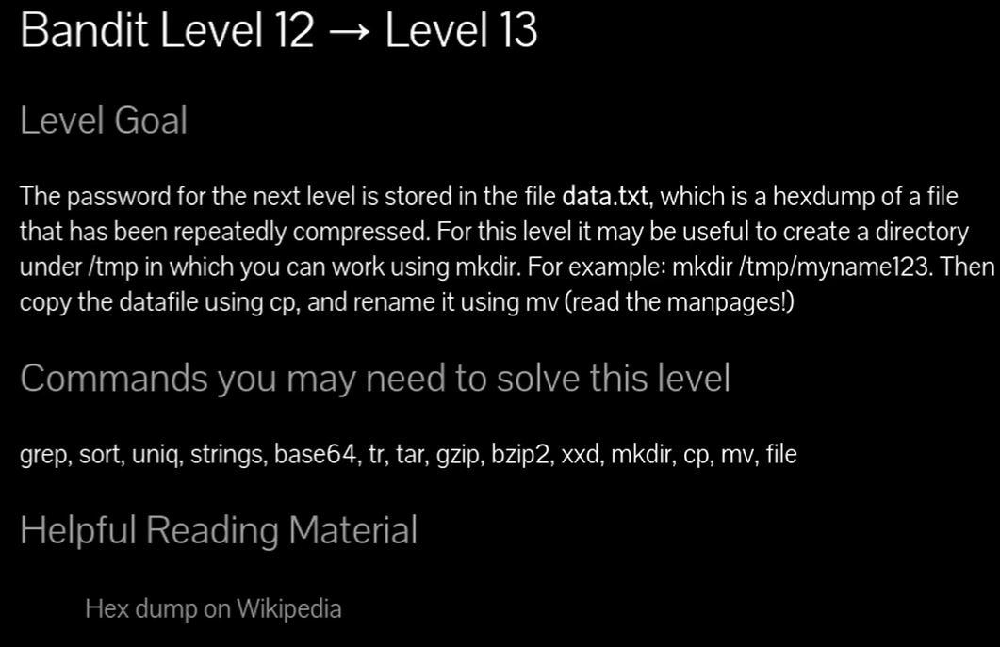

# Siempre poner al conectarse a una maquina por SSH : -export TERM=xterm

# 🎯 Objetivo del nivel

La contraseña para el siguiente nivel está guardada en el archivo **data.txt**, el cual es un **hexdump** de un archivo que ha sido comprimido repetidamente.

Para este nivel puede ser útil crear un directorio bajo **/tmp** en el que trabajar usando `mkdir`.

`data.txt` **no es texto plano**: es un hexadecimal (hexdump) de un archivo que ha sido **comprimido varias veces** con distintos formatos. Debes reconstruir el binario original y descomprimir **en cadena** hasta ver la contraseña.

> Consejo del juego: crea un directorio temporal en `/tmp` y trabaja allí.

---

### 1) Reconstruir el binario desde el **hexdump**

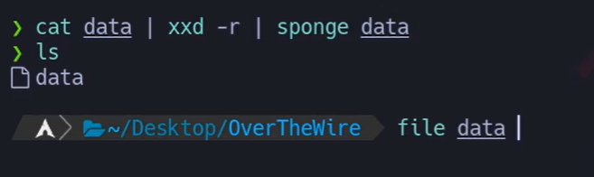 

# {Comando}

## `cat data.txt | xxd -r | sponge

# {Salida}

## `data`

## {Desglose}

## **`| sponge data`**

- `sponge` recoge la salida del `xxd -r` **en memoria**.
    
- Cuando ya ha terminado, lo guarda en el archivo `data`.
    
- Esto evita que el archivo se sobrescriba mientras aún se está leyendo.

- **`xxd -r`** → _reverse hexdump_, convierte texto hex a binario.  
    💬 \Tag{Comentario del profe} Si usas `moreutils`, `sponge` permite escribir sobre el mismo nombre (`… | sponge data`).
    

---

### 2) Identificar el tipo de archivo

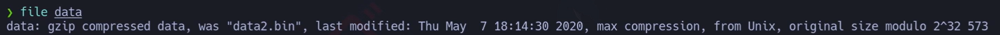
# {Comando}

## `file data`

# {Salida} (ejemplo real)

## `data: gzip compressed data, was "data2.bin", ...`

##  💬{Comentario del profe} **`file` es tu brújula**: te dice **qué** es y **cómo** tratarlo.

---

### 3) Descomprimir en cadena según indique `file`

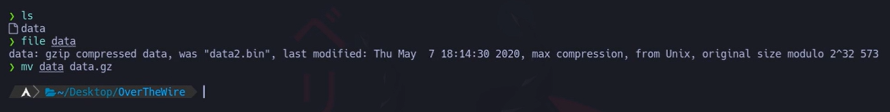
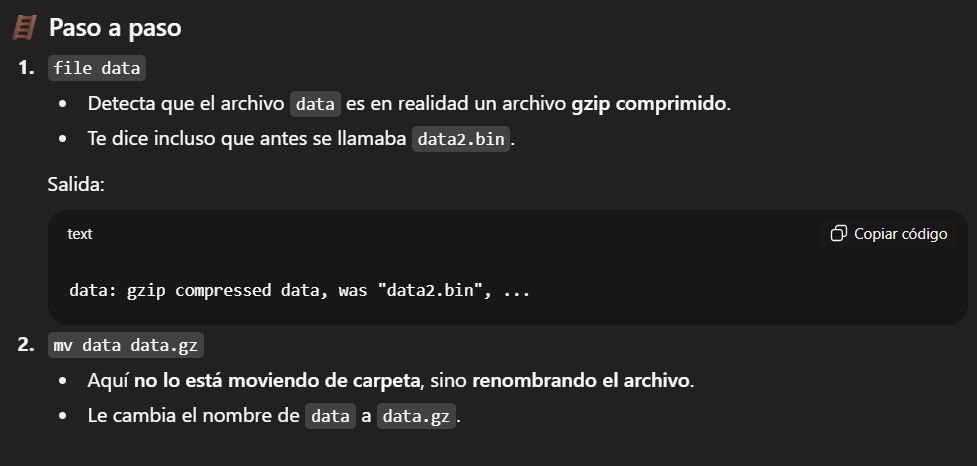

Repite el patrón: **mira tipo → renombra → descomprime → vuelve a mirar**.

A. Si es **gzip**

`mv data data.gz && gunzip data.gz # genera: data (siguiente capa)`

B. Si es **bzip2**

`mv data data.bz2 && bunzip2 data.bz2`

C. Si es **tar**

`mv data data.tar && tar -xvf data.tar # suele extraer un nuevo archivo: p.ej., data5.bin → renómbralo a "data" para seguir mv data5.bin data`

D. Si vuelve a ser **gzip** (pasa varias veces)

`file data # si dice gzip: mv data data.gz && gunzip data.gz`

E. Cuando `file` diga **ASCII text**

`file data # data: ASCII text cat data`

\Tag{Salida} (ejemplo real)

`The password is 8ZjyCRiBWFYknea... (etc.)`

💬 \Tag{Comentario del profe} En tu captura aparece la secuencia: `gzip → gzip → tar → (otro tar/gzip) → … → ASCII`. Es normal que haya **múltiples capas**.

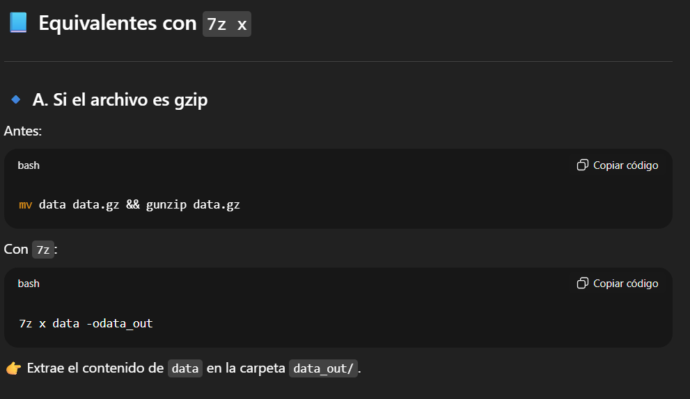

# -odata_out ( quiere decir que detras de la -o sin espacios pones el nombre de la carpeta donde va dirigida)
---

### 4) (Opción alternativa) Usar `7z` para listar/extract

Si prefieres, `7z` (7-Zip) lista y extrae muchos formatos:

# `7z l data.gz  # Listar 
# PARA LISTAR 

# `7z x data.gz   # extraer`

# PARA EXTRAER

Repite list/extract con los nuevos nombres (`data2`, `data4.bin`, etc.) según vaya saliendo en `file`/`7z l`.

---

## ❌ Errores comunes y soluciones

- **Escribir sobre el mismo archivo** al invertir hexdump sin `> data` o sin `sponge` → queda corrupto.
    
- **No renombrar** antes de descomprimir → herramientas como `gunzip` requieren extensión correcta.
    
- **Saltar “file”** entre pasos → no sabes con qué formato estás tratando.
    
- **Usar `cat` sobre binarios** y ensuciar la terminal → si pasa, `reset`.
    

---

## 🧾 Chuleta final (Nivel 12→13)

|Comando|Propósito|Ejemplo mínimo|
|---|---|---|
|`xxd -r`|Invertir hexdump → binario|`xxd -r data.txt > data`|
|`file`|Detectar tipo de archivo|`file data`|
|`gunzip` / `bunzip2`|Descomprimir gzip/bzip2|`gunzip data.gz`|
|`tar -xvf`|Extraer TAR|`tar -xvf data.tar`|
|`7z l/x`|Listar / extraer multi-formato|`7z x data.gz`|

## 🗒️ Notas adicionales

- Trabaja siempre en `/tmp` para no ensuciar tu home.
    
- `file` es la herramienta clave; úsala **tras cada extracción**.
    
- Si te pierdes con los nombres, renómbralos siempre a `data` para mantener el **mismo comando** en el siguiente paso.
    
- Para inspección visual, un editor hexadecimal (`xxd`, `ghex`) también ayuda a reconocer cabeceras (`1F 8B` = gzip, `42 5A` = bzip2, `75 73 74 61 72` = “ustar” → tar).

---

## 🧩 Script final (Nivel 12→13)

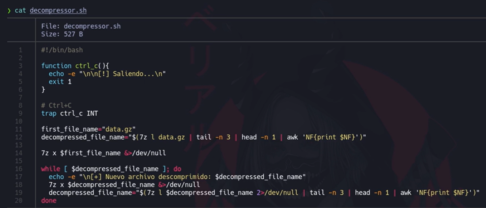

# PRINCIPIO SCRITP SAVITAR

#!/bin/bash

function ctrl_c(){

  echo -e "\n\n[!] Saliendo...\n"

  exit 1

}

trap ctrl_c INT

  

first_file_name="data.gz"

decompressed_file_name="$(7z l data.gz | tail -n 3 | head -n 1 | awk 'NF{print $NF}')"

  

7z x $first_file_name &>/dev/null

  

while [ $decompressed_file_name ]; do

  echo -e "\n[+] Nuevo archivo descomprimido: $decompressed_file_name"

  7z x $decompressed_file_name &>/dev/null

  decompressed_file_name="$(7z l $decompressed_file_name 2>/dev/null | tail -n 3 | head -n 1 | awk 'NF{print $NF}')"

done

# FIN SCRIPT
---

# 🪜 Explicación paso a paso

### 🔹 Línea 1

## 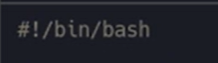

Shebang → indica que el script debe ejecutarse con **bash**.

---

### 🔹 Función de salida limpia

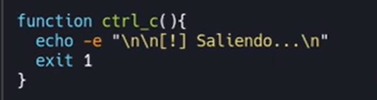
- Define una **función** que se ejecutará cuando el usuario pulse `Ctrl+C`.
    
- `echo -e` imprime con saltos de línea y colores si se usan `\n` o `\033`.
    
- `exit 1` termina el script con código de error 1.
    

---

### 🔹 Captura de señal

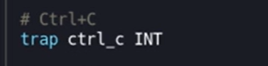

- `trap` captura señales del sistema.
    
- `INT` es la señal que manda `Ctrl+C`.  
    👉 Aquí se enlaza con la función `ctrl_c`, para que no se corte el script bruscamente.
    

---

### 🔹 Variables iniciales
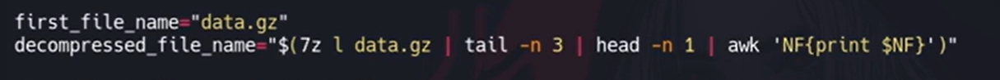

1. `first_file_name` → el primer archivo a descomprimir (`data.gz`).
    
2. `decompressed_file_name` → usa `7z l` (listar contenido de un archivo comprimido) para obtener el **nombre del primer archivo dentro**:
    
    - `7z l data.gz` → lista el contenido.
        
    - `tail -n 3` → toma las últimas 3 líneas (donde aparece el archivo real).
        
    - `head -n 1` → se queda con la primera de esas líneas.
        
    - `awk 'NF{print $NF}'` → imprime la última columna (el nombre del archivo).
        

Ejemplo de salida:

`data2.bin`

---

### 🔹 Primera extracción
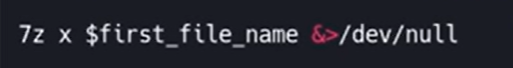

- `7z x` → extrae el contenido.
    
- `&>/dev/null` → descarta tanto la salida estándar como los errores (silencio total).
    

---

### 🔹 Bucle principal
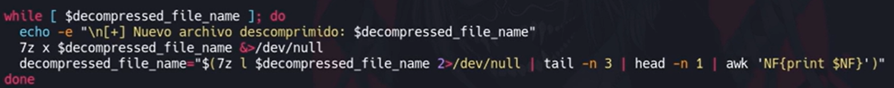

1. `while [ $decompressed_file_name ]`
    
    - Mientras exista un nombre de archivo válido, sigue descomprimiendo.
        
2. `echo` → muestra en pantalla qué archivo se está descomprimiendo.
    
3. `7z x $decompressed_file_name &>/dev/null` → descomprime el archivo.
    
4. `decompressed_file_name=...` → vuelve a calcular cuál es el **siguiente archivo interno**.
    
5. Cuando ya no hay más archivos dentro, el `while` termina.
    

---

# ⚙️ ¿Qué hace en la práctica?

1. Empieza con `data.gz`.
    
2. Lo descomprime y detecta que dentro hay `data2.bin`.
    
3. Lo descomprime y detecta que dentro hay `data3.bin`.
    
4. Repite el proceso hasta que **ya no haya más capas de compresión**.
    
5. El último archivo será el que contiene el **password en texto plano**.
    

---

# 💡 Comentario del profe

Este script es un **automatizador de descompresiones anidadas**.  
En lugar de descomprimir a mano 7, 8, 9 veces con `7z x ...`, el bucle se encarga de hacerlo todo en cadena hasta llegar al archivo final.

