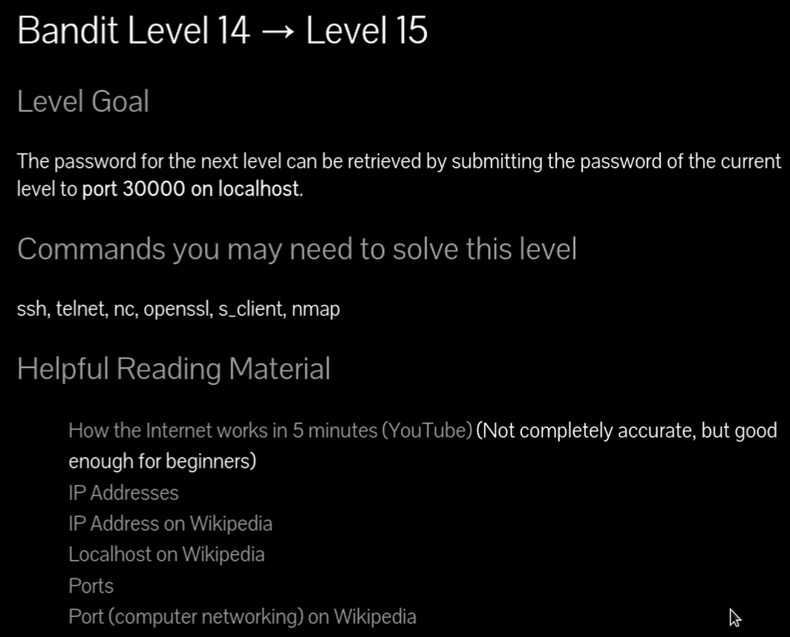
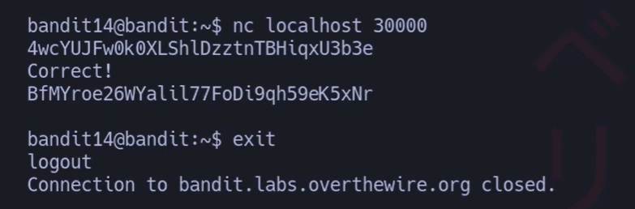

# Siempre poner al conectarse a una maquina por SSH : -export TERM=xterm

## 🔎 Objetivo del nivel

El objetivo es conectarse al puerto **30000** en `localhost` y enviar la contraseña del nivel actual (level 14).  
Si la contraseña es correcta, el servidor devuelve la contraseña del siguiente nivel (level 15).

---

## 🪜 Paso a paso (con consola real)

# {Comando}

## `nc localhost 30000`

## Contraseña anterior 
## `4wcYUJFw0k0XLShlDzztnTBHiqxU3b3e

# {Salida}

## `BfMYroe26WYalil77FoDi9qh59eK5xNr`

## {Desglose del comando}

- **Binario:** `nc` → netcat, herramienta para leer/escribir datos en conexiones TCP/UDP.
    
- **Parámetro 1:** `localhost` → indica que la conexión es hacia la máquina local.
    
- **Parámetro 2:** `30000` → puerto específico al que nos conectamos.
    

## 💬{Comentario del profe}

Piensa en netcat como un "teléfono universal" que marca a un puerto específico. Si el servicio responde con "Correct!", significa que has dado la clave correcta.`

---

## 🧰 Todas las opciones del comando `nc`

- **Uso básico:** `nc [host] [puerto]` → conectar a un servicio.
    
- **-l** → escuchar en un puerto (modo servidor).
    
- **-v** → modo verboso, muestra más información.
    
- **-z** → escaneo rápido de puertos sin enviar datos.
    
- **-n** → no resolver DNS, usar IP directamente.
    
- **-u** → usar UDP en lugar de TCP.
    

💬 Consejo: `nc` es como una navaja suiza de la red, sirve tanto para cliente como para servidor.

---

## ❌ Errores comunes y soluciones

- ❌ Usar mal el puerto (ej. 3000 en vez de 30000) → ✔️ Verificar número exacto en el enunciado.
    
- ❌ Olvidar escribir la contraseña del nivel actual en la conexión → ✔️ Debes pegar la clave del nivel 14.
    
- ❌ Conexión rechazada → ✔️ Asegúrate de estar dentro del entorno bandit (SSH) y que el puerto esté abierto.
    

---

## 🧾 Chuleta final

|Comando|Propósito|Uso mínimo|
|---|---|---|
|nc host puerto|Conectar a un servicio remoto|`nc localhost 30000`|
|nc -l -p puerto|Escuchar conexiones entrantes|`nc -l -p 1234`|
|nc -z -v host rango|Escanear puertos abiertos|`nc -z -v localhost 20-100`|

---

## 🧩 Script final completo

`#!/usr/bin/env bash set -euo pipefail  # Script para conectar con netcat y enviar la contraseña del nivel 14 main() {   # Guardar contraseña en variable   PASSWORD="4wcYUJFw0k0XLShlDzztnTBHiqxU3b3e"      # Conectar al puerto 30000 en localhost y enviar contraseña   echo "$PASSWORD" | nc localhost 30000 }  main "$@"`

---

## 🗒️ Notas adicionales

- **Versión manual:** escribir `nc localhost 30000` y pegar la contraseña.
    
- **Versión intermedia:** guardar la contraseña en un archivo y redirigirlo con `<`.
    
- **Versión completa:** usar el script anterior con manejo de errores.
    

---

## 📚 Referencias

- `man nc` → manual oficial.
    
- OverTheWire Bandit
    
- Documentación de netcat en Wikipedia.
    

---

## ⚖️ Marco legal/ético

El uso de `nc` debe hacerse con responsabilidad.  
Nunca escanees o intentes conectarte a puertos de sistemas que no sean tuyos o sin autorización expresa.  
En entornos de práctica como Bandit, está permitido y es legal.
