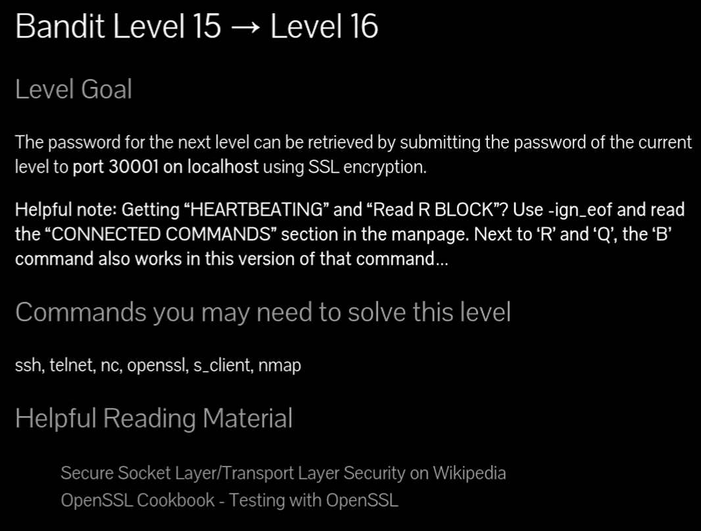
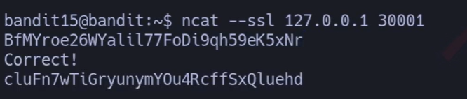
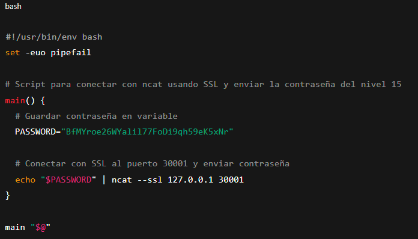

# Siempre poner al conectarse a una maquina por SSH : -export TERM=xterm

## 🔎 Objetivo del nivel

El objetivo es conectarse al puerto **30001** en `localhost` usando cifrado SSL y enviar la contraseña del nivel actual (level 15).  
Si la contraseña es correcta, el servidor devuelve la contraseña del siguiente nivel (level 16).

---

## 🪜 Paso a paso (con consola real

# {Comando}

## `bandit15@bandit:~$ ncat --ssl 127.0.0.1 30001`

## (contraseña anterior)

## `BfMYroe26WYalil77FoDi9qh59eK5xNr

# {Salida}

## `cluFn7wTiGryunymYOu4RcffSxQluehd`

## {Desglose del comando}

- **Binario:** `ncat` → versión mejorada de netcat compatible con SSL.
    
- **Opción:** `--ssl` → obliga a que la conexión use cifrado SSL/TLS.
    
- **Parámetro 1:** `127.0.0.1` → dirección IP local (equivalente a localhost).
    
- **Parámetro 2:** `30001` → puerto específico de la conexión segura.
    

## 💬{Comentario del profe}

Aquí netcat no es suficiente, porque el servidor exige cifrado SSL. Con `--ssl`, la comunicación se cifra y el servidor valida la contraseña.``

---

## 🧰 Todas las opciones del comando `ncat` y `openssl s_client`

- **Uso básico con SSL:** `ncat --ssl host puerto`.
    
- **-v** → modo verboso, muestra información detallada.
    
- **--ssl-cert archivo.crt** → usar certificado propio.
    
- **--ssl-key archivo.key** → clave privada asociada.
    
- **openssl s_client -connect host:puerto** → alternativa con OpenSSL.
    

💬 Consejo: `ncat` es más fácil para conexiones rápidas, mientras que `openssl s_client` ofrece más control y debug de SSL.

---

## ❌ Errores comunes y soluciones

- ❌ Usar `nc` sin SSL → ✔️ El servidor lo rechaza porque espera cifrado seguro.
    
- ❌ Olvidar escribir la contraseña tras conectarse → ✔️ Recuerda pegar la clave del nivel anterior (15).
    
- ❌ Error de certificados → ✔️ Usa `--ssl` en `ncat` o `-ign_eof` en `openssl` para mantener la conexión abierta.
    

---

## 🧾 Chuleta final

|Comando|Propósito|Uso mínimo|
|---|---|---|
|ncat --ssl host puerto|Conectar a un servicio con SSL|`ncat --ssl 127.0.0.1 30001`|
|openssl s_client -connect host:p|Conexión SSL detallada|`openssl s_client -connect localhost:30001`|

---

## 🧩 Script final completo

`#!/usr/bin/env bash set -euo pipefail  # Script para conectar con ncat usando SSL y enviar la contraseña del nivel 15 main() {   # Guardar contraseña en variable   PASSWORD="BfMYroe26WYalil77FoDi9qh59eK5xNr"      # Conectar con SSL al puerto 30001 y enviar contraseña   echo "$PASSWORD" | ncat --ssl 127.0.0.1 30001 }  main "$@"`

---

## 🗒️ Notas adicionales

- **Versión manual:** `ncat --ssl 127.0.0.1 30001` y pegar la contraseña.
    
- **Versión intermedia:** `echo "contraseña" | ncat --ssl localhost 30001`.
    
- **Versión completa:** usar el script con variable y manejo de errores.
    

---

## 📚 Referencias

- `man ncat`, `man openssl s_client` → manual oficial.
    
- OverTheWire Bandit
    
- Documentación de OpenSSL y SSL en Wikipedia.
    

---

## ⚖️ Marco legal/ético

El uso de conexiones SSL debe hacerse en entornos controlados y con autorización.  
Nunca intentes interceptar o falsificar tráfico cifrado en sistemas ajenos.  
Bandit es un laboratorio legal y seguro para estas prácticas.
