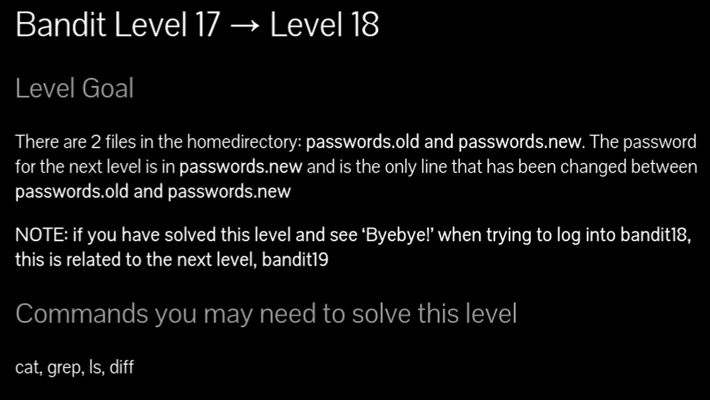
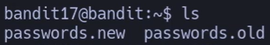
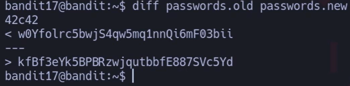
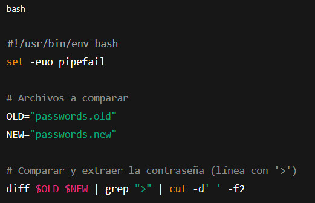

# Siempre poner al conectarse a una maquina por SSH : -export TERM=xterm

## 🔎 Objetivo del nivel

En este nivel hay dos archivos en el **home directory**:

## - `passwords.old`
    
## - `passwords.new`
    

La contraseña para el siguiente nivel (`bandit18`) está en `passwords.new` y es **la única línea diferente** entre ambos archivos.

---

## 🪜 Paso a paso (con consola real)

### 1. Ver los archivos disponibles

# {Comando}

## `bandit17@bandit:~$ ls`

# {Salida}

## `passwords.new  passwords.old`

## 💬{Comentario del profe}

Siempre empieza mirando qué tienes en la carpeta, como abrir tu mochila antes de buscar algo.`

---

### 2. Comparar los archivos con `diff`

# {Comando}

## `bandit17@bandit:~$ diff passwords.old passwords.new`

# {Salida}

## `42c42
## `< w0Yfolrc5bwjS4qw5mq1nnQi6mF03bii 
## `--- 
## `> kfBf3eYk5BPBRzwjqub b fE887SVc5Yd`

\Tag{Desglose}

- **diff** → compara dos archivos línea a línea.
    
- **passwords.old** → archivo base.
    
- **passwords.new** → archivo actualizado.
    
- **42c42** → significa que en la línea 42 hubo un cambio.
    
- `<` → contenido antiguo.
    
- `>` → contenido nuevo (esta es la contraseña correcta).
    

## 💬{Comentario del profe}

El símbolo “<” es lo que había antes, y el “>” lo que hay ahora.  ¡La contraseña está después del “>”!`

---

## 🧰 Todas las opciones del comando `diff`

- **diff archivo1 archivo2** → compara dos archivos.
    
- **-u** → formato unificado, más limpio.
    
- **-c** → contexto adicional alrededor de la diferencia.
    
- **-y** → muestra diferencias lado a lado.
    
- **--color=auto** → resalta cambios en color (si está soportado).
    

💬 Consejo: `diff` es como un “resaltador” que marca qué cambió entre dos versiones.

---

## ❌ Errores comunes y soluciones

- ❌ Leer la línea con `<` → ✔️ esa es la antigua, la contraseña es la que aparece con `>`.
    
- ❌ Usar mal el orden de archivos (`diff new old`) → ✔️ aunque el resultado sigue siendo válido, puede confundir.
    
- ❌ Intentar abrir los archivos con `cat` y buscarlos a mano → ✔️ funciona, pero es mucho más lento y propenso a errores.
    

---

## 🧾 Chuleta final

|Comando|Propósito|Uso mínimo|
|---|---|---|
|ls|Ver archivos en el directorio|`ls`|
|diff archivo1 archivo2|Comparar archivos|`diff passwords.old passwords.new`|
|diff -u archivo1 archivo2|Comparar en formato unificado|`diff -u passwords.old passwords.new`|
|diff -y archivo1 archivo2|Comparar lado a lado|`diff -y passwords.old passwords.new`|

---

## 🧩 Script final completo

`#!/usr/bin/env bash set -euo pipefail  # Archivos a comparar OLD="passwords.old" NEW="passwords.new"  # Comparar y extraer la contraseña (línea con '>') diff $OLD $NEW | grep ">" | cut -d' ' -f2`

## 💬 Este script muestra directamente la contraseña del nivel 18.

---

## 🗒️ Notas adicionales

- Versión manual → usar `diff` y buscar la línea con `>`.
    
- Versión intermedia → usar `diff | grep ">"`.
    
- Versión completa → script que devuelve solo la contraseña limpia.
    

---

## 📚 Referencias

- `man diff`
    
- OverTheWire Bandit
    

---

## ⚖️ Marco legal/ético

El uso de `diff` es totalmente seguro y legal.  
La comparación de archivos es una técnica habitual en administración de sistemas y control de versiones (similar a `git diff`).

