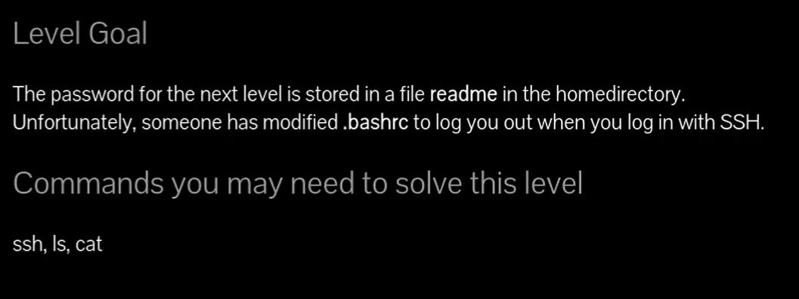
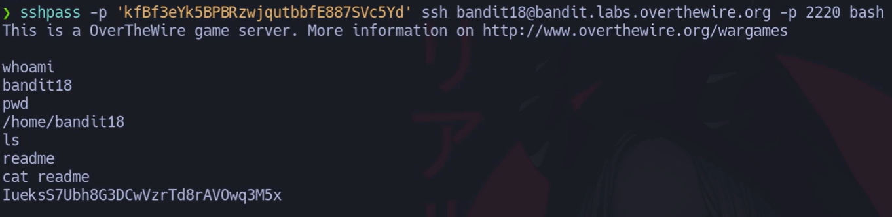

 

# Siempre poner al conectarse a una maquina por SSH : -export TERM=xterm

## 🔎 Objetivo del nivel

La contraseña del siguiente nivel está en un archivo **`readme`** del **home** de `bandit18`.  
El problema: han modificado **`~/.bashrc`** para que **te cierre la sesión al conectarte por SSH**.  
Truco: ejecutar **un comando remoto no-interactivo** (o lanzar un shell que **no lea** `.bashrc`) para poder leer `readme`.

---

## 🪜 Paso a paso (con consola real)

### Método 1 — Ejecutar un comando remoto (lo más limpio)

# {Comando}

## `$ ssh -p 2220 bandit18@bandit.labs.overthewire.org "cat readme"`

# {Salida}

## `IueksS7Ubh8G3DCwVzrTd8rAVOwq3M5x`

## {Desglose del comando}

- **Binario:** `ssh` → cliente SSH.
    
- **-p 2220** → puerto del servidor Bandit.
    
- **bandit18@bandit.labs.overthewire.org** → usuario@host.
    
- **"cat readme"** → **comando remoto**; al no abrir shell interactivo, **no se ejecuta `~/.bashrc`**.
    

## 💬{Comentario del profe}  

Piensa en esto como “entra, coge el papel y sal”. No abres la sesión normal, solo mandas una orden y recibes la respuesta.

---

### Método 2 — Usar `sshpass` para no teclear la contraseña (igual de válido)

# {Comando}

## `$ sshpass -p 'kfBf3eYk5BPBRzwjqubbfE887SVc5Yd' \   ssh -p 2220 bandit18@bandit.labs.overthewire.org "cat readme"`

# {Salida}

## `IueksS7Ubh8G3DCwVzrTd8rAVOwq3M5x`

## {Desglose del comando}

- **sshpass -p '…'** → inyecta la contraseña sin interacción.
    
- **ssh … "cat readme"** → igual que el método 1.
    

## 💬{Comentario del profe}  

Ideal para scripts/automatización. En retos CTF está bien; en producción **mejor claves**.

---

### Método 3 — Abrir un shell que **no** lea `~/.bashrc`

# {Comando}

## `$ ssh -p 2220 bandit18@bandit.labs.overthewire.org bash

## Este le hizo en la captura pero abajo se hace todo junto en una misma línea

# {Comando}

## `$ ssh -p 2220 bandit18@bandit.labs.overthewire.org "bash --noprofile --norc" whoami pwd ls cat readme`

# {Salida}

## `bandit18 /home/bandit18 readme IueksS7Ubh8G3DCwVzrTd8rAVOwq3M5x`

## {Desglose del comando}

- **bash --noprofile --norc** → inicia Bash **sin** leer `~/.profile`, `~/.bash_profile` **ni** `~/.bashrc`.
    
- Ya dentro, ejecutas tus comandos con normalidad.
    

## 💬{Comentario del profe}  

Es como entrar por una “puerta de servicio” que evita los ganchos de inicio de sesión.

---

## 🧰 Todas las opciones del comando `ssh` (mini-manual)

**Uso básico:** `ssh [opciones] usuario@host [comando]`

**Opciones clave (con ejemplo y truco):**

- **-p PUERTO** → cambia el puerto.  
    _Ej._ `ssh -p 2220 user@host`  
    💬 _Pista:_ Bandit **siempre** 2220.
    
- **-i CLAVE** → usa clave privada.  
    _Ej._ `ssh -i id_rsa user@host`  
    💬 _Pista:_ “i de identidad”.
    
- **-o StrictHostKeyChecking=no** → no preguntar por la huella (laboratorio).  
    _Ej._ `ssh -o StrictHostKeyChecking=no user@host`  
    💬 _Pista:_ útil en scripts; inseguro fuera de CTFs.
    
- **-v / -vv / -vvv** → modo verboso (debug).  
    _Ej._ `ssh -vv user@host`  
    💬 _Pista:_ tres “v” = “verlo todo”.
    
- **-t** → fuerza pseudo-TTY (para programas interactivos).  
    _Ej._ `ssh -t user@host top`  
    💬 _Pista:_ “t de terminal”.
    
- **-T** → **deshabilita** pseudo-TTY (más “no-interactivo”).  
    _Ej._ `ssh -T user@host "cat file"`  
    💬 _Pista:_ “T de TTY off”.
    
- **-J SALTO** → ProxyJump/bastión.  
    _Ej._ `ssh -J jump@bastion host`  
    💬 _Pista:_ “J de Jump”.
    
- **-L LPORT:RHOST:RPORT** → túnel local (port-forward).  
    _Ej._ `ssh -L 8080:127.0.0.1:80 host`  
    💬 _Pista:_ “L = Local”.
    
- **-R RPORT:LHOST:LPORT** → túnel remoto.  
    _Ej._ `ssh -R 2222:localhost:22 host`  
    💬 _Pista:_ “R = Remote”.
    
- **-N** → no ejecutar comando remoto (solo túneles).  
    _Ej._ `ssh -N -L 8080:127.0.0.1:80 host`  
    💬 _Pista:_ “N de Nada”.
    
- **-C** → comprimir.  
    _Ej._ `ssh -C user@host`  
    💬 _Pista:_ útil enlaces lentos.
    

**`sshpass` (extra rápido):**

- **-p 'PASS'** → contraseña literal.  
    _Ej._ `sshpass -p 'pass' ssh user@host "cmd"`  
    💬 _Pista:_ bien para laboratorio, **no** para producción.
    

---

## ❌ Errores comunes y soluciones

- **Te echa al entrar (Bye!)** → Estás abriendo shell interactivo y se ejecuta `~/.bashrc`.  
    ✔ Solución: `ssh user@host "cat readme"` o `bash --noprofile --norc`.
    
- **Se queda esperando la contraseña** y quieres automatizarlo.  
    ✔ Solución: `sshpass -p '…' ssh … "cmd"`.
    
- **“Host key verification failed”** (huella nueva).  
    ✔ Solución en CTF: `-o StrictHostKeyChecking=no -o UserKnownHostsFile=/dev/null`.
    
- **Cortas la contraseña sin querer (saltos de línea/espacios)**.  
    ✔ Solución: comillas **dobles** o **simples** correctas; revisa que `cat readme` no añada caracteres extra.
    

---

## 🧾 Chuleta final

|Comando / Opción|Propósito|Uso mínimo|
|---|---|---|
|`ssh -p 2220 user@host "cmd"`|Ejecutar comando remoto (no ejecuta `.bashrc`)|`ssh -p 2220 bandit18@bandit.labs.overthewire.org "cat readme"`|
|`sshpass -p 'PASS' ssh host "cmd"`|Evitar teclear contraseña|`sshpass -p '…' ssh -p 2220 bandit18@host "cat readme"`|
|`bash --noprofile --norc`|Shell sin leer `.bashrc`|`ssh host "bash --noprofile --norc"`|
|`-o StrictHostKeyChecking=no`|Saltar confirmación de huella (lab)|`ssh -o StrictHostKeyChecking=no …`|

---

## 🧩 Script final completo

`#!/usr/bin/env bash set -euo pipefail  HOST="bandit.labs.overthewire.org" PORT=2220 USER="bandit18" PASS="kfBf3eYk5BPBRzwjqubbfE887SVc5Yd"   # del nivel anterior  # 1) Método directo: comando remoto no interactivo sshpass -p "$PASS" ssh -p "$PORT" -o StrictHostKeyChecking=no \   "${USER}@${HOST}" "cat readme" # → Imprime la contraseña de bandit19`

---

## 🗒️ Notas adicionales

- **¿Por qué funciona?** `~/.bashrc` se ejecuta en **shells interactivos**. Al pasar un comando remoto, SSH abre una sesión **no interactiva**, ejecuta el comando y sale: no pasa por `.bashrc`.
    
- **Alternativas seguras**: en sistemas reales, usa **claves** (`ssh -i id_ed25519`) en lugar de `sshpass`.
    
- **Diagnóstico**: si dudas, añade `-vvv` a `ssh` para ver en qué fase te expulsa.
    

---

## 📚 Referencias

- `man ssh`, `man ssh_config`, `man bash` (sección inicio de sesión).
    
- OverTheWire Bandit – descripción del nivel 18.
    

---

## ⚖️ Marco legal/ético

Evita automatizaciones con contraseñas en texto claro fuera de laboratorios.  
En producción, usa claves, passphrases y verificación de huellas. No automatices accesos sin permiso explícito.
