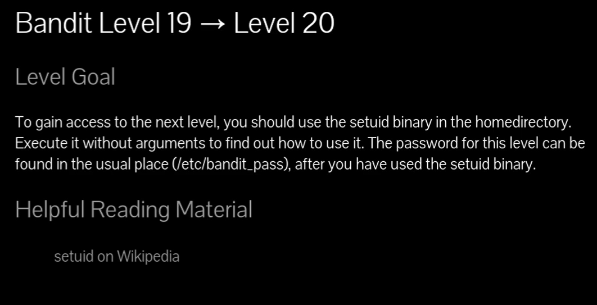
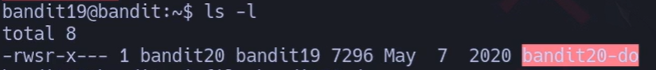
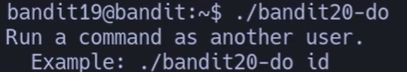
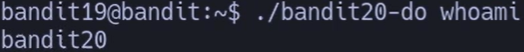
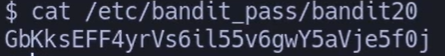
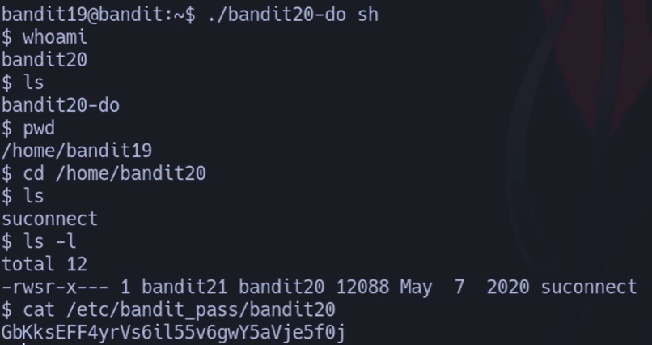
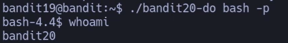
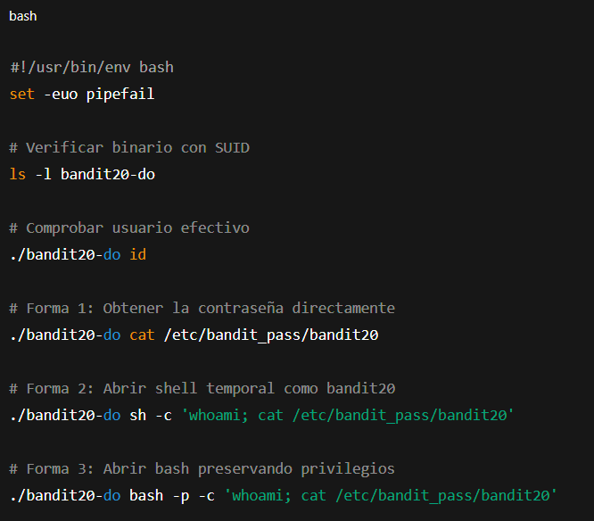

# Siempre poner al conectarse a una maquina por SSH : -export TERM=xterm

### Bandit Nivel 19 → Nivel 20

**Objetivo del nivel**  
Para obtener acceso al siguiente nivel, debes usar el binario **setuid** que está en el directorio home.  
Ejecútalo sin argumentos para averiguar cómo usarlo.  
La contraseña para este nivel puede encontrarse en el lugar habitual (`/etc/bandit_pass`), después de que hayas usado el binario setuid.

**Material de lectura recomendado**

- _setuid en Wikipedia_

## 🔎 Objetivo del nivel

Este nivel introduce el uso de **binarios con bit SUID**.  
En el home hay un binario especial llamado `bandit20-do`.  
Su función es ejecutar comandos como **otro usuario** (`bandit20`).  
La contraseña está en:

`/etc/bandit_pass/bandit20`

y solo puede leerse si se ejecuta con permisos de `bandit20`.

---

## 🪜 Paso a paso (con consola real)

### 1. Ver el binario disponible

# {Comando}

## `bandit19@bandit:~$ ls -l`

# {Salida}

## `-rwsr-x--- 1 bandit20 bandit19 7296 May  7  2020 bandit20-do`

## 💬{Comentario del profe}  

El permiso `-rwsr-x---` indica que **tiene el bit SUID activo** (`s` en el campo de usuario).  
Eso significa que **se ejecuta con los permisos de su propietario (bandit20)**.

---

### 2. Ejecutar el binario sin argumentos

# {Comando}

## `./bandit20-do`

# {Salida}

## `Run a command as another user. Example: ./bandit20-do id`

---

### 3. Probar con un comando básico

# {Comando}

## `./bandit20-do whoami`

# {Salida}

## `bandit20`

## 💬{Comentario del profe}  

¡Perfecto! Aunque estás logueado como `bandit19`, el comando se ejecuta como `bandit20`.

---

### 4. Obtener la contraseña

## 🪜 Paso a paso (formas de acceder)

### ✅ Forma 1 — Ejecutar un comando directamente

# {Comando}

## `./bandit20-do cat /etc/bandit_pass/bandit20`

# {Salida}

## `GbKksEFF4yrVs6il55v6gwY5aVje5f0j`

## 💬{Comentario del profe}  

La forma más directa: le dices al binario qué ejecutar y listo.

---

### ✅ Forma 2 — Abrir una shell como bandit20

# {Comando}

## `./bandit20-do sh`

# {Salida}

## `$ whoami bandit20`

## {Uso}

## `$ cat /etc/bandit_pass/bandit20 GbKksEFF4yrVs6il55v6gwY5aVje5f0j`

## 💬{Comentario del profe}  

Aquí ya no solo ejecutas un comando: abres una shell **con privilegios de bandit20**.

---

### ✅ Forma 3 — Abrir una shell persistente con `bash -p`

# {Comando}

## `./bandit20-do bash -p`

# {Salida}

## `bash-4.4$ whoami bandit20`

## {Uso}

## `bash-4.4$ cat /etc/bandit_pass/bandit20 GbKksEFF4yrVs6il55v6gwY5aVje5f0j`

## 💬{Comentario del profe}  

La opción `-p` (preserve privileges) en `bash` hace que la shell **mantenga el UID efectivo (bandit20)** en lugar de “degradarlo” al usuario real (`bandit19`).  
En sistemas modernos esto es importante, porque sin `-p` puede que pierdas los privilegios del SUID.

---

### ✅ Forma 4 — Usar comandos de diagnóstico

# {Comando}

## `./bandit20-do id`

# {Salida}

## `uid=11020(bandit20) gid=11019(bandit19) euid=11020(bandit20) groups=11019(bandit19)`

## 💬{Comentario del profe}  

`id` muestra que tu **UID efectivo** es de `bandit20`, aunque tu **GID** siga siendo de `bandit19`.

---

## 🔎 ¿Por qué podemos entrar de varias formas?

- El binario **tiene el bit SUID activado** (`-rwsr-x---` con la `s` en permisos de usuario).
    
- Cuando se ejecuta, el sistema operativo cambia tu **UID efectivo** al del propietario (`bandit20`).
    
- Eso significa que **cualquier proceso hijo (sh, bash, cat, etc.) hereda ese UID** y por lo tanto tiene acceso a los archivos de `bandit20`.
    
- Por eso funcionan tanto:
    
    - `cat` → ejecutar un comando puntual.
        
    - `sh` → abrir una shell básica.
        
    - `bash -p` → abrir una shell avanzada manteniendo privilegios.
        

💡 Piensa en SUID como **prestar la tarjeta de acceso del dueño del archivo durante la ejecución del programa**.

---

## ❌ Errores comunes y soluciones

- ❌ Ejecutar `cat /etc/bandit_pass/bandit20` directo → **Permiso denegado**.  
    ✔️ Solución: anteponer `./bandit20-do`.
    
- ❌ Ejecutar `./bandit20-do bash` sin `-p` → a veces la shell degrada privilegios y sigues siendo `bandit19`.  
    ✔️ Solución: usar `bash -p`.
    
- ❌ Pensar que `sh` es inseguro → en este caso funciona igual porque hereda el UID efectivo de `bandit20`.
    

---

## 🧾 Chuleta final

|Comando|Propósito|Ejemplo mínimo|
|---|---|---|
|`./bandit20-do cat /etc/bandit_pass/bandit20`|Leer directamente la contraseña|`cat /etc/bandit_pass/bandit20`|
|`./bandit20-do sh`|Abrir shell como bandit20|`whoami` → `bandit20`|
|`./bandit20-do bash -p`|Abrir bash preservando privilegios|`whoami` → `bandit20`|
|`./bandit20-do id`|Ver UID/GID efectivo|`uid=bandit20`|

---

## 🧩 Script final completo

`#!/usr/bin/env bash set -euo pipefail  # Verificar binario con SUID ls -l bandit20-do  # Comprobar usuario efectivo ./bandit20-do id  # Forma 1: Obtener la contraseña directamente ./bandit20-do cat /etc/bandit_pass/bandit20  # Forma 2: Abrir shell temporal como bandit20 ./bandit20-do sh -c 'whoami; cat /etc/bandit_pass/bandit20'  # Forma 3: Abrir bash preservando privilegios ./bandit20-do bash -p -c 'whoami; cat /etc/bandit_pass/bandit20'`

---

## 🗒️ Notas adicionales

- SUID es un concepto **muy usado en escaladas de privilegios** en CTFs y pentesting.
    
- No todos los sistemas permiten `bash -p`; algunos ignoran privilegios heredados por seguridad.
    
- `sh` suele ser más fiable en estos retos porque es mínimo y hereda UID sin complicaciones.
