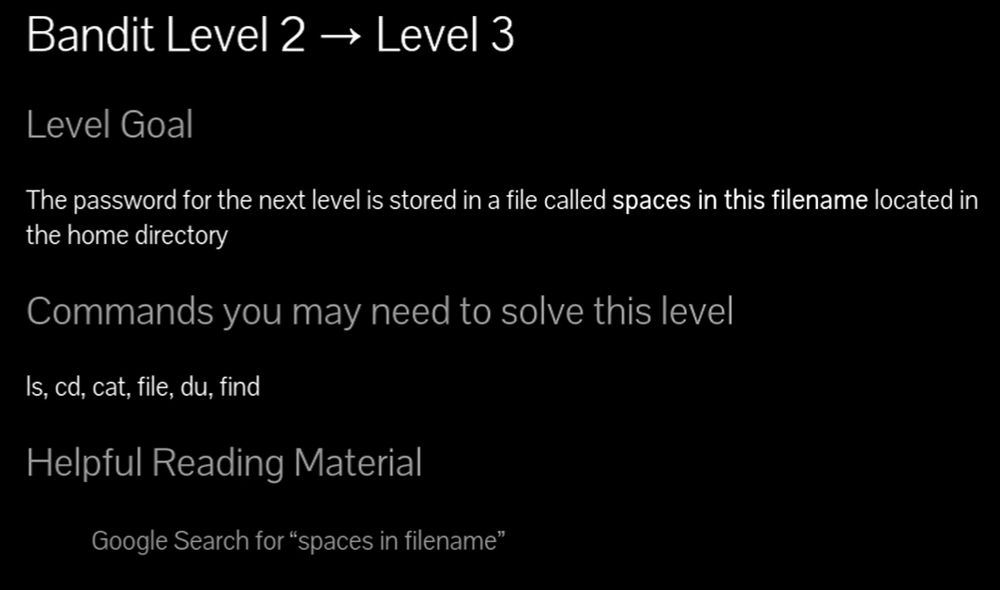
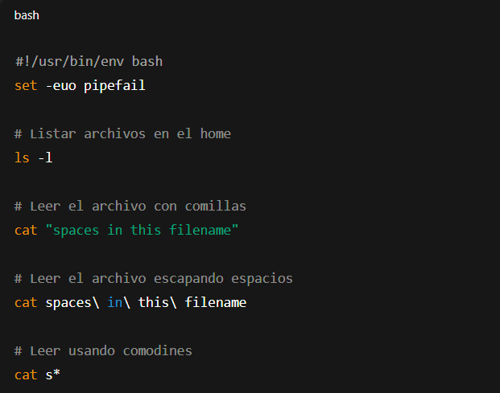

# Siempre poner al conectarse a una maquina por SSH : -export TERM=xterm

## 📄 Enunciado del nivel

La contraseña para el siguiente nivel está guardada en un archivo llamado  
#**`spaces in this filename`** dentro del directorio **home** de `bandit2`.

Tu tarea es abrir ese archivo y obtener la contraseña para conectarte como `bandit3`.

---

## 🔎 Objetivo del nivel

Aprender a manejar archivos con **espacios en el nombre**, utilizando comillas (`" "`),  
caracteres de escape (`\` ) o comodines (`*`).

---

## 🪜 Paso a paso (con consola real)

### 1. Listar archivos

# {Comando}

## `ls -l`

# {Salida}

## `-rw-r----- 1 bandit3 bandit2 33 May  7  2020 spaces in this filename`

💬 \Tag{Comentario del profe}  
El archivo se llama con espacios, así que si lo escribimos tal cual, dará error.

---

### 2. Intento directo (falla)

# {Comando}

## `cat spaces in this filename`

# {Salida}

## `cat: spaces: No such file or directory cat: in: No such file or directory cat: this: No such file or directory cat: filename: No such file or directory`

## 💬{Comentario del profe}  

Linux cree que cada palabra es un archivo distinto.

---

### 3. Solución con comillas

# {Comando}

## `cat "spaces in this filename"`

# {Salida}

## `UmHadQclWmgdLOKQ3YNgjWxGoRMb5luK`

## 💬{Comentario del profe}  

Las comillas indican que todo es un solo nombre.

---

### 4. Solución con `\` (escape)

# {Comando}

## `cat spaces\ in\ this\ filename`

# {Salida}

## `UmHadQclWmgdLOKQ3YNgjWxGoRMb5luK`

## 💬{Comentario del profe}  

El `\` le dice al sistema “esto no es un separador, es parte del nombre”.

---

### 5. Solución con comodín

# {Comando}

## `cat s*`

# {Salida}

## `UmHadQclWmgdLOKQ3YNgjWxGoRMb5luK`

## 💬{Comentario del profe}  

El `*` reemplaza cualquier cosa. Aquí funciona porque solo hay un archivo que empieza por “s”.

---

### 6. Solución con ruta absoluta

# {Comando}

## `cat /home/bandit2/s*`

# {Salida}

## `UmHadQclWmgdLOKQ3YNgjWxGoRMb5luK`

---

## ❌ Errores comunes y soluciones

- ❌ Escribir el nombre sin comillas ni escapes → lo interpreta como varios archivos.
    
- ❌ Olvidar cerrar comillas → error de sintaxis.
    
- ❌ Usar `*` en un directorio con varios archivos → puede mostrar más de lo esperado.
    

---

## 🧾 Chuleta final

|  Comando                    | Propósito                       | Uso mínimo                       |
| --------------------------- | ------------------------------- | -------------------------------- |
| `cat "nombre con espacios"` | Leer archivo con comillas       | `cat "spaces in this filename"`  |
| `cat nombre\ con\ espacios` | Leer archivo escapando espacios | `cat spaces\ in\ this\ filename` |
| `cat s*`                    | Leer archivo con comodines      | `cat s*`                         |

---

## 🧩 Script final completo

`#!/usr/bin/env bash set -euo pipefail
`# Listar archivos en el home ls -l 
`# Leer el archivo con comillas cat "spaces in this filename" 
`# Leer el archivo escapando espacios cat spaces\ in\ this\ filename 
`# Leer usando comodines cat s*`

---

## 🗒️ Notas adicionales

✔️ **Versión manual**: `cat "spaces in this filename"`  
✔️ **Versión intermedia**: `cat spaces\ in\ this\ filename`  
✔️ **Versión avanzada**: `cat s*` o `cat /home/bandit2/s*`

