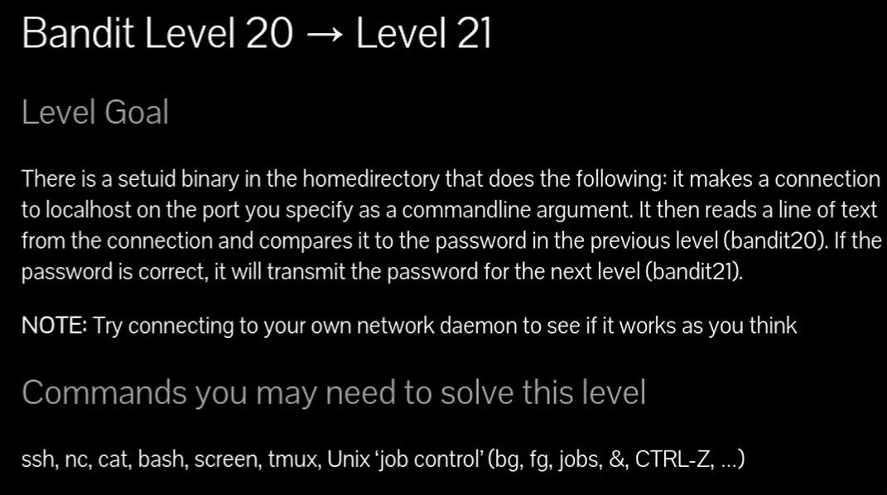

# Siempre poner al conectarse a una maquina por SSH : -export TERM=xterm

## 🔎 Traducción del enunciado

> En el **directorio home** hay un **binario con SUID** que hace lo siguiente: se conecta a **localhost** en el **puerto** que le pases como **argumento**. Luego **lee una línea de texto** de esa conexión y la **compara** con la **contraseña del nivel anterior (bandit20)**.  
> Si la contraseña es **correcta**, **envía** (por esa misma conexión) la **contraseña del siguiente nivel (bandit21)**.  
> **Nota:** intenta conectarlo contra tu propio “servicio” (daemon) de red para comprobar que funciona como piensas.

---

## 🪜 Paso a paso (con consola real)

### Resumen de la idea

1. Tú levantas **un servicio local** que escuche en un puerto (con `nc -nlvp PUERTO`).
    
2. Ejecutas el binario SUID `./suconnect PUERTO` para que **se conecte** a tu servicio.
    
3. En tu `nc`, **escribes** la contraseña de bandit20.
    
4. Si coincide, el binario te **devuelve** la contraseña de bandit21 por esa conexión.
    

---

### Método A (dos terminales / dos paneles)

# {Comando — Terminal 1: escuchar con netcat}

## `bandit20@bandit:~$ nc -nlvp 4646`

## {Desglose del comando}

- **nc**: netcat (cliente/servidor TCP/IP).
    
- **-n**: no resolver DNS (más rápido).
    
- **-l**: modo “listen” (servidor).
    
- **-v**: verboso (muestra conexiones).
    
- **-p 4646**: puerto local 4646.
    

# {Salida (cuando aún no hay conexión)}

## `listening on [any] 4646 ...`

# {Comando — Terminal 2: lanzar el binario SUID y conectar}

## `bandit20@bandit:~$ ./suconnect 4646`

# {Salida típica en la Terminal 2}

## `Read: GbKksEFF4yrVs6il55v6gwY5aVje5f0j Password matches, sending next password`

# {Acción — Terminal 1: enviar la contraseña de bandit20}

## `GbKksEFF4yrVs6il55v6gwY5aVje5f0j`

# {Salida — Terminal 1: recibes la contraseña de bandit21}

## `connect to [127.0.0.1] from (UNKNOWN) [127.0.0.1] 38246 
## `GbKksEFF4yrVs6il55v6gwY5aVje5f0j 
## `gE269g2h3mw3pwgri0Ha9Uoqen1c9DGr`

## 💬{Comentario del profe}  

“nc escucha”, “suconnect llama”, tú mandas la clave **anterior** y te devuelve la **siguiente**.

---

### Método B (una sola terminal con control de trabajos)

# {Comando}

`bandit20@bandit:~$ nc -nlvp 4646 # (ahora pulsa CTRL+Z para suspender el proceso) bandit20@bandit:~$ bg        # lo mandas al background bandit20@bandit:~$ jobs      # verás el nc ‘Escuchando’ como [1]+ bandit20@bandit:~$ ./suconnect 4646 bandit20@bandit:~$ fg        # vuelves a nc para escribir GbKksEFF4yrVs6il55v6gwY5aVje5f0j # netcat mostrará la contraseña de bandit21`

## 💬{Comentario del profe} 

Con **CTRL+Z**, **bg**, **jobs**, **fg** no necesitas dos terminales (exactamente lo que sugiere el enunciado: job control).

---

### Método C (automatizado con “echo” y tubería)

> Útil si el binario no requiere interacción del lado cliente (a veces funciona perfecto).

# {Comando}

### `bandit20@bandit:~$ ( echo "GbKksEFF4yrVs6il55v6gwY5aVje5f0j" | nc -nlvp 4646 ) &  bandit20@bandit:~$ ./suconnect 4646 # en la salida del subshell verás la contraseña de bandit21`

## 💬{Comentario del profe}  

Ponemos a `nc` a escuchar **y** a enviar la línea correcta nada más conecten; luego `suconnect` se conecta y devuelve la clave.

---

## 🧰 Comandos clave (mini-manual)

- **nc -nlvp PUERTO** → escucha TCP en `PUERTO`.
    
    - **-n**: IPs numéricas, **-l**: listen, **-v**: verboso, **-p**: puerto.
        
- **./suconnect PUERTO** → binario SUID que conecta a `localhost:PUERTO`, lee **una línea** y la compara con la **contraseña de bandit20**.
    
- **bg / fg / jobs / CTRL+Z** → control de trabajos en la misma terminal.
    

---

## ❌ Errores comunes y soluciones

- **Pones mal el puerto** (nc en 4646 y suconnect a 4647).  
    ✔ Verifica que ambos usan **exactamente** el mismo puerto.
    
- **Escribes la contraseña con espacios/sin salto**.  
    ✔ Pega **solo** la línea de la contraseña anterior y pulsa **Enter**.
    
- **Ejecutas `suconnect` antes de que `nc` escuche**.  
    ✔ Arranca primero `nc -nlvp PUERTO` y **después** `./suconnect PUERTO`.
    
- **Usas `nc -l 4646` sin `-p` (algunas versiones)**.  
    ✔ Bandit usa `netcat-openbsd`, el patrón correcto es `-l -p 4646` o `-l 4646` (con OpenBSD valen ambos, yo uso `-nlvp 4646` para evitar dudas).
    

---

## 🧾 Chuleta final

|Acción|Comando|Dónde|
|---|---|---|
|Escuchar|`nc -nlvp 4646`|Terminal 1|
|Conectar|`./suconnect 4646`|Terminal 2 (o misma con job control)|
|Enviar clave bandit20|`GbKksEFF4yrVs6il55v6gwY5aVje5f0j` + Enter|En la sesión de `nc`|
|Recibir clave bandit21|`gE269g2h3mw3pwgri0Ha9Uoqen1c9DGr`|Mostrada por `nc`|

---

## 🧩 Script final (automatizado y robusto)

`#!/usr/bin/env bash set -euo pipefail  PORT=4646 PW_20="GbKksEFF4yrVs6il55v6gwY5aVje5f0j"  # 1) Arranca nc en background y espera conexión; cuando llegue, envía la contraseña y muestra la respuesta (    # Espera pasiva: cuando suconnect conecte, nc recibirá y luego imprimirá la respuesta   # En OpenBSD nc, -l acepta puerto directo; uso -nlvp por claridad   { echo "$PW_20"; cat; } | nc -nlvp "$PORT" ) &  # 2) Lanza el binario SUID que se conectará a nuestro puerto ./suconnect "$PORT"  # 3) Espera a que termine el subshell wait`

💬 Si el `cat` te deja la sesión “abierta”, corta con **CTRL+C** tras ver la contraseña.

---

## 📚 Referencias rápidas

- `man nc`, `man bash` (job control), notas del reto en OverTheWire Bandit.

# Pregunta: ¿Tiene que ser al puerto 4646, o puede ser al que tu elijas?

## No **tiene que ser específicamente el 4646**.

En este nivel lo que ocurre es:

- El binario `./suconnect PUERTO` **intenta conectarse a `localhost:PUERTO`**.
    
- Por lo tanto, **ese puerto lo eliges tú**.
    
- Solo necesitas que:
    
    1. El puerto que abras con `nc -nlvp` coincida con el que pongas a `suconnect`.
        
    2. Ese puerto no esté ya en uso por otro servicio.
        

### Ejemplo:

### `bandit20@bandit:~$ nc -nlvp 5555 listening on [any] 5555 ...`

En otra terminal:

### `bandit20@bandit:~$ ./suconnect 5555 Read: GbKksEFF4yrVs6il55v6gwY5aVje5f0j Password matches, sending next password`

En la sesión de `nc`:

### `GbKksEFF4yrVs6il55v6gwY5aVje5f0j gE269g2h3mw3pwgri0Ha9Uoqen1c9DGr`

## 💬 **Truco del profe**:

### piensa en el puerto como un número de teléfono interno. Mientras que el que llama (`suconnect`) y el que escucha (`nc`) usen el mismo número, se entienden.
