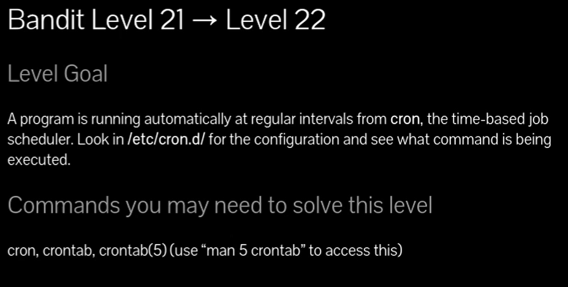
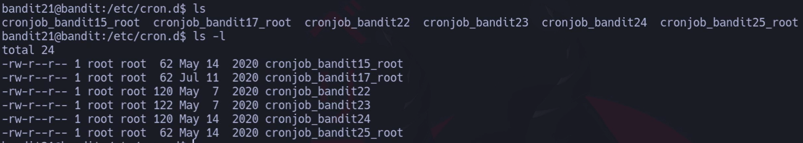
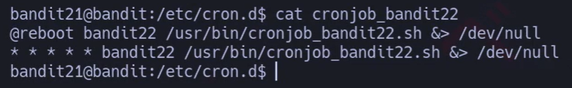
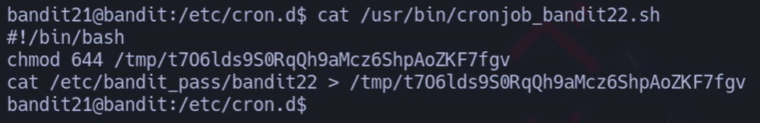
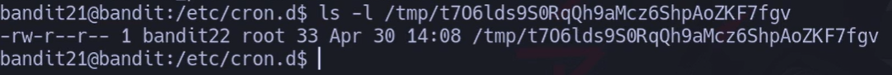
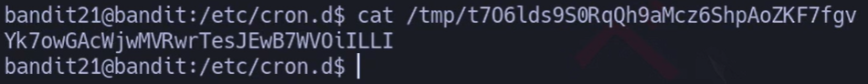
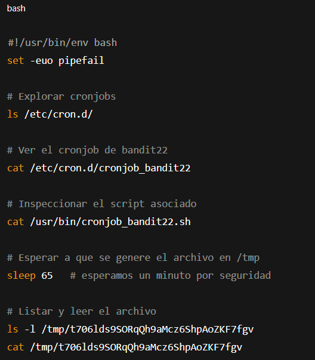



# Siempre poner al conectarse a una maquina por SSH : -export TERM=xterm

## 🔎 Traducción del enunciado

> Un programa se está ejecutando automáticamente a intervalos regulares desde **cron** (el planificador de tareas basado en tiempo).  
> Debes mirar en **/etc/cron.d/** para ver la configuración y comprobar qué comando se está ejecutando.

---

## 🪜 Paso a paso (consola real)

### 1. Explorar las tareas de cron

# {Comando}

## `ls -l /etc/cron.d/`

# {Salida}
## `En la captura`

## 💬{Comentario del profe}  

Cada fichero de aquí es una tarea programada para ejecutarse automáticamente.

---

### 2. Ver el cronjob específico de bandit22

# {Comando}

## `cat /etc/cron.d/cronjob_bandit22`

# {Salida}

## `@reboot bandit22 /usr/bin/cronjob_bandit22.sh &> /dev/null * * * * * bandit22 /usr/bin/cronjob_bandit22.sh &> /dev/null`

## 💬{Comentario del profe}  

Esto significa: cada minuto, el usuario **bandit22** ejecuta el script `/usr/bin/cronjob_bandit22.sh`.

---

### 3. Leer el script que se ejecuta

# {Comando}

## `cat /usr/bin/cronjob_bandit22.sh`

# {Salida}

## `#!/bin/bash 
## `chmod 644 /tmp/t706lds9SORqQh9aMcz6ShpAoZKF7fgv 
## `cat /etc/bandit_pass/bandit22 > /tmp/t706lds9SORqQh9aMcz6ShpAoZKF7fgv`

## 💬{Comentario del profe}  

El script copia la contraseña de **bandit22** en un archivo temporal dentro de esta ruta  `/tmp/t706lds9SORqQh9aMcz6ShpAoZKF7fgv` ,con permisos de lectura para todos.

---

### 4. Verificar los permisos del archivo temporal

# {Comando}

## `ls -l /tmp/t706lds9SORqQh9aMcz6ShpAoZKF7fgv`

# {Salida}

## `-rw-r--r-- 1 bandit22 root 33 Apr 30 14:08 /tmp/t706lds9SORqQh9aMcz6ShpAoZKF7fgv`

## 💬{Comentario del profe}  

Tiene permisos **644**, es decir, cualquier usuario puede leerlo.

---

### 5. Obtener la contraseña de bandit22

# {Comando}

## `cat /tmp/t706lds9SORqQh9aMcz6ShpAoZKF7fgv`

# {Salida}

## `Yk7owGAcWjwMVRwrTesJEwB7WVOiILLI`

## 💬{Comentario del profe}  

¡Aquí está la contraseña de **bandit22**! 🎉

---

## ❌ Errores comunes y soluciones

- ❌ Intentar leer directamente `/etc/bandit_pass/bandit22` → **Permission denied**.  
    ✔ Solución: seguir el rastro del cronjob.
    
- ❌ Buscar en `/etc/crontab` en lugar de `/etc/cron.d/` → puedes no ver nada útil.  
    ✔ Solución: siempre revisa la carpeta `/etc/cron.d/` en estos niveles.
    
- ❌ No esperar a que se ejecute el cronjob → el archivo puede no estar actualizado.  
    ✔ Solución: si no existe aún, espera 1 minuto y vuelve a mirar.
    

---

## 🧾 Chuleta final

|Comando|Propósito|Ejemplo mínimo|
|---|---|---|
|`ls /etc/cron.d/`|Ver cronjobs disponibles|`ls /etc/cron.d/`|
|`cat /etc/cron.d/cronjob_bandit22`|Ver qué se ejecuta|`cat cronjob_bandit22`|
|`cat /usr/bin/cronjob_bandit22.sh`|Analizar script|`cat cronjob_bandit22.sh`|
|`ls -l /tmp/ARCHIVO`|Ver permisos del archivo|`ls -l /tmp/...`|
|`cat /tmp/ARCHIVO`|Leer la contraseña|`cat /tmp/...`|

---

## 🧩 Script final completo

`#!/usr/bin/env bash set -euo pipefail  # Explorar cronjobs ls /etc/cron.d/  # Ver el cronjob de bandit22 cat /etc/cron.d/cronjob_bandit22  # Inspeccionar el script asociado cat /usr/bin/cronjob_bandit22.sh  # Esperar a que se genere el archivo en /tmp sleep 65   # esperamos un minuto por seguridad  # Listar y leer el archivo ls -l /tmp/t706lds9SORqQh9aMcz6ShpAoZKF7fgv cat /tmp/t706lds9SORqQh9aMcz6ShpAoZKF7fgv`

---

## 📚 Referencias

- `man 5 crontab`
    
- OverTheWire Bandit → niveles cronjobs
