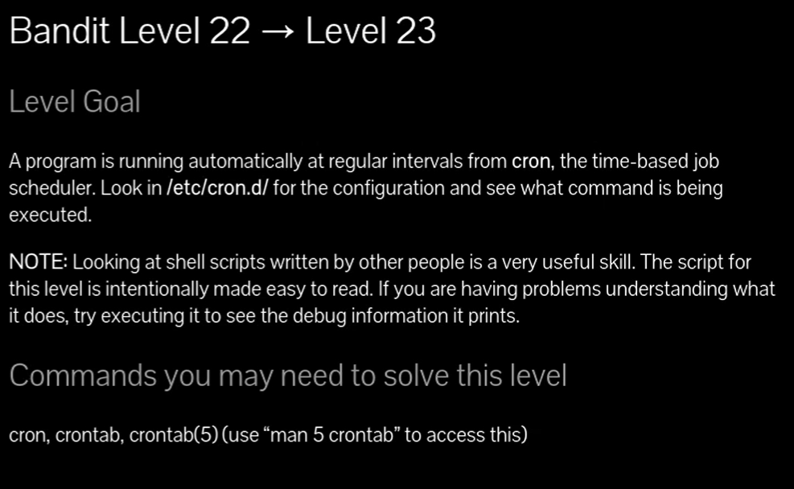
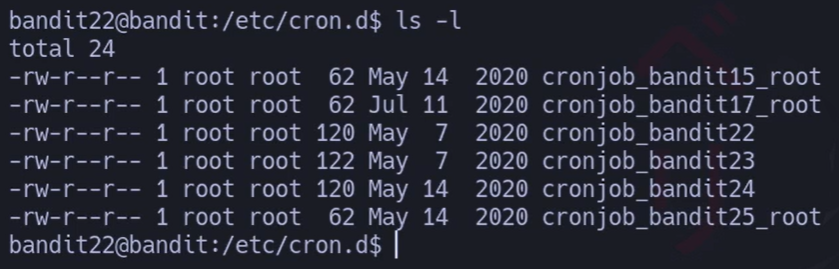
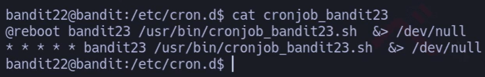
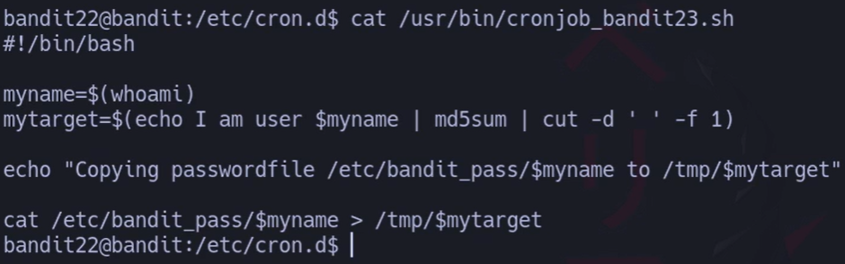
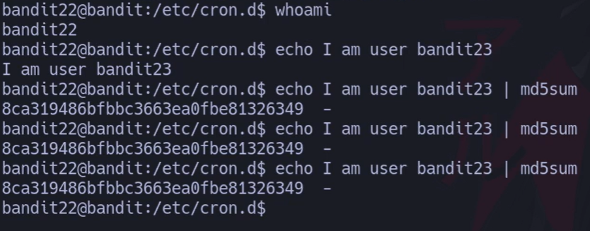
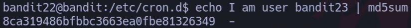
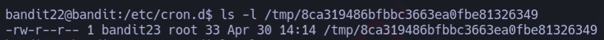
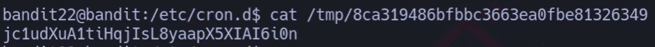
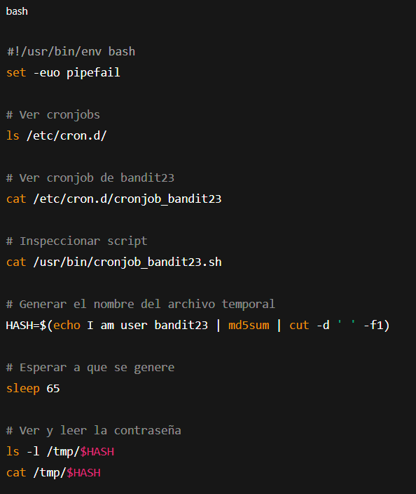



# Siempre poner al conectarse a una maquina por SSH : -export TERM=xterm

## 🔎 Traducción del enunciado

> Un programa se está ejecutando automáticamente a intervalos regulares desde **cron**.  
> Debes mirar en **/etc/cron.d/** para ver la configuración y comprobar qué comando se está ejecutando.
> 
> 💡 Nota: Leer y entender **scripts en Bash escritos por otros** es una habilidad muy útil.  
> El script de este nivel está hecho para que sea fácil de leer. Si tienes problemas, ejecútalo para ver la información de depuración.

---

## 🪜 Paso a paso (consola real)

### 1. Ver cronjobs disponibles

# {Comando}

## `ls -l /etc/cron.d/`

# {Salida}

## `La Captura`
## 💬{Comentario del profe} 

Aquí vemos el cronjob **cronjob_bandit23**, que es el que nos interesa.

---

### 2. Inspeccionar el cronjob

# {Comando}

## `cat /etc/cron.d/cronjob_bandit23`

# {Salida}

## `@reboot bandit23 /usr/bin/cronjob_bandit23.sh &> /dev/null
## `* * * * * bandit23 /usr/bin/cronjob_bandit23.sh &> /dev/null`

## 💬{Comentario del profe}  

Cada minuto el usuario **bandit23** ejecuta el script `/usr/bin/cronjob_bandit23.sh`.

---

### 3. Leer el script

# {Comando}

## `cat /usr/bin/cronjob_bandit23.sh`

# {Salida}

`#!/bin/bash
`myname=$(whoami)
`mytarget=$(echo I am user $myname | md5sum | cut -d ' ' -f 1)
`echo "Copying passwordfile /etc/bandit_pass/$myname to /tmp/$mytarget"
`cat /etc/bandit_pass/$myname > /tmp/$mytarget`

## 💬{Comentario del profe}  

El script genera un nombre de archivo con **md5sum** a partir de la cadena `"I am user bandit23"`.  
Después copia la contraseña de `/etc/bandit_pass/bandit23` a ese archivo en `/tmp`.

##### Descripcion del scritp pincha para verlo  

¡Vamos línea por línea! (El script es `/usr/bin/cronjob_bandit23.sh`).

`#!/bin/bash`

- **Shebang**: indica que el script debe ejecutarse con **bash**.
    

`myname=$(whoami)`

- **`whoami`** devuelve el usuario **efectivo** que ejecuta el script.
    
- Como lo lanza un **cron** del usuario `bandit23`, aquí `myname` queda en `bandit23`.
    

`mytarget=$(echo I am user $myname | md5sum | cut -d ' ' -f 1)`

- Construye la cadena **exacta** `I am user bandit23` **con salto de línea al final** (porque `echo` sin `-n` añade `\n`).
    
- La pasa por **`md5sum`**, que saca algo como:
    
    `8ca319486bfbbc3663ea0fbe81326349  -`
    
    (observa que `md5sum` imprime el hash y luego dos espacios y un `-`).
    
- **`cut -d ' ' -f 1`** se queda **solo con el primer campo**, es decir, el hash de 32 hex.
    
- Resultado: `mytarget=8ca319486bfbbc3663ea0fbe81326349` (para el caso de `bandit23` con salto de línea).
    

`echo "Copying passwordfile /etc/bandit_pass/$myname to /tmp/$mytarget"`

- Mensaje informativo: muestra **de dónde** va a copiar y **a qué ruta** en `/tmp`.
    

`cat /etc/bandit_pass/$myname > /tmp/$mytarget`

- **Lee** el password del fichero `/etc/bandit_pass/bandit23`
    
- **Redirige** la salida al archivo `/tmp/8ca319486bfbbc3663ea0fbe81326349`.
    
- Al ejecutarse como `bandit23`, **sí tiene permisos de lectura** sobre su contraseña.
    
- En `/tmp` cualquiera puede crear/leer archivos según permisos; con la umask habitual, ese archivo queda **legible por otros**, que es justo la “puerta” del reto.
    

---

### Resumen rápido de lo que hace

1. Detecta el usuario que ejecuta el cron (`bandit23`).
    
2. Calcula un **nombre “ofuscado”** en `/tmp/` como MD5 de `I am user bandit23\n`.
    
3. **Copia** su contraseña desde `/etc/bandit_pass/bandit23` a ese archivo en `/tmp`.

---

### 4. Generar el nombre del archivo temporal

# {Comando}

## `echo I am user bandit23 | md5sum`

# {Salida}

## `8ca319486bfbbc3663ea0fbe81326349  -`

## 💬{Comentario del profe}  

Ese hash será el **nombre del archivo en /tmp** donde se guarda la contraseña.

---

### 5. Verificar el archivo en /tmp

# 
# {Comando}

## `ls -l /tmp/8ca319486bfbbc3663ea0fbe81326349`

# {Salida}

`-rw-r--r-- 1 bandit23 root 33 Apr 30 14:14 /tmp/8ca319486bfbbc3663ea0fbe81326349`

## 💬{Comentario del profe}  

El archivo existe, y tiene permisos de lectura para todos.

---

### 6. Leer la contraseña

# {Comando}

## `cat /tmp/8ca319486bfbbc3663ea0fbe81326349`

# {Salida}

## `jc1udXuA1tiHqjIsL8yaapX5XIAI6i0n`

## 💬{Comentario del profe}  

¡Aquí tienes la contraseña de **bandit23**!

---

## ❌ Errores comunes y soluciones

- ❌ Intentar leer `/etc/bandit_pass/bandit23` directamente → **Permission denied**.  
    ✔ Solución: seguir el hash en `/tmp`.
    
- ❌ Calcular mal el `md5sum` (por ejemplo sin el texto exacto `"I am user bandit23"`) → archivo no encontrado.  
    ✔ Solución: copia la cadena exactamente igual.
    

---

## 🧾 Chuleta final

|Comando|Propósito|Uso mínimo|
|---|---|---|
|`ls /etc/cron.d/`|Ver cronjobs|`ls /etc/cron.d/`|
|`cat /etc/cron.d/cronjob_bandit23`|Ver configuración|`cat cronjob_bandit23`|
|`cat /usr/bin/cronjob_bandit23.sh`|Leer el script|`cat cronjob_bandit23.sh`|
|`echo I am user bandit23|md5sum`|Generar nombre de archivo|
|`cat /tmp/HASH`|Leer contraseña|`cat /tmp/...`|

---

## 🧩 Script final completo

`#!/usr/bin/env bash set -euo pipefail  # Ver cronjobs ls /etc/cron.d/  # Ver cronjob de bandit23 cat /etc/cron.d/cronjob_bandit23  # Inspeccionar script cat /usr/bin/cronjob_bandit23.sh  # Generar el nombre del archivo temporal HASH=$(echo I am user bandit23 | md5sum | cut -d ' ' -f1)  # Esperar a que se genere sleep 65  # Ver y leer la contraseña ls -l /tmp/$HASH cat /tmp/$HASH`

---

## 📚 Referencias

- `man 5 crontab`
    
- Comando `md5sum`
