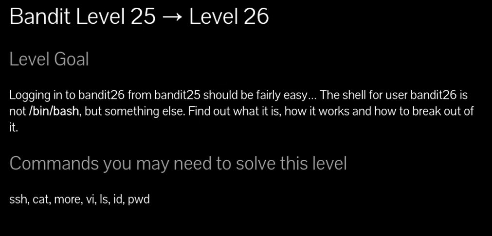

# Siempre poner al conectarse a una maquina por SSH : -export TERM=xterm

**Objetivo del nivel**  
Iniciar sesión en **bandit26** desde **bandit25** debería ser relativamente sencillo...  
La **shell** para el usuario **bandit26** **no es `/bin/bash`**, sino otra cosa diferente.  
Debes descubrir:

1. Qué shell es,
    
2. Cómo funciona, y
    
3. Cómo escapar de ella.
    

**Comandos que puedes necesitar para resolver este nivel**:  
`ssh`, `cat`, `more`, `vi`, `ls`, `id`, `pwd`

---

## 💬 **Comentario del profe**:  

Este nivel es un reto clásico de _restricted shells_ → cuando un usuario no tiene bash, sino una shell limitada (por ejemplo `more`, `vi` o una shell restringida). La clave está en **entender esa shell alternativa y buscar una forma de escapar a un shell normal.**

## 🔎 Enunciado traducido

> Conectarse a `bandit26` desde `bandit25` es fácil, pero el **shell del usuario bandit26 no es `/bin/bash`**, sino otro programa. Hay que averiguar **qué es**, cómo funciona y **cómo escapar de él**.

---

## 🪜 Paso a paso con explicación

### 1. Revisar el shell asignado

`bandit25@bandit:~$ cat /etc/passwd | grep bandit26`

🔹 Esto muestra la entrada de `bandit26`.  
Vemos que en vez de `/bin/bash`, tiene como shell **`/usr/bin/showtext`**.

---

### 2. Ver el script de `showtext`

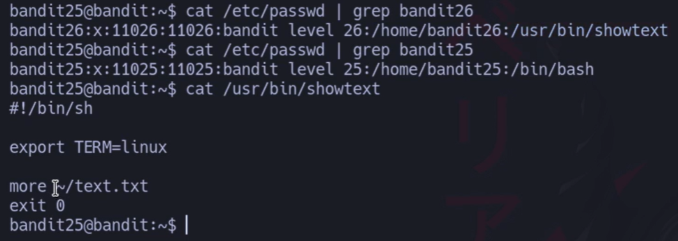

## `bandit25@bandit:~$ cat /usr/bin/showtext`

# Contenido:

## `#!/bin/sh 
## `export TERM=linux
## `more ~/text.txt
## `exit 0`

📌 Explicación:

- En vez de una bash interactiva, al conectarte se ejecuta este script.
    
- `more ~/text.txt` abre un archivo con el comando **`more`**, que permite moverse por el texto pero **no da una shell directamente**.
    
- Después se hace `exit 0`, cerrando la sesión.
    

---

### 3. Conectarse a bandit26

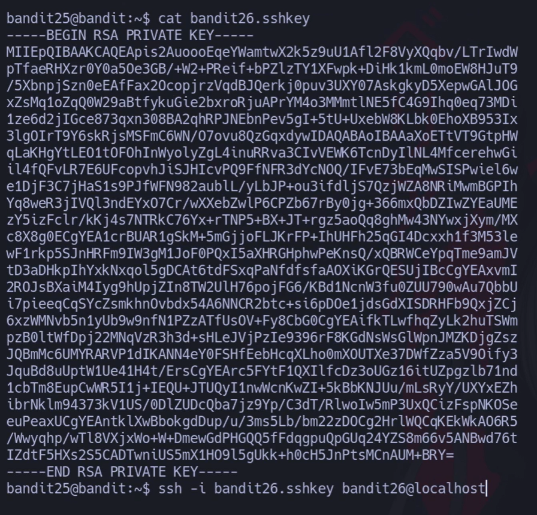

# Comando: 

## `bandit25@bandit:~$ ssh -i bandit26.sshkey bandit26@localhost`

Se entra, pero en lugar de una shell normal aparece un texto mostrado con `more`.

---

### 4. Escapar del `more`

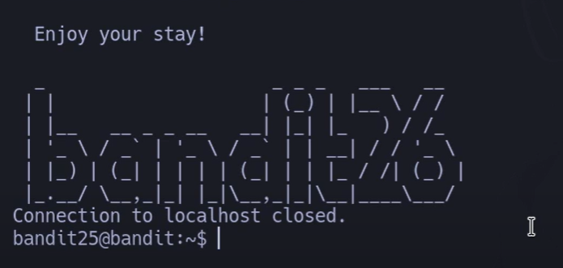

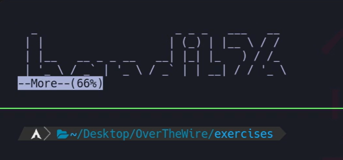
# Aquí está el truco:
## (hacerlo chiquitito para luego ponerle el v y poder escribir dentro )

### 🔹 En `more`, puedes escribir **`v`** → abre el archivo en **`vi`**.  
### 🔹 Dentro de `vi`,  le das a  `esc` + `sifth` + `: ` puedes meter instrucciones por ejemplo un shell:

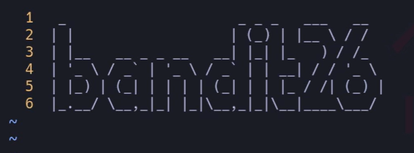
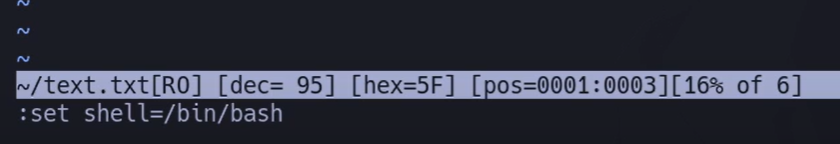

## `:set shell=/bin/bash :shell`

👉 Esto lanza una bash interactiva como **bandit26** 🎉.

---

### 5. Confirmar acceso y buscar archivos

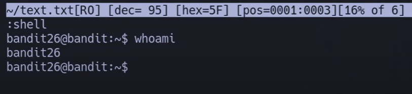
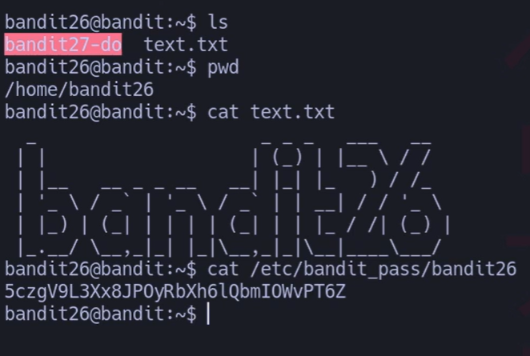

Una vez dentro:

`bandit26@bandit:~$ ls bandit27-do  text.txt`

---

### 6. Ver qué hace `bandit27-do`

#### `bandit26@bandit:~$ ./bandit27-do Run a command as another user. Example: ./bandit27-do id`

📌 Este binario es un **setuid** que permite ejecutar comandos como `bandit27`.

---

### 7. Ejecutar comando para leer la contraseña

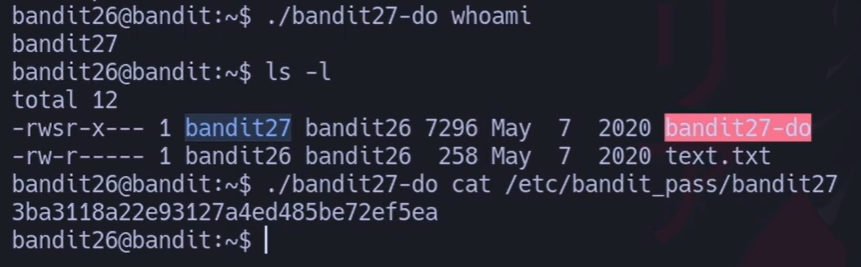

# Comando:
## `bandit26@bandit:~$ ./bandit27-do cat /etc/bandit_pass/bandit27`

# Salida:

## `3ba3118a22e931274aed485be72ef5ea`

👉 Esta es la contraseña de **bandit27** ✅.

---

## 💡 Resumen de la lógica

1. `bandit26` no tiene bash, sino `showtext`.
    
2. `showtext` abre un archivo con `more`.
    
3. Con la tecla **`v`**, saltamos a `vi`.
    
4. Desde `vi`, usamos `:set shell=/bin/bash` y `:shell` para escapar.
    
5. Ya en bash como `bandit26`, usamos `bandit27-do` para ejecutar comandos como `bandit27`.
    
6. Leemos la contraseña en `/etc/bandit_pass/bandit27`.

# 📘 Apuntes de **setuid** con ejemplo `bandit27-do`

---

## 🔎 ¿Qué es setuid?

- **setuid** (set user ID) es un **bit especial de permisos en Linux**.
    
- Cuando un archivo ejecutable tiene el **bit setuid activado**:  
    👉 Ese programa **se ejecuta con los privilegios del propietario del archivo**, no con los del usuario que lo ejecuta.
    

---

## 🪜 Ejemplo práctico en Bandit

### 1️⃣ Ver permisos del binario

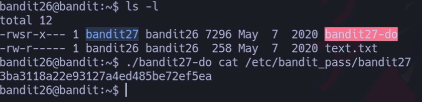

# {Comando}

## `bandit26@bandit:~$ ls -l`

# {Salida}

`-rwsr-x--- 1 bandit27 bandit26 7296 May  7  2020 bandit27-do -rw-r----- 1 bandit26 bandit26  258 May  7  2020 text.txt`

📌 Aquí el `s` en `-rwsr-x---` significa que el **bit setuid** está activo.

- El propietario del archivo es **bandit27**.
    
- Eso implica que cualquier usuario que ejecute `bandit27-do` lo hará con permisos de **bandit27**.
    

---

### 2️⃣ Comprobar quién soy al ejecutar el binario

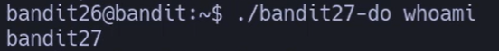

# {Comando}

## `bandit26@bandit:~$ ./bandit27-do whoami`

# {Salida}

## `bandit27`

## 💬 Aunque el usuario conectado es **bandit26**, el binario corre como **bandit27** gracias al **setuid**.

---

### 3️⃣ Usar el binario para leer la contraseña

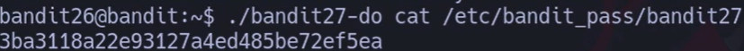

# {Comando}

## `bandit26@bandit:~$ ./bandit27-do cat /etc/bandit_pass/bandit27`

# {Salida}

## `3ba3118a22e931274aed485be72ef5ea`

## 📌 Normalmente `bandit26` no tiene permiso para leer ese archivo,  
## pero con `bandit27-do` lo logra porque el binario se ejecuta como **bandit27**.

---

## 🧠 Resumen sencillo

- **Normal**: el comando se ejecuta con los permisos del usuario actual.
    
- **Con setuid**: el comando se ejecuta con los permisos del propietario del archivo.
    

## 💬 **Truco del profe**:  

Imagina que el **setuid** es un disfraz.  
Aunque tú seas bandit26, al ejecutar el binario te “disfrazas” temporalmente de bandit27.

---

## ⚠️ Seguridad

- Los binarios con setuid son delicados:
    
    - Si tienen fallos de seguridad, se pueden usar para **escalar privilegios**.
        
    - En muchos sistemas modernos se desactiva o limita.
