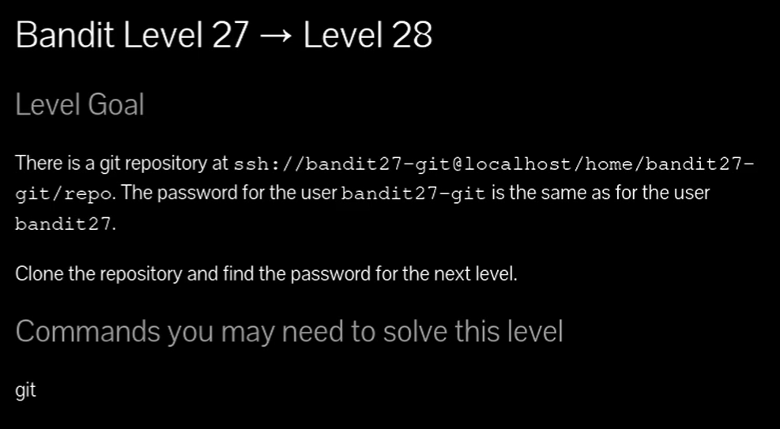
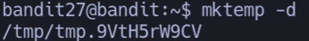
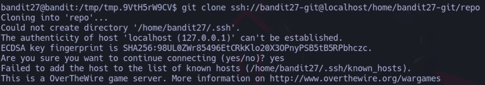
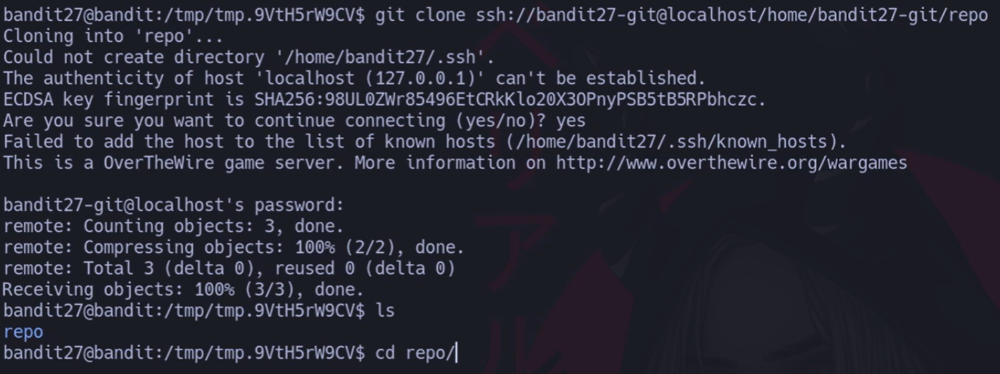
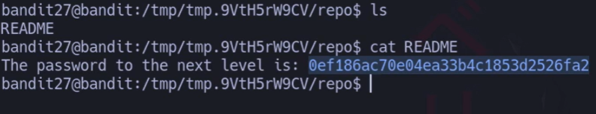



# Siempre poner al conectarse a una maquina por SSH : -export TERM=xterm

# Contraseña

## `3ba3118a22e931274aed485be72ef5ea`

## 🔎 Objetivo

Clonar un repositorio Git desde el servidor `ssh://bandit27-git@localhost/home/bandit27-git/repo` y encontrar la contraseña del siguiente nivel.

---

## 🪜 Paso a paso

### 1️⃣ Crear un directorio temporal

## `bandit27@bandit:~$ mktemp -d
## `/tmp/tmp.9VtH5rW9CV`

## 👉 Se crea un directorio temporal en `/tmp` para trabajar sin ensuciar el home.

### Entramos en ese directorio:

## `bandit27@bandit:~$ cd /tmp/tmp.9VtH5rW9CV`

---

### 2️⃣ Clonar el repositorio

`bandit27@bandit:/tmp/tmp.9VtH5rW9CV$ git clone ssh://bandit27-git@localhost/home/bandit27-git/repo`

## 👉 Aquí estamos clonando el repositorio con `git clone`.

- Nos pedirá la **contraseña de bandit27**.
    
- Tras autenticarnos, descarga los archivos del repositorio dentro de una carpeta llamada `repo`.

# Contraseña

## `3ba3118a22e931274aed485be72ef5ea`

---

### 3️⃣ Entrar al repositorio

## `bandit27@bandit:/tmp/tmp.9VtH5rW9CV$ cd repo/`

---

### 4️⃣ Ver los archivos disponibles

## `bandit27@bandit:/tmp/tmp.9VtH5rW9CV/repo$ ls README`

👉 El repositorio solo contiene un archivo `README`.

---

### 5️⃣ Leer el archivo `README`

## `bandit27@bandit:/tmp/tmp.9VtH5rW9CV/repo$ cat README
## `The password to the next level is: 0ef186ac70e04ea33b4c1853d2526fa2`

👉 En el archivo encontramos la contraseña para el usuario **bandit28**:

## `0ef186ac70e04ea33b4c1853d2526fa2`

---

## 📄 Resumen

- Creamos un directorio temporal con `mktemp -d`.
    
- Clonamos el repositorio con `git clone`.
    
- Entramos en `repo/` y leímos el archivo `README`.
    
- La contraseña estaba ahí dentro.
    

✅ ¡Nivel completado! Ahora puedes acceder como **bandit28**.

