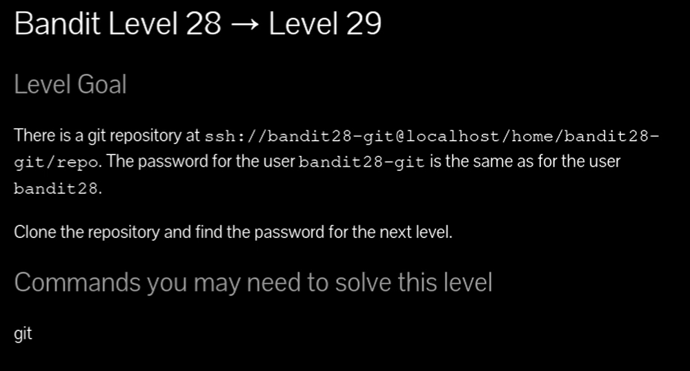
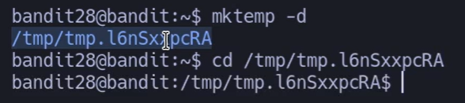
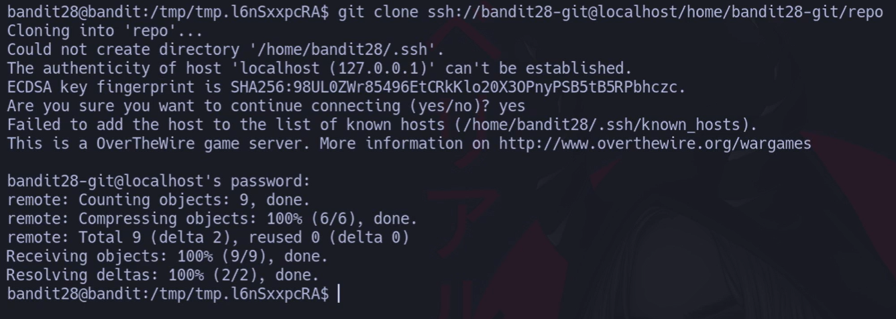
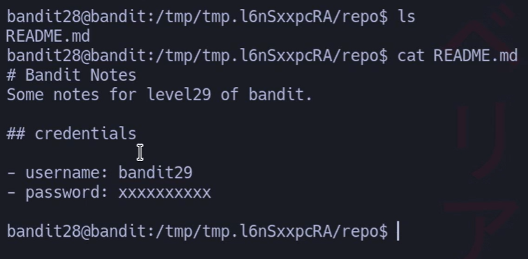
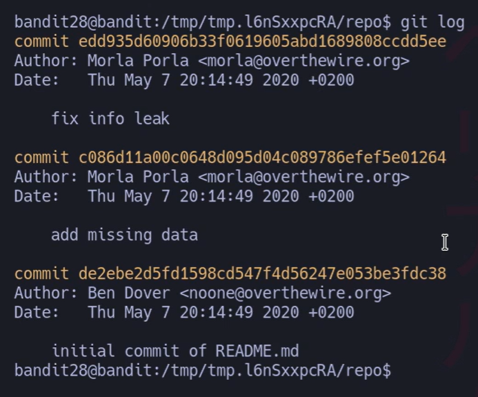
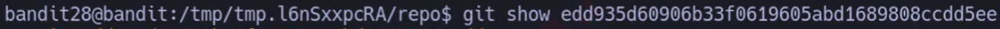
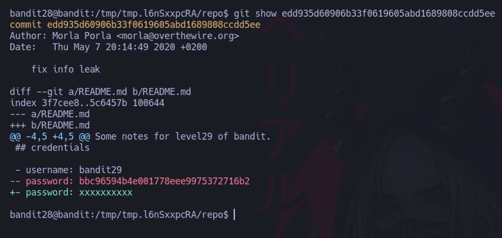
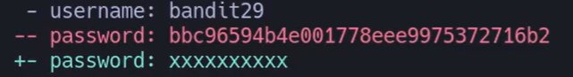



# Siempre poner al conectarse a una maquina por SSH : -export TERM=xterm

# 📘 Bandit Level 28 → Level 29

## 🔎 Objetivo

Clonar el repositorio Git de `bandit28-git` y encontrar la contraseña para el siguiente nivel (`bandit29`).

---

## 🪜 Paso a paso

### 1. Crear directorio temporal

## `bandit28@bandit:~$ mktemp -d /tmp/tmp.l6nSxxpcRA`

## `bandit28@bandit:~$ cd /tmp/tmp.l6nSxxpcRA`

---

### 2. Clonar el repositorio

Entramos al repositorio:

## `bandit28@bandit:/tmp/tmp.l6nSxxpcRA$ cd repo`

---

### 3. Leer el archivo principal

`bandit28@bandit:/tmp/tmp.l6nSxxpcRA/repo$ ls README.md`

`bandit28@bandit:/tmp/tmp.l6nSxxpcRA/repo$ cat README.md 
`# Bandit Notes 
`Some notes for level29 of bandit. 
`## credentials 
`- username: bandit29 
`- password: xxxxxxxxxx`

👉 El password está oculto con `xxxxxxxxxx`.

---

### 4. Revisar historial de commits

# Comando: 

## `bandit28@bandit:/tmp/tmp.l6nSxxpcRA/repo$ git 

`log commit edd935d60906b33f0619605abd1689808ccdd5ee` 
`Author: Morla Porla <morla@overthewire.org>
`Date:   Thu May 7 20:14:49 2020 +0200      
`fix info leak 

El último commit dice _“fix info leak”_ → seguramente ahí estaba el password.
# Nos interesa la primera por que dice fuga de datos (fix info leak)

`commit c086d11a00c0648d095d04c089786efef5e01264
`Author: Morla Porla <morla@overthewire.org> 
`Date:   Thu May 7 20:14:49 2020 +0200     
`add missing data  

`commit de2ebe2d5fd1598cd547f4d56247e053be3fdc38 
`Author: Ben Dover <noone@overthewire.org> 
`Date:   Thu May 7 20:14:49 2020 +0200     
`initial commit of README.md`

---

### 5. Inspeccionar commit sospechoso

# Comando:
##### `bandit28@bandit:/tmp/tmp.l6nSxxpcRA/repo$ git show edd935d60906b33f0619605abd1689808ccdd5ee

# Salida:

👉 **La contraseña real está en el commit anterior:**

## `bbc96594b4e001778eee9975372716b2`

---

## 📄 Contraseña para bandit29

## `bbc96594b4e001778eee9975372716b2`
