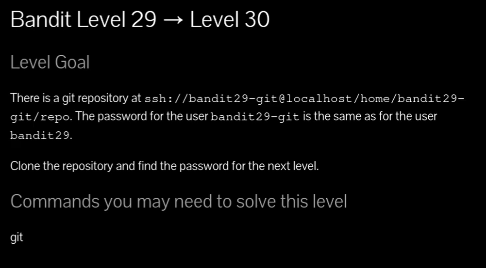
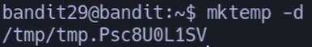
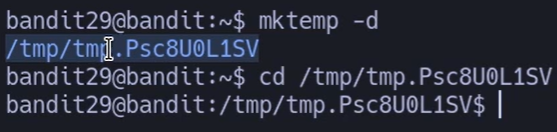
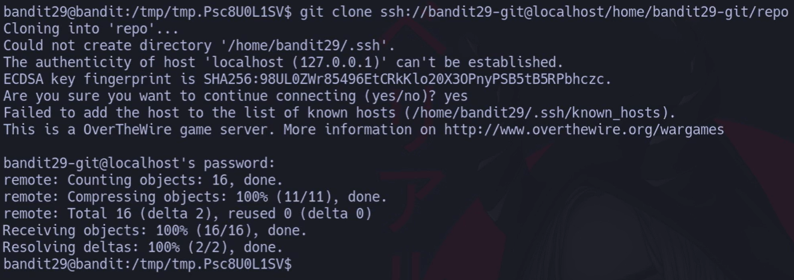
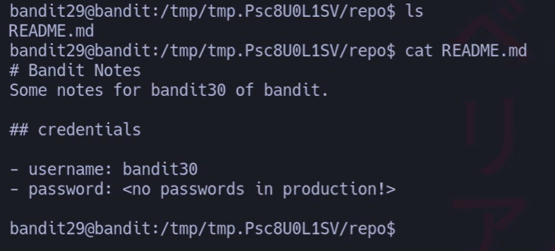
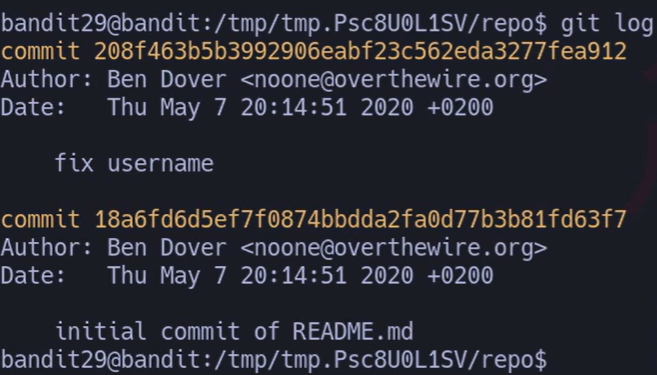
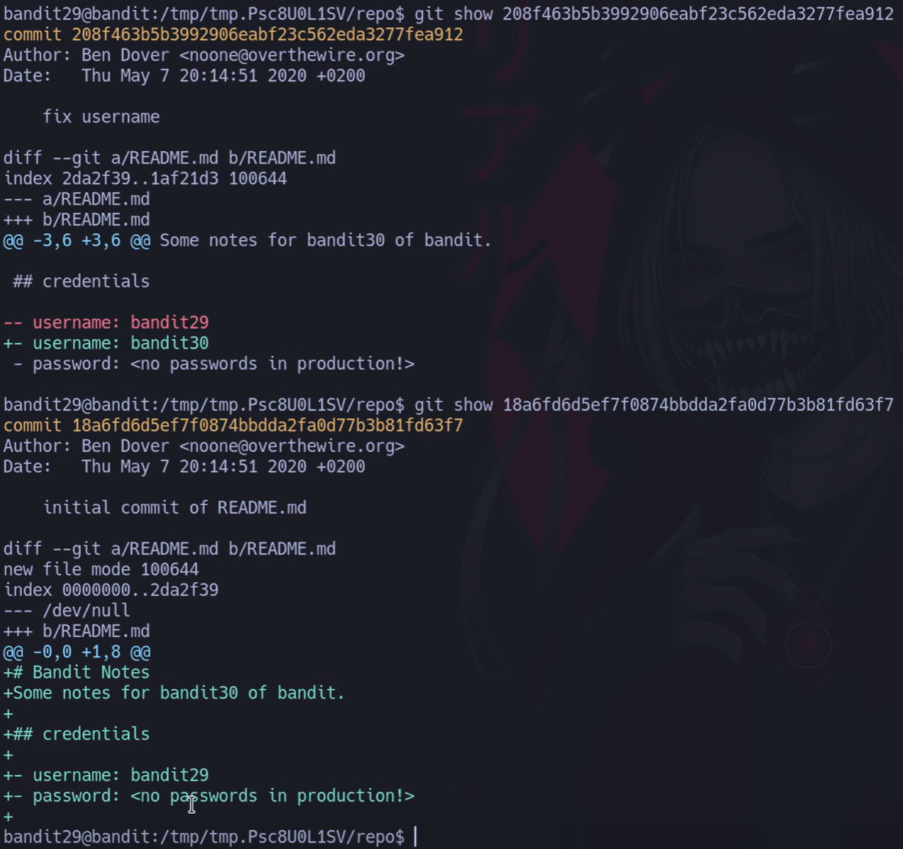
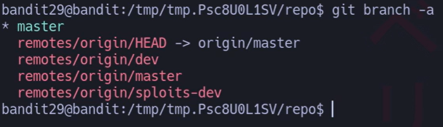
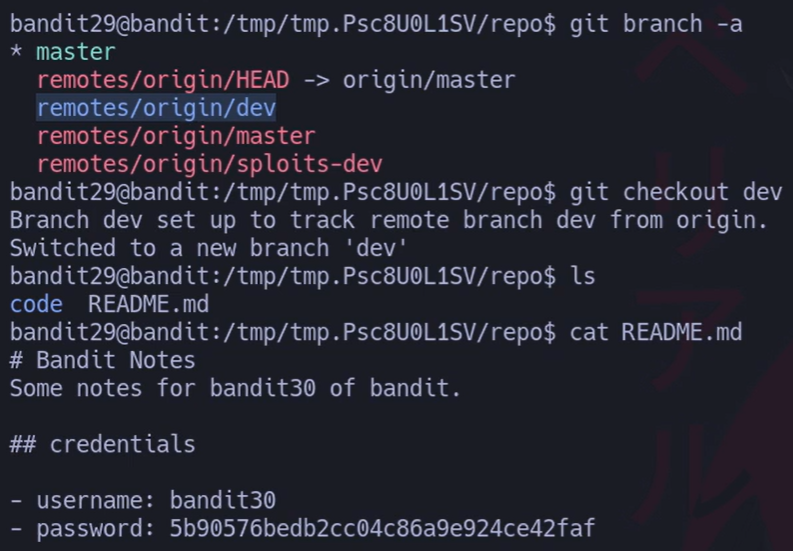



## 🔎 Objetivo del nivel

Clonar un repositorio Git remoto en `localhost`, investigar su historial y ramas para encontrar la **contraseña del usuario bandit30**.

---

## 🪜 Paso a paso (con consola real)

### Paso 1 — Crear un directorio temporal seguro

# {Comando}

## `bandit29@bandit:~$ mktemp -d`

# {Salida}

## `/tmp/tmp.Psc8U0L1SV`

## {Desglose del comando}

- **Binario:** `mktemp`
    
- **Opciones:** `-d` → crea un **directorio** temporal seguro.
    
- **Parámetros / rutas:** (vacío) → el sistema genera el nombre único bajo `/tmp`.
    

## 💬{Comentario del profe}  

Usa `/tmp` para trabajar limpio y con permisos de escritura; así no ensucias tu `$HOME`.

---

### Paso 2 — Entrar en el directorio temporal

# {Comando}

## `bandit29@bandit:~$ cd /tmp/tmp.Psc8U0L1SV`

\Tag{Desglose del comando}

- **Binario:** `cd`
    
- **Opciones:** —
    
- **Parámetros / rutas:** `/tmp/tmp.Psc8U0L1SV` → carpeta recién creada.
    

## 💬{Comentario del profe}  

Moverte al “taller” temporal evita choques con permisos restringidos.

---

### Paso 3 — Clonar el repositorio Git por SSH

# {Comando}

##### `bandit29@bandit:/tmp/tmp.Psc8U0L1SV$ git clone ssh://bandit29-git@localhost/home/bandit29-git/repo`

## {Desglose del comando}

- **Binario:** `git`
    
- **Subcomando:** `clone` → clona un repo existente.
    
- **Parámetros:** `ssh://bandit29-git@localhost/home/bandit29-git/repo`
    
    - Protocolo `ssh://`
        
    - Usuario `bandit29-git` (misma contraseña que **bandit29**)
        
    - Host `localhost`
        
    - Ruta `/home/bandit29-git/repo`
        

## 💬{Comentario del profe} 

Si te pregunta por la “host key”, responde `yes` la **primera** vez: añade la clave a `~/.ssh/known_hosts`.

---

### Paso 4 — Revisar el contenido inicial

# 

# {Comando}

## `bandit29@bandit:/tmp/tmp.Psc8U0L1SV$ cd repo && ls && cat README.md`

# {Salida}

`README.md # Bandit Notes Some notes for bandit30 of bandit.  ## credentials - username: bandit30 - password: <no passwords in production!>
`
## {Desglose del comando}

- **Binarios:** `cd`, `ls`, `cat`
    
- **Objetivo:** ver ficheros y el README.
    
- **Hallazgo:** usuario correcto, pero la **contraseña** no aparece en `master`.
    

## 💬{Comentario del profe}  

Cuando el README no lo dice todo, el “tesoro” suele estar en **commits** o **ramas**.

---

### Paso 5 — Mirar el histortorial git log

# {Comando}

## `bandit29@bandit:/tmp/tmp.Psc8U0L1SV/repo$ git log`

# {Salida}

## `208f463 fix username 18a6fd6 initial commit of README.md`

## {Desglose del comando}

- **Binario:** `git`
    
- **Subcomando:** `log`
    
- **Opciones:** `--oneline` → vista compacta (hash corto + mensaje).
    

## 💬{Comentario del profe}  

“fix username” sugiere cambios en credenciales; vamos a inspeccionarlo.

---

### Paso 6 — Ver el commit sospechoso

# {Comando}

##### `bandit29@bandit:/tmp/tmp.Psc8U0L1SV/repo$ git show 208f463b5b3992906eabf23c562eda3277fea912`

Hacemos lo mismo con la otra opcion y no aparece nada
# {Salida}

`commit 208f463... (fix username) diff --git a/README.md b/README.md - username: bandit29 + username: bandit30`

## {Desglose del comando}

- **Subcomando:** `show`
    
- **Parámetros:** `<hash>` → objeto a mostrar (commit).
    

## 💬{Comentario del profe}  

Confirma el **usuario**, pero no aparece la clave; toca revisar **ramas**.

---

### Paso 7 — Listar ramas locales y remotas git branch 

# {Comando}

## `bandit29@bandit:/tmp/tmp.Psc8U0L1SV/repo$ git branch -a`

# {Salida}

`* master   remotes/origin/HEAD -> origin/master   remotes/origin/dev   remotes/origin/master   remotes/origin/sploits-dev`

## {Desglose del comando}

- **Subcomando:** `branch`
    
- **Opciones:** `-a` → incluye **ramas remotas**.
    

## 💬{Comentario del profe} 

Las pistas suelen estar en **`origin/dev`** o ramas de trabajo. ¡Vamos allí!

---

### Paso 8 — Cambiar a la rama `dev` y leer el README

# {Comando}

`bandit29@bandit:/tmp/tmp.Psc8U0L1SV/repo$ git checkout dev && cat README.md`

# {Salida}

`Branch 'dev' set up to track remote branch 'dev' from 'origin'.
`Switched to a new branch 'dev'
`# Bandit Notes Some notes for bandit30 of bandit. 
`## credentials 
`- username: bandit30 
`- password: 5b90576bedb2cc04c86a9e924ce42faf`

## {Desglose del comando}

- **Subcomando:** `checkout` → moverse de rama.
    
- **Efecto:** cambia `HEAD` a `dev` y actualiza el working tree.
    
- **Prueba final:** el README en `dev` contiene la **contraseña**.
    

## 💬{Comentario del profe}  

💡 Truco: si tu Git es moderno, puedes usar `git switch dev` (más seguro para cambios de rama).

---

## 🧰 Todas las opciones del comando (mini-manual)

- **Uso básico (que usaste aquí):**
    
    - `git clone <URL>` → clonar un repo (SSH/HTTPS).
        
    - `git log --oneline` → historial compacto.
        
    - `git show <hash>` → detalles de un commit.
        
    - `git branch -a` → listar ramas locales y remotas.
        
    - `git checkout <rama>` / `git switch <rama>` → cambiar de rama.
        
- **Opciones clave (con ejemplo por opción):**
    
    - `git clone -b dev <URL>` → clonar y poner HEAD en `dev`.
        
    - `git log -p` → historial con parches (diffs).
        
    - `git log --graph --decorate --oneline` → vista “árbol” bonita.
        
    - `git show :README.md` → muestra versión indexada de un fichero.
        
    - `git diff master..dev` → diferencias entre ramas.
        
    - `git fetch --all` → trae todas las ramas remotas.
        
    - `git remote -v` → URLs de `origin`.
        
    - `git status` → estado del working tree.
        

_(Más opciones completas del comando `git` en la sección “Apuntes completos del comando git” más abajo.)_

---

## ❌ Errores comunes y soluciones

- **Permiso denegado (publickey)** → En Bandit se usa password: asegúrate de escribir la de **bandit29** para el usuario `bandit29-git`.
    
- **`host key verification failed`** → Acepta con `yes` la primera conexión o limpia entradas obsoletas en `~/.ssh/known_hosts`.
    
- **Clonando en `$HOME` sin permisos** → Usa `mktemp -d` en `/tmp`.
    
- **No ves cambios al cambiar de rama** → `git fetch --all` y luego `git checkout dev` (o `git switch dev`).
    
- **Hash abreviado no resuelve** → usa el hash **completo** en `git show <hash>`.
    

---

## 🧾 Chuleta final

|Comando|Propósito|Uso mínimo|
|---|---|---|
|`mktemp -d`|Carpeta temporal segura|`mktemp -d`|
|`git clone ssh://user@host/ruta`|Clonar por SSH|`git clone ssh://bandit29-git@localhost/home/bandit29-git/repo`|
|`git log --oneline`|Historial compacto|`git log --oneline`|
|`git show <hash>`|Ver cambios de un commit|`git show 208f463b5b39...`|
|`git branch -a`|Listar ramas (locales+remotas)|`git branch -a`|
|`git checkout dev` / `git switch dev`|Cambiar a rama `dev`|`git checkout dev`|
|`cat README.md`|Ver credenciales|`cat README.md`|

---

## 🧩 Script final completo

\Tag{Comando}

`#!/usr/bin/env bash set -euo pipefail # Bandit 29 -> 30: clona repo y extrae contraseña desde la rama 'dev'  main() {   tmpdir="$(mktemp -d)"                      # crea dir temporal seguro   echo "[+] Trabajo en: $tmpdir"   cd "$tmpdir"    # Clona el repo por SSH (pedirá la password de bandit29)   git clone ssh://bandit29-git@localhost/home/bandit29-git/repo   cd repo    git fetch --all                            # asegura todas las ramas remotas   git checkout dev                           # cambia a la rama 'dev'    echo "[+] Credenciales (README.md):"   grep -A1 '^## credentials' -n README.md || true    # Extraer solo la password:   pass="$(awk -F': ' '/password/ {print $2}' README.md)"   echo "[+] bandit30 password: $pass" }  main "$@"`

\Tag{Salida}

`[+] Trabajo en: /tmp/tmp.xxxxxx Cloning into 'repo'... ... Switched to a new branch 'dev' [+] Credenciales (README.md): 45-## credentials 46-- username: bandit30 47-- password: 5b90576bedb2cc04c86a9e924ce42faf [+] bandit30 password: 5b90576bedb2cc04c86a9e924ce42faf`

---

## 🗒️ Notas adicionales

- **Versión manual**: repetir los pasos 1→8 uno a uno.
    
- **Versión intermedia**: sustituir `git checkout dev` por `git switch dev` (Git ≥ 2.23).
    
- **Atajo**: `git clone -b dev <URL>` te coloca directamente en la rama `dev`.
    
- **Tip**: `git show <hash>:README.md` muestra el archivo tal como era en ese commit.
    

---

## 📚 Referencias

- `man git`, `man git-clone`, `man git-log`, `man git-show`, `man git-branch`, `man git-checkout`
    
- Pro Git (Chacon & Straub) — _capítulos 2 y 3_
    
- Documentación oficial: _Git SCM Reference_.
    

---

## ⚖️ Marco legal/ético

- No guardes credenciales reales en repos públicos.
    
- Usa estos conocimientos en entornos de **formación** (como Bandit) o con permiso explícito.
    
- Respeta **privacidad** y **Términos de Servicio** del servidor donde trabajes.
    

---

## 📘 Apuntes completos del comando `git` (NUEVA NORMA)

> **Listado de subcomandos más usados**, explicación clara, **ejemplo real** y **comentario**.

## 🔎 Subcomandos más usados

### 1. `git clone`

- **Qué hace:** copia un repositorio existente (SSH/HTTPS).
    
- **Uso:**
    
    `git clone [-b rama] <URL>`
    
- **Ejemplo:**
    
    `git clone -b dev ssh://user@host/path/repo`
    
- 💬 **Profe:** “`-b` te deja caer ya en la rama que quieres”.
    

---

### 2. `git log`

- **Qué hace:** historial de commits.
    
- **Opciones:** `--oneline`, `-p`, `--graph --decorate`
    
- **Ejemplo:**
    
    `git log --graph --decorate --oneline`
    
- 💬 **Profe:** con `--graph` ves el árbol de merges de un vistazo.
    

---

### 3. `git show`

- **Qué hace:** muestra un objeto (commit, etiqueta o archivo en un commit).
    
- **Ejemplo:**
    
    `git show <hash>:README.md`
    
- 💬 **Profe:** añade `:ruta` para ver el archivo en ese commit.
    

---

### 4. `git branch`

- **Qué hace:** lista, crea o borra ramas.
    
- **Opciones:** `-a` (todas), `-r` (remotas).
    
- **Ejemplo:**
    
    `git branch -a`
    
- 💬 **Profe:** mira siempre ramas remotas; esconden pistas.
    

---

### 5. `git checkout` / `git switch`

- **Qué hace:** moverse entre ramas o restaurar archivos.
    
- **Ejemplo:**
    
    `git switch dev`
    
- 💬 **Profe:** `switch` es más claro/seguro para ramas nuevas.
    

---

### 6. `git fetch`

- **Qué hace:** trae objetos/refs sin fusionar.
    
- **Ejemplo:**
    
    `git fetch --all`
    
- 💬 **Profe:** ideal antes de mirar ramas remotas.
    

---

### 7. `git pull`

- **Qué hace:** `fetch` + `merge` (o `rebase` según config).
    
- **Ejemplo:**
    
    `git pull --rebase`
    
- 💬 **Profe:** `--rebase` evita commits de “merge vacíos”.
    

---

### 8. `git diff`

- **Qué hace:** muestra diferencias.
    
- **Ejemplo:**
    
    `git diff master..dev`
    
- 💬 **Profe:** el doble punto compara puntas de ramas.
    

---

### 9. `git status`

- **Qué hace:** estado del working tree.
    
- **Ejemplo:**
    
    `git status`
    
- 💬 **Profe:** tu “radar” antes de commitear.
    

---

### 10. `git remote`

- **Qué hace:** gestiona orígenes (URLs).
    
- **Ejemplo:**
    
    `git remote -v`
    
- 💬 **Profe:** confirma dónde estás clonando/empujando.
    

---

### 11. `git tag`

- **Qué hace:** marca commits (versiones).
    
- **Ejemplo:**
    
    `git tag -a v1.0 -m "release"`
    
- 💬 **Profe:** útil para “puntos de oro”.
    

---

### 12. `git add`

- **Qué hace:** añade cambios al índice.
    
- **Ejemplo:**
    
    `git add README.md`
    
- 💬 **Profe:** piensa en “preparar” antes de commitear.
    

---

### 13. `git commit`

- **Qué hace:** guarda un snapshot en la historia.
    
- **Ejemplo:**
    
    `git commit -m "fix username"`
    
- 💬 **Profe:** mensajes claros = futuro feliz.
    

---

### 14. `git merge`

- **Qué hace:** combina ramas.
    
- **Ejemplo:**
    
    `git merge dev`
    
- 💬 **Profe:** resuelve conflictos con cabeza (y `git mergetool`).
    

---

### 15. `git rebase`

- **Qué hace:** reescribe base de una rama.
    
- **Ejemplo:**
    
    `git rebase main`
    
- 💬 **Profe:** limpio, pero ⚠️ no rebases ramas compartidas sin acordarlo.
    

---

### 16. `git stash`

- **Qué hace:** guarda cambios “en el bolsillo”.
    
- **Ejemplo:**
    
    `git stash push -m wip`
    
- 💬 **Profe:** pausa tu trabajo sin ensuciar commits.
    

---

### 17. `git restore` (Git moderno)

- **Qué hace:** restaura archivos del índice/HEAD.
    
- **Ejemplo:**
    
    `git restore README.md`
    
- 💬 **Profe:** más claro que `checkout` para archivos.
---

