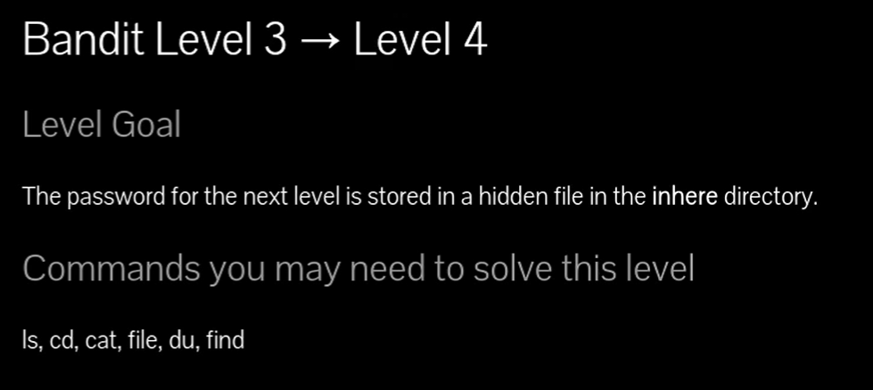
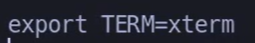
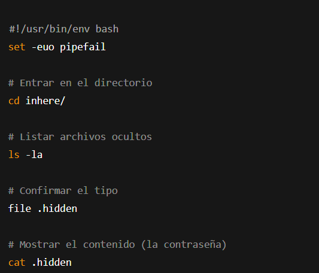

### LISTAR CONTENIDOS OCULTOS 

# Siempre poner al conectarse a una maquina por SSH : -export TERM=xterm

## 📄 Enunciado del nivel

La contraseña para el siguiente nivel está almacenada en un archivo **oculto** dentro del directorio `inhere`.

---

## 🔎 Objetivo del nivel

Aprender a **buscar y leer archivos ocultos** en Linux (los que comienzan con `.`).

---

## 🪜 Paso a paso (con consola real)

### 1. Ver el directorio disponible

\Tag{Comando}

`ls`

\Tag{Salida}

`inhere`

---

### 2. Entrar en el directorio

\Tag{Comando}

`cd inhere/`

---

### 3. Listar archivos normalmente

\Tag{Comando}

`ls`

\Tag{Salida}

`(nada aparece)`

💬 \Tag{Comentario del profe}  
Los archivos ocultos no se ven con `ls` normal.

---

### 4. Listar también ocultos (`-a`)

\Tag{Comando}

`ls -la`

\Tag{Salida}

`-rw-r----- 1 bandit4 bandit3 33 May  7  2020 .hidden`

💬 \Tag{Comentario del profe}  
El `-a` muestra los archivos que empiezan por `.`.

---

### 5. Ver qué tipo de archivo es

\Tag{Comando}

`file .hidden`

\Tag{Salida}

`.hidden: ASCII text`

💬 \Tag{Comentario del profe}  
Confirmamos que es un archivo de texto.

---

### 6. Leer el archivo oculto

\Tag{Comando}

`cat .hidden`

\Tag{Salida}

`pIwrPrtPN36QITSp3EQaw936yaFoFgAB`

💬 \Tag{Comentario del profe}  
¡Aquí está la contraseña para el siguiente nivel!

---

### 7. Forma alternativa con `find`

\Tag{Comando}

`find . -type f | grep "hidden" | xargs cat`

\Tag{Salida}

`pIwrPrtPN36QITSp3EQaw936yaFoFgAB`

💬 \Tag{Comentario del profe}  
`find` permite localizar ficheros incluso sin saber el nombre exacto.

---

## ❌ Errores comunes y soluciones

- ❌ Usar solo `ls` → no se ven los archivos ocultos.
    
- ❌ Buscar en el directorio equivocado (olvidar `cd inhere/`).
    
- ❌ Escribir mal `.hidden` (recuerda el punto).
    

---

## 🧾 Chuleta final

|Comando|Propósito|Uso mínimo|
|---|---|---|
|`ls -la`|Mostrar archivos ocultos|`ls -la`|
|`file archivo`|Ver tipo de archivo|`file .hidden`|
|`cat archivo`|Leer contenido de un archivo|`cat .hidden`|
|`find . -type f`|Buscar archivos en un directorio|`find . -type f`|

---

## 🧩 Script final completo

`#!/usr/bin/env bash set -euo pipefail  # Entrar en el directorio cd inhere/  # Listar archivos ocultos ls -la  # Confirmar el tipo file .hidden  # Mostrar el contenido (la contraseña) cat .hidden`

---

## 🗒️ Notas adicionales

✔️ **Versión manual**: `ls -la` + `cat .hidden`.  
✔️ **Versión intermedia**: comprobar antes con `file`.  
✔️ **Versión avanzada**: usar `find` + `xargs` para localizarlo automáticamente.
