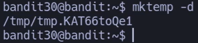

## 🔎 Objetivo del nivel

Clonar el repositorio de **bandit30-git** y localizar la contraseña del siguiente nivel (**bandit31**) investigando **tags de Git**.

---

## 🪜 Paso a paso (con consola real)

### Paso 1 — Crear directorio temporal

# {Comando}

## `bandit30@bandit:~$ mktemp -d`

## {Salida}

## `/tmp/tmp.KAT66toQe1`

## 💬 **Profe:** 

siempre trabaja en `/tmp` para no ensuciar tu home.

---

### Paso 2 — Entrar en el directorio

# {Comando}

## `bandit30@bandit:~$ cd /tmp/tmp.KAT66toQe1`

---

### Paso 3 — Clonar el repositorio

# {Comando}

`bandit30@bandit:/tmp/tmp.KAT66toQe1$ git clone ssh://bandit30-git@localhost/home/bandit30-git/repo`

## 💬 **Profe:** 

la clave de `bandit30-git` es la misma que la de `bandit30`.

---

### Paso 4 — Revisar el contenido

# {Comando}

## `bandit30@bandit:/tmp/tmp.KAT66toQe1$ cd repo && ls && cat README.md`

# {Salida}

## `README.md just an empty file... muahaha`

## 💬 **Profe:** 

cuando el README no da pistas → toca mirar commits, ramas o etiquetas.

---

### Paso 5 — Revisar historial

# {Comando}

## `bandit30@bandit:/tmp/tmp.KAT66toQe1/repo$ git log `

---

### Paso 6 — Ver ramas

# {Comando}

## `bandit30@bandit:/tmp/tmp.KAT66toQe1/repo$ git branch -a`

# {Salida}

## `* master   remotes/origin/HEAD -> origin/master   remotes/origin/master`

## 💬 **Profe:**

no hay ramas extra… pero sí puede haber **tags**.

---

### Paso 7 — Buscar etiquetas

# {Comando}

## `bandit30@bandit:/tmp/tmp.KAT66toQe1/repo$ git tag`

# {Salida}

## `secret`

---

### Paso 8 — Mostrar contenido del tag

# {Comando}

## `bandit30@bandit:/tmp/tmp.KAT66toQe1/repo$ git show secret`

# {Salida}

## `47e603bb428404d265f59c42920d81e5`

## 💬 **Profe:** 

ese string es la **contraseña para bandit31** ✅

---

## ❌ Errores comunes y soluciones

- **README vacío** → mira `git tag` o `git show-ref --tags`.
    
- **No aparece el tag** → usa `git fetch --tags`.
    
- **Problemas de clave/host key** → acepta fingerprint en la primera conexión.
    

---

## 🧾 Chuleta final

|Comando|Propósito|Uso mínimo|
|---|---|---|
|`git tag`|Listar etiquetas|`git tag`|
|`git show <tag>`|Ver contenido de un tag|`git show secret`|
|`git show-ref --tags`|Ver hashes de etiquetas|`git show-ref --tags`|

---

## 🧩 Script final completo

`#!/usr/bin/env bash set -euo pipefail # Bandit 30 -> 31: buscar contraseña en tags  main() {   tmpdir=$(mktemp -d)   cd "$tmpdir"   git clone ssh://bandit30-git@localhost/home/bandit30-git/repo   cd repo   git fetch --tags   git tag   git show secret } main "$@"`

---

## 🗒️ Notas adicionales

- `git show secret` funciona para tags ligeros y anotados.
    
- Para ver a qué commit apunta un tag:
    
    `git rev-list -n1 secret`
    
- Para traer solo tags sin actualizar ramas:
    
    `git fetch origin --tags`
    

---

## 📚 Referencias

- `man git-tag`, `man git-show`
    
- Pro Git — _Capítulo 2: Fundamentos_
    

---

## ⚖️ Marco legal/ético

- No uses tags para esconder información sensible en repos reales.
    
- Bandit es un entorno educativo seguro para practicar.
    

---

✅ **Contraseña para bandit31:**  

`47e603bb428404d265f59c42920d81e5`
