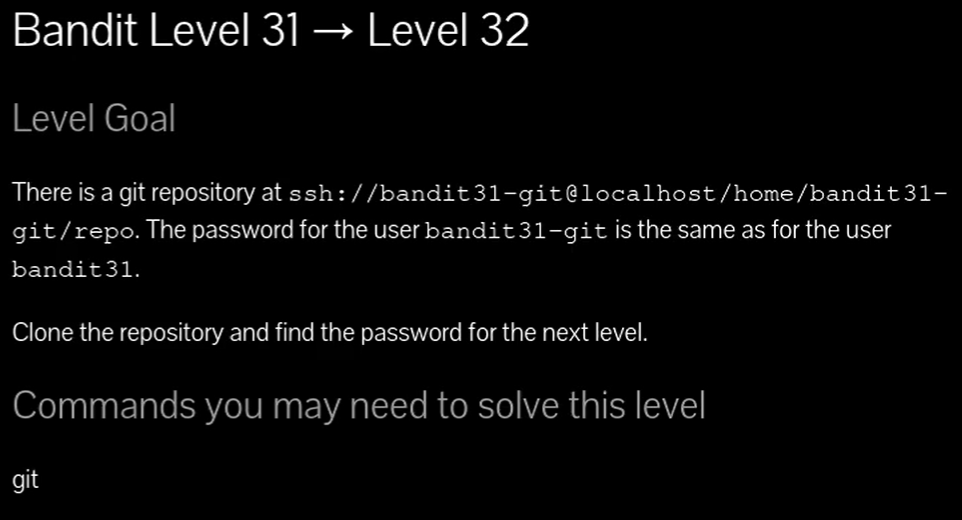

## 🔎 Objetivo del nivel

Clonar el repositorio de **bandit31-git**, seguir las instrucciones y enviar un archivo al repositorio remoto para obtener la contraseña del siguiente nivel (**bandit32**).

---

## 🪜 Paso a paso (con consola real)

### Paso 1 — Crear carpeta temporal

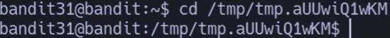
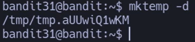
# {Comando}

## `bandit31@bandit:~$ mktemp -d`

# {Salida}

## `/tmp/tmp.aUUwiQ1wKM`

---

### Paso 2 — Clonar el repositorio

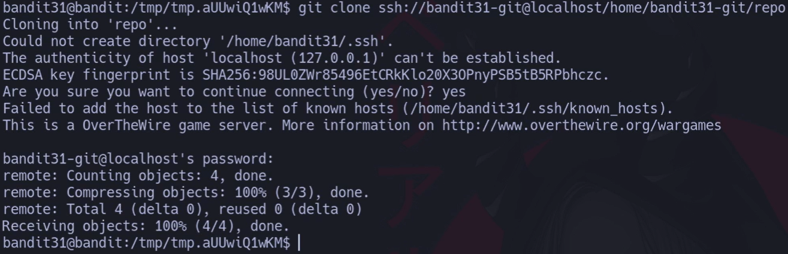

# {Comando}

`bandit31@bandit:/tmp/tmp.aUUwiQ1wKM$ git clone ssh://bandit31-git@localhost/home/bandit31-git/repo`

---

### Paso 3 — Leer instrucciones en README

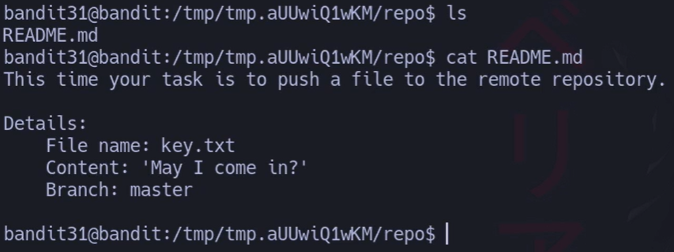
# {Comando}

`bandit31@bandit:/tmp/tmp.aUUwiQ1wKM/repo$ cat README.md`

# {Salida}

`This time your task is to push a file to the remote repository. 
`Details: 
`File name: key.txt   
`Content: 'May I come in?'   
`Branch: master`

## 💬 **Profe:**

El reto consiste en crear `key.txt` con ese contenido y hacer **push**.

---

### Paso 4 — Crear el archivo requerido

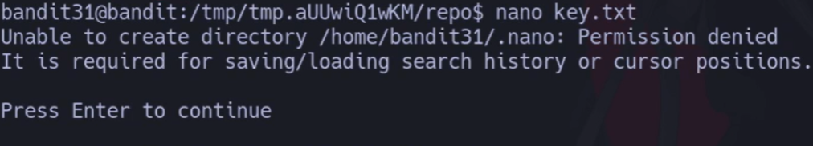
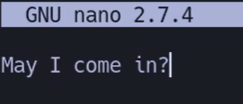

# {Comando}

## `bandit31@bandit:/tmp/tmp.aUUwiQ1wKM/repo$ nano key.txt`

# {Contenido} AÑADIR TU 

## `May I come in?`

---

### Paso 5 — Añadir y commitear el archivo

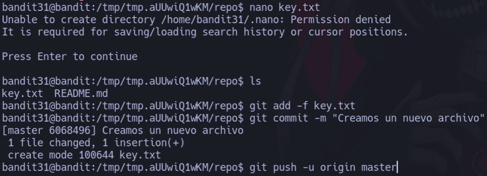
# {Comando}

`bandit31@bandit:/tmp/tmp.aUUwiQ1wKM/repo$ git add -f key.txt bandit31@bandit:/tmp/tmp.aUUwiQ1wKM/repo$ git commit -m "Creamos un nuevo archivo"`

# {Salida}

`[master 6068496] Creamos un nuevo archivo 
`1 file changed, 1 insertion(+)  
`create mode 100644 key.txt`

## 💬 **Profe:** 

Se usa `-f` en `git add` porque a veces el `.gitignore` bloquea archivos.

---

### Paso 6 — Hacer push al remoto

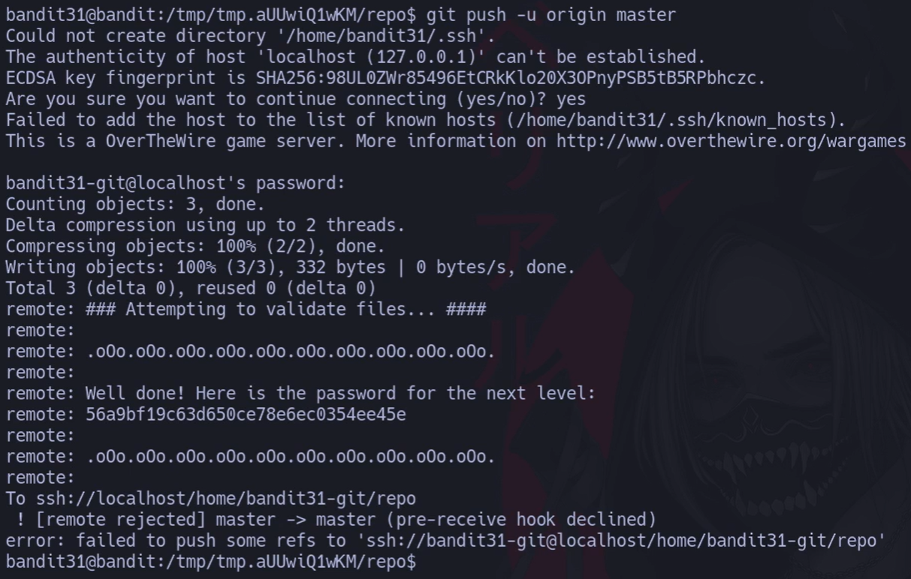
# {Comando}

## `bandit31@bandit:/tmp/tmp.aUUwiQ1wKM/repo$ git push -u origin master`

# {Salida}

La Captura

##  al crear esto se añadio un nuevo archivo en el git log mira 
 
 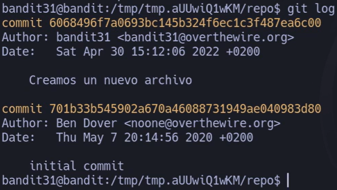
## 💬 **Profe:** 

La contraseña aparece al validar el push. 🎉

---

## ❌ Errores comunes y soluciones

- **Fichero ignorado por .gitignore** → usa `git add -f nombre`.
    
- **Push rechazado (pre-receive hook)** → asegúrate de usar `master` como pide el reto.
    
- **Commit sin cambios** → revisa el contenido de `key.txt`.
    

---

## 🧾 Chuleta final

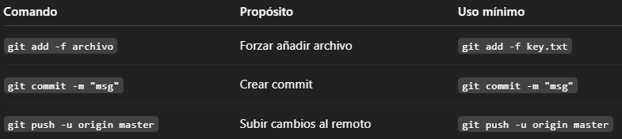

|Comando|Propósito|Uso mínimo|
|---|---|---|
|`git add -f archivo`|Forzar añadir archivo|`git add -f key.txt`|
|`git commit -m "msg"`|Crear commit|`git commit -m "msg"`|
|`git push -u origin master`|Subir cambios al remoto|`git push -u origin master`|

---

## 🧩 Script final completo

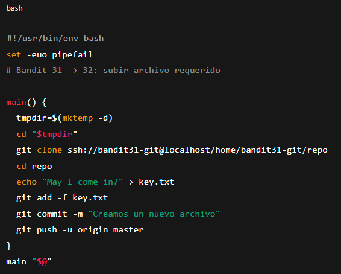

`#!/usr/bin/env bash set -euo pipefail # Bandit 31 -> 32: subir archivo requerido  main() {   tmpdir=$(mktemp -d)   cd "$tmpdir"   git clone ssh://bandit31-git@localhost/home/bandit31-git/repo   cd repo   echo "May I come in?" > key.txt   git add -f key.txt   git commit -m "Creamos un nuevo archivo"   git push -u origin master } main "$@"`

---

## 📚 Referencias

- `man git-push`, `man git-add`
    
- Pro Git — _Cap. 2 y 3_
    

---

## ⚖️ Marco legal/ético

- No fuerces archivos en repos reales a menos que tengas permiso.
    
- Este reto está diseñado para aprender **git push** y validaciones en servidor.
    

---

✅ **Contraseña para bandit32:**  
`56a9bf19c63d650ce78e6ec0354ee45e`
