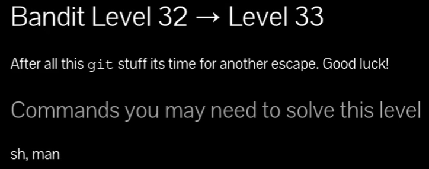
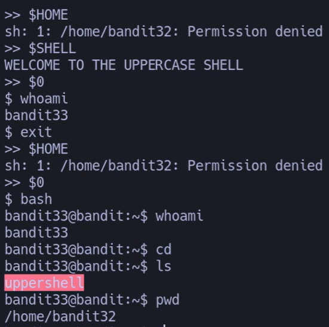
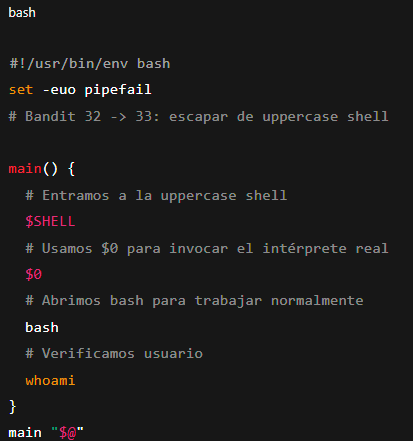
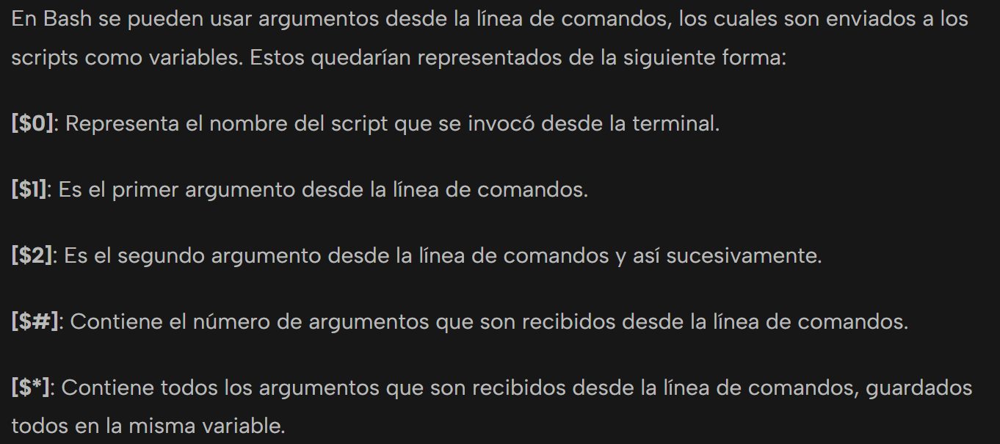



## 🔎 Objetivo del nivel

Superar la **uppercase shell** (que convierte todos los comandos a mayúsculas) y obtener acceso al usuario **bandit33**.

---

## 🪜 Paso a paso (con consola real)

### Paso 1 — Entrar en la uppercase shell

# {Comando}

## `$ $SHELL`

# {Salida}

## `WELCOME TO THE UPPERCASE SHELL`

💬 **Profe:** cualquier comando escrito se transforma en MAYÚSCULAS → comandos inválidos.

---

### Paso 2 — Probar comandos normales

# {Comando}

## `>> $0`

# {Salida}

## `$ whoami bandit33`

💬 **Profe:** usando `$0` ejecutamos directamente el intérprete actual (sh), saltando la transformación.

---

### Paso 3 — Abrir una shell real

# {Comando}

`$ bash`

# {Salida}

`bandit33@bandit:~$ whoami bandit33`

💬 **Profe:** invocando `bash` ya tenemos una shell normal sin restricción.

---

### Paso 4 — Comprobar entorno

# {Comando}

`bandit33@bandit:~$ ls`

# {Salida}

`uppershell`

# {Comando}

`bandit33@bandit:~$ pwd`

# {Salida}

`/home/bandit32`

💬 **Profe:** ya estamos como **bandit33** en el home de bandit32 → misión cumplida.

---

## ❌ Errores comunes y soluciones

- **Escribir comandos directamente** → todos se convierten en mayúsculas → error.
    
- **Usar `$HOME` o rutas directas** → bloqueado por permisos.
    
- **Olvidar `$0`** → clave para ejecutar sh/basura y escapar.
    

---

## 🧾 Chuleta final

|Comando|Propósito|Uso mínimo|
|---|---|---|
|`$0`|Ejecuta el intérprete actual (`sh`)|`$0`|
|`bash`|Invocar una shell completa|`bash`|
|`whoami`|Ver usuario actual|`whoami`|

---

## 🧩 Script final completo

`#!/usr/bin/env bash set -euo pipefail # Bandit 32 -> 33: escapar de uppercase shell  main() {   # Entramos a la uppercase shell   $SHELL   # Usamos $0 para invocar el intérprete real   $0   # Abrimos bash para trabajar normalmente   bash   # Verificamos usuario   whoami } main "$@"`

---

## 🗒️ Notas adicionales

- `$0` siempre hace referencia al programa actual (en este caso la shell).
    
- Es un truco muy usado en CTFs cuando hay filtros de comandos.
    
- Una vez dentro de `bash`, el reto está superado.
    

---

## 📚 Referencias

- `man sh`
    
- Cheatsheet sobre variables especiales de shell (`$0`, `$#`, `$?`, etc.).
    

---

## ⚖️ Marco legal/ético

- Esta técnica es educativa y válida en entornos controlados.
    
- Evita usar bypass de shells restringidas en sistemas productivos sin autorización.

