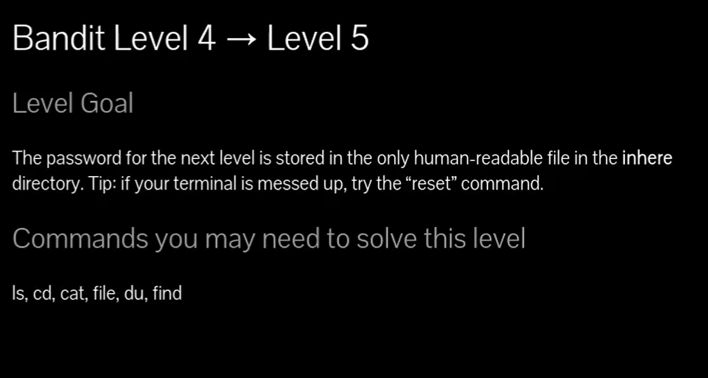
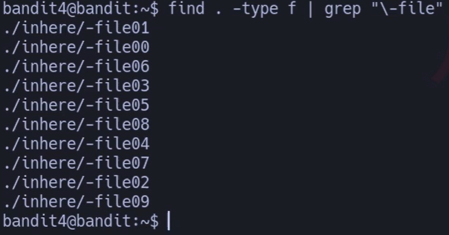
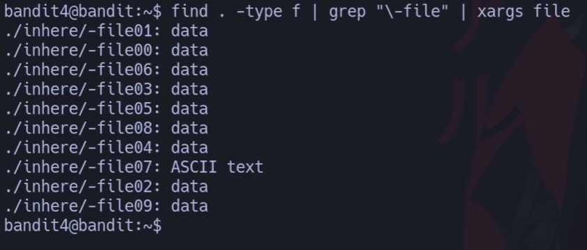
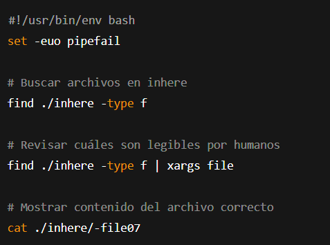



### BUSCAR ARCHIVOS LEGIBLES ENTERE UNOS CUANTOS CON FILE 

# Siempre poner al conectarse a una maquina por SSH : -export TERM=xterm

## 📄 Enunciado del nivel

La contraseña para el siguiente nivel está en el **único archivo legible por humanos** dentro del directorio `inhere`.  
👉 Pista: si tu terminal se estropea, usa el comando `reset`.

---

## 🔎 Objetivo del nivel

Identificar entre varios archivos cuál es de tipo **texto legible (ASCII)** y leer su contenido.

---

## 🪜 Paso a paso (con consola real)

### 1. Listar los archivos en `inhere`

# {Comando}

## `find . -type f | grep "\-file"`

## 💬 {Comentario del profe}  

Todos los archivos se llaman parecido: `-file0X`.

---

### 2. Revisar qué tipo de archivo es cada uno

# {Comando}

## `find . -type f | grep "\-file" | xargs file`

## 💬 {Comentario del profe}  

Solo **`-file07`** es texto ASCII. Ese debe contener la contraseña.

---

### 3. Leer el archivo correcto

# {Comando}

## `cat ./inhere/-file07`

# {Salida}

## `koReBOKuIDDepwhWk7jZC0RTdopnAYKh`

## 💬 {Comentario del profe}  

¡Contraseña encontrada!

---

## ❌ Errores comunes y soluciones

- ❌ Leer todos los archivos con `cat` → muchos tienen caracteres raros que ensucian la terminal.
    
- ❌ Usar mal `grep "-file"` (sin escapar `-`) → da error.
    
- ❌ No usar `file` → no sabrás cuál es legible.
    

---

## 🧾 Chuleta final

|Comando|Propósito|Uso mínimo|
|---|---|---|
|`find . -type f`|Buscar todos los archivos|`find . -type f`|
|`file archivo`|Ver el tipo de archivo|`file ./inhere/-file07`|
|`xargs`|Pasar lista de archivos a otro comando|`find . -type f|
|`cat archivo`|Leer el archivo de texto correcto|`cat ./inhere/-file07`|

---

## 🧩 Script final completo

`#!/usr/bin/env bash set -euo pipefail  # Buscar archivos en inhere find ./inhere -type f  # Revisar cuáles son legibles por humanos find ./inhere -type f | xargs file  # Mostrar contenido del archivo correcto cat ./inhere/-file07`

---

## 🗒️ Notas adicionales

✔️ **Versión manual**: Probar con `file` uno por uno.  
✔️ **Versión intermedia**: Usar `find` y luego `file` sobre todos.  
✔️ **Versión avanzada**: Filtrar automáticamente con `grep ASCII`.
