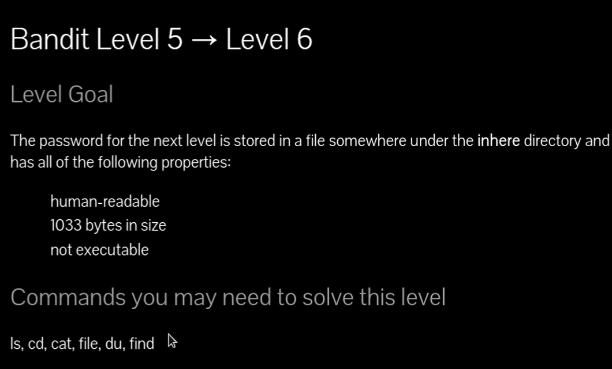
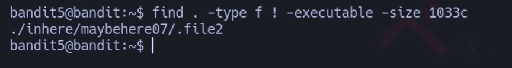
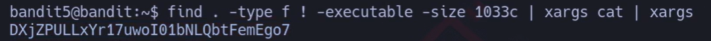
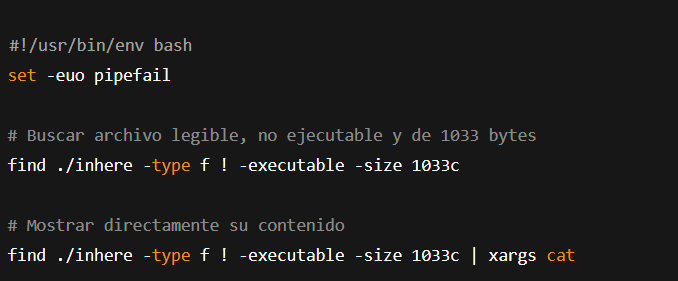



### Buscar con File pero con características de Bytes 

# Siempre poner al conectarse a una maquina por SSH :

## export TERM=xterm

## 📄 Enunciado del nivel

La contraseña para el siguiente nivel está almacenada en un archivo **dentro del directorio `inhere`** que cumple estas condiciones:

- ✅ Legible por humanos (texto ASCII).
    
- ✅ Tamaño exacto de **1033 bytes**.
    
- ✅ No es ejecutable.
    

---

## 🔎 Objetivo del nivel

Aprender a usar `find` con **condiciones múltiples** para localizar archivos por tamaño, permisos y tipo.

---

## 🪜 Paso a paso (con consola real)

### 1. Buscar archivos con las condiciones

# {Comando}

## `find . -type f ! -executable -size 1033c`

# {Salida}

## `./inhere/maybehere07/.file2`

## 💬{Comentario del profe}  

El `! -executable` descarta ejecutables. `-size 1033c` busca exactamente 1033 bytes.

---

### 2. Mostrar el contenido del archivo encontrado

# {Comando}

## `find . -type f ! -executable -size 1033c | xargs cat`

# {Salida}

## `DXjZPULLxYr17uwoI01bNLQbtFemEgo7`

## 💬{Comentario del profe}  

¡Aquí está la contraseña para el siguiente nivel!

---

## ❌ Errores comunes y soluciones

- ❌ Usar `-size 1033` sin `c` → busca bloques de 512 bytes, no bytes exactos.
    
- ❌ Olvidar el `! -executable` → puede listar binarios ilegibles.
    
- ❌ No usar `xargs cat` → solo muestra la ruta del archivo.
    

---

## 🧾 Chuleta final

|Comando|Propósito|Uso mínimo|
|---|---|---|
|`find . -type f`|Buscar todos los archivos|`find . -type f`|
|`find . -size 1033c`|Buscar archivos de tamaño exacto (1033 B)|`find . -size 1033c`|
|`find . ! -executable`|Filtrar archivos no ejecutables|`find . ! -executable`|
|`xargs cat`|Leer automáticamente el archivo encontrado|`find ...|

---

## 🧩 Script final completo

`#!/usr/bin/env bash set -euo pipefail  
`# Buscar archivo legible, no ejecutable y de 1033 bytes find ./inhere -type f ! -executable -size 1033c 
`# Mostrar directamente su contenido find ./inhere -type f ! -executable -size 1033c | xargs cat`

---

## 🗒️ Notas adicionales

✔️ **Versión manual**: probar `ls -lh` y `file` en cada archivo.  
✔️ **Versión intermedia**: usar `find` con solo `-size`.  
✔️ **Versión avanzada**: encadenar filtros con `find` y leer de golpe con `xargs`.

