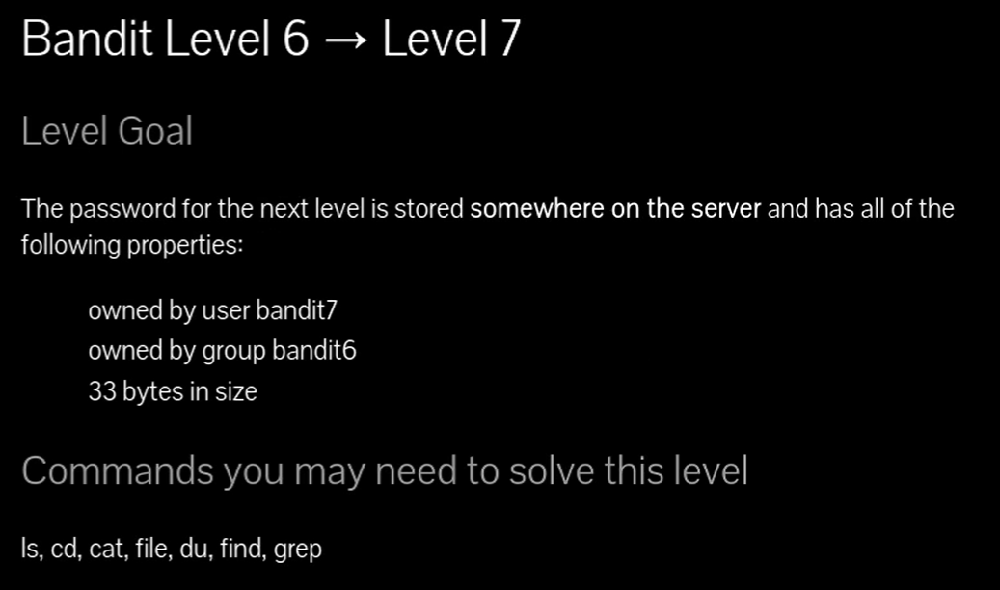
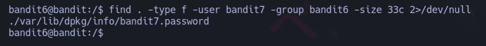
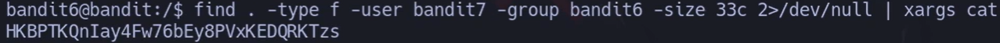
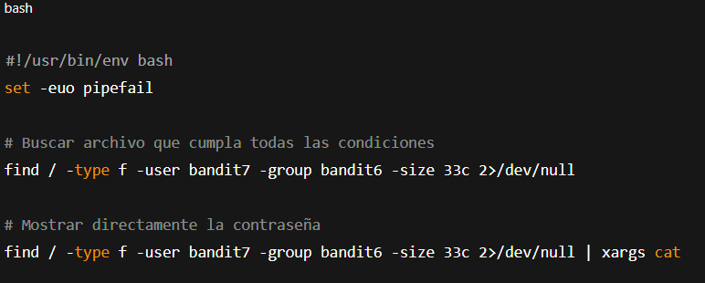

### Buscar con find si uno es propietario y otro esta en grupos 

# Siempre poner al conectarse a una maquina por SSH : -export TERM=xterm

## 📄 Enunciado del nivel

La contraseña para el siguiente nivel está almacenada **en algún lugar del servidor** en un archivo que cumple estas condiciones:

- ✅ Perteneciente al usuario **bandit7**
    
- ✅ Perteneciente al grupo **bandit6**
    
- ✅ De tamaño exacto **33 bytes**
    

---

## 🔎 Objetivo del nivel

Practicar el uso avanzado de `find` para filtrar archivos por:

- Usuario propietario (`-user`)
    
- Grupo propietario (`-group`)
    
- Tamaño exacto (`-size`)
    

---

## 🪜 Paso a paso (con consola real)

### 1. Buscar por tamaño (33 bytes)

# {Comando}

## `find . -type f -size 33c 2>/dev/null`

# {Salida}

## `./home/bandit4/inhere/-file01 ...`

## 💬{Comentario del profe}  

Ya localizamos archivos con ese tamaño, pero aún no sabemos si cumplen las otras condiciones.

---

### 2. Buscar también por usuario y grupo

# {Comando}

## `find . -type f -user bandit7 -group bandit6 -size 33c 2>/dev/null`

# {Salida}

## `./var/lib/dpkg/info/bandit7.password`

## 💬{Comentario del profe}  

Ahora filtramos solo los archivos que cumplen **todas** las condiciones.

---

### 3. Mostrar el contenido del archivo

# {Comando}

## `find . -type f -user bandit7 -group bandit6 -size 33c 2>/dev/null | xargs cat`

# {Salida}

## `HKBPTKQnIay4Fw76bEy8PVxKEDQRKTzs`

## 💬{Comentario del profe}  

¡Ahí está la contraseña para el siguiente nivel! 🎉

---

## ❌ Errores comunes y soluciones

- ❌ No redirigir errores con `2>/dev/null` → verás cientos de mensajes de “Permiso denegado”.
    
- ❌ Usar mal `-size 33` → por defecto son bloques de 512 bytes, no bytes. Se debe usar `33c`.
    
- ❌ Olvidar añadir `-user` y `-group` → aparecerán archivos de otros usuarios que no son válidos.
    

---

## 🧾 Chuleta final

|Comando|Propósito|Uso mínimo|
|---|---|---|
|`find . -type f -size 33c`|Buscar archivos de 33 bytes|`find . -size 33c`|
|`find . -user bandit7`|Buscar archivos de un usuario específico|`find . -user bandit7`|
|`find . -group bandit6`|Buscar archivos de un grupo específico|`find . -group bandit6`|
|`find ... 2>/dev/null`|Ocultar errores de permisos|`find . 2>/dev/null`|
|`xargs cat`|Mostrar contenido del archivo encontrado|`...|

---

## 🧩 Script final completo

`#!/usr/bin/env bash set -euo pipefail  
`# Buscar archivo que cumpla todas las condiciones find / -type f -user bandit7 -group bandit6 -size 33c 2>/dev/null  
`# Mostrar directamente la contraseña find / -type f -user bandit7 -group bandit6 -size 33c 2>/dev/null | xargs cat`

---

## 🗒️ Notas adicionales

✔️ **Versión manual**: primero buscar por tamaño, luego inspeccionar con `ls -l`.  
✔️ **Versión intermedia**: usar `find` con `-user` o `-group`.  
✔️ **Versión avanzada**: encadenar todas las condiciones y redirigir errores.

