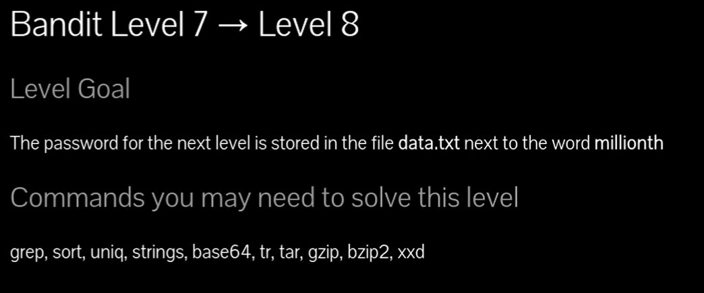
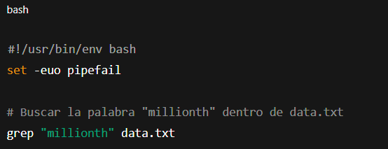

### Usos del grep buscar archivos filtrando por un nombre 

# Siempre poner al conectarse a una maquina por SSH : -export TERM=xterm

## 📄 Enunciado del nivel

La contraseña para el siguiente nivel está almacenada en el archivo **data.txt**, justo al lado de la palabra **millionth**.

---

## 🔎 Objetivo del nivel

Aprender a usar `grep` para buscar una palabra clave dentro de un archivo y extraer la línea correspondiente.

---

## 🪜 Paso a paso (con consola real)

### 1. Ver el archivo con `cat` y buscar con `grep`

# {Comando}

## `cat data.txt | grep "millionth"`

# {Salida}

## `millionth    cvX2JJa4CFALtqS87jk27qwqGhBM9plV`

## 💬{Comentario del profe}  

`grep` busca la palabra en cada línea. La contraseña está justo al lado de “millionth”.

---

### 2. Forma más directa con `grep`

# {Comando}

## `grep "millionth" data.txt`

# {Salida}

## `millionth    cvX2JJa4CFALtqS87jk27qwqGhBM9plV`

## 💬{Comentario del profe} 

Esto es más corto y hace lo mismo: abrir el archivo y filtrar por la palabra clave.

---

## ❌ Errores comunes y soluciones

- ❌ Usar `cat data.txt` sin `grep` → tendrás que revisar millones de líneas manualmente.
    
- ❌ Escribir mal la palabra clave (“milionth” en lugar de “millionth”).
    
- ❌ Usar `grep` sin comillas → puede dar problemas si la palabra tiene caracteres especiales.
    

---

## 🧾 Chuleta final

|Comando|Propósito|Uso mínimo|
|---|---|---|
|`grep "palabra" archivo`|Buscar líneas que contengan algo|`grep "millionth" data.txt`|
|`cat archivo|grep "palabra"`|Alternativa con tubería|

---

## 🧩 Script final completo

`#!/usr/bin/env bash set -euo pipefail
`# Buscar la palabra "millionth" dentro de data.txt grep "millionth" data.txt`

---

## 🗒️ Notas adicionales

✔️ **Versión manual**: abrir `data.txt` y revisar línea por línea (impráctico).  
✔️ **Versión intermedia**: `cat data.txt | grep "millionth"`.  
✔️ **Versión avanzada**: directamente `grep "millionth" data.txt`.

