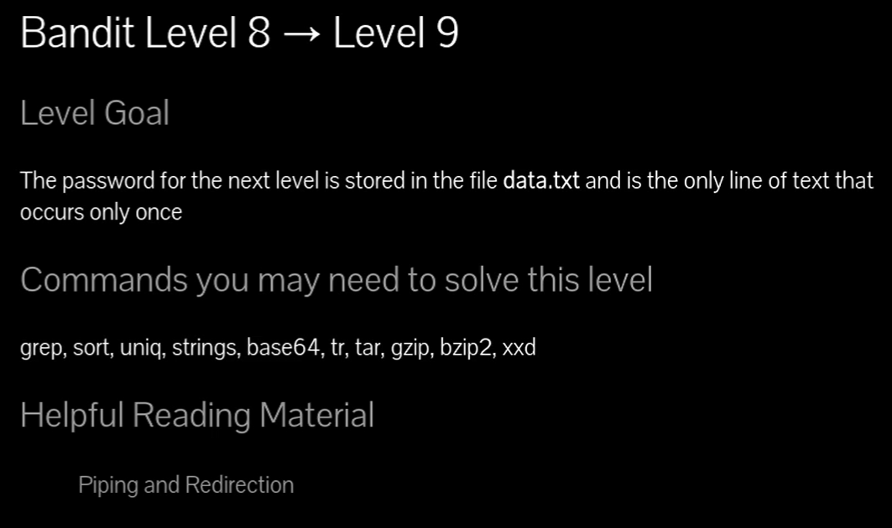
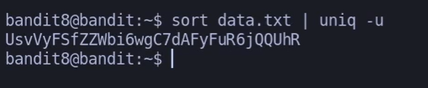
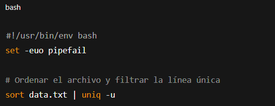

### Dentro de un .txt hay muchas líneas pero tu quieres buscar una en concreto que en esta caso solo se repite una vez, utilizando : sort ( ordenar alfabéticamente ) / uniq ( -u ) líneas únicas.

# Siempre poner al conectarse a una maquina por SSH : -export TERM=xterm

## 📄 Enunciado del nivel

La contraseña para el siguiente nivel está en el archivo **data.txt** y es la única línea que aparece **una sola vez**.

---

## 🔎 Objetivo del nivel

Aprender a combinar los comandos `sort` y `uniq` para identificar una línea única en un archivo con muchos duplicados.

---

## 🪜 Paso a paso (con consola real)

### 1. Ordenar el archivo

# {Comando}

## `sort data.txt` para ordenar alfabéticamente 

## 💬{Comentario del profe}  

## `uniq` solo funciona sobre líneas consecutivas. Por eso primero hay que ordenar.

---

### 2. Filtrar la línea que aparece solo una vez

# {Comando}

## `sort data.txt | uniq -u`

# {Salida}

## `UsvVyFSfZZWbi6wgC7dAFyFuR6jQQUhR`

## 💬{Comentario del profe}  

El parámetro `-u` de `uniq` muestra solo las líneas que no están repetidas. Aquí está la contraseña.

---

## ❌ Errores comunes y soluciones

- ❌ Usar `uniq -u data.txt` sin `sort` → no funciona porque los duplicados no están juntos.
    
- ❌ Confundir `uniq -u` (únicos) con `uniq -d` (solo duplicados).
    
- ❌ Olvidar redirigir con tubería `|` →  se conecta la salida de `sort` con `uniq`.
    

---

## 🧾 Chuleta final

|Comando|Propósito|Uso mínimo|
|---|---|---|
|`sort archivo`|Ordenar líneas del archivo|`sort data.txt`|
|`uniq -u`|Mostrar solo las líneas únicas|`uniq -u`|
|`sort archivo|uniq -u`|Combinar ordenado + filtrado único|

---

## 🧩 Script final completo

`#!/usr/bin/env bash set -euo pipefail 
`# Ordenar el archivo y filtrar la línea única sort data.txt | uniq -u`

---

## 🗒️ Notas adicionales

✔️ **Versión manual**: revisar `data.txt` a mano → impráctico.  
✔️ **Versión intermedia**: usar solo `uniq -u` (falla si no está ordenado).  
✔️ **Versión correcta**: `sort data.txt | uniq -u`.

