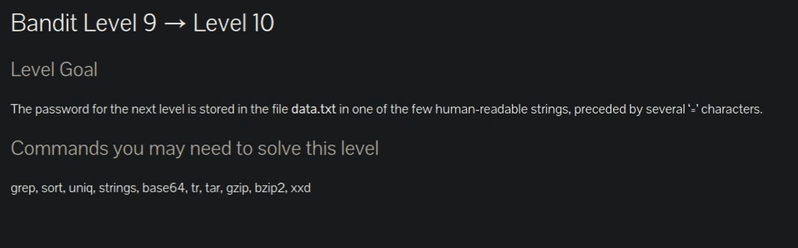
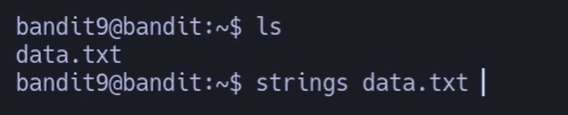
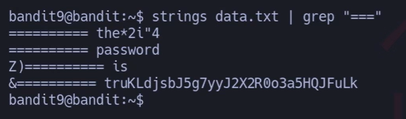
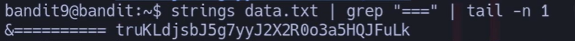
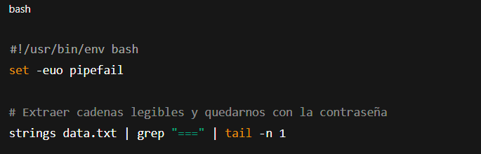



# Siempre poner al conectarse a una maquina por SSH : -export TERM=xterm

## 📄 Enunciado del nivel

La contraseña para el siguiente nivel está almacenada en el archivo **data.txt**, dentro de una de las pocas cadenas legibles para humanos, precedida por varios caracteres `"="`.

---

## 🔎 Objetivo del nivel

Aprender a usar `strings` para extraer texto legible de un archivo binario y filtrar con `grep` las cadenas que nos interesan.

---

## 🪜 Paso a paso (con consola real)

### 1. Listar los archivos disponibles

# {Comando}

## `ls`

# {Salida}

## `data.txt`

## 💬{Comentario del profe}  

Confirmamos que el archivo **data.txt** está en el directorio.

---

### 2. Extraer cadenas legibles con `strings`

# {Comando}

## `strings data.txt`

## 💬{Comentario del profe}  

`strings` muestra solo texto imprimible dentro de un binario.

---

### 3. Filtrar las cadenas con `"="`

# {Comando}

## `strings data.txt | grep "==="`

# {Salida}

## `========== the*2i"4
## `========== password
## `Z)========== is
## `&========== truKLdjsbJ5g7yyJ2X2R0o3a5HQJFuLk`

## 💬{Comentario del profe}  

Ya vemos la pista: `"password is ..."`. La última cadena es la contraseña real.

---

### 4. Extraer solo la contraseña

# {Comando} filtrando tail -n1 la primera fila empezando por abajo 

## `strings data.txt | grep "===" | tail -n 1`

# {Salida}

## `&========== truKLdjsbJ5g7yyJ2X2R0o3a5HQJFuLk`

## 💬{Comentario del profe}  

Con `tail -n 1` nos quedamos solo con la última línea, que contiene la contraseña.

---

## ❌ Errores comunes y soluciones

- ❌ Leer `data.txt` con `cat` → solo muestra basura binaria.
    
- ❌ Usar `grep "password"` directamente → puede mostrar varias pistas irrelevantes.
    
- ❌ No usar `tail` o `head` → salen demasiadas cadenas y no se distingue bien la contraseña.
    

---

## 🧾 Chuleta final

|Comando|Propósito|Uso mínimo|
|---|---|---|
|`strings archivo`|Extraer texto legible de un binario|`strings data.txt`|
|`grep "==="`|Filtrar las cadenas con el patrón|`strings data.txt \| grep "==="`|
|`tail -n 1`|Quedarse con la última coincidencia|`... \| tail -n 1`|

---

## 🧩 Script final completo

`#!/usr/bin/env bash set -euo pipefail 
`# Extraer cadenas legibles y quedarnos con la contraseña strings data.txt | grep "===" | tail -n 1`

---

## 🗒️ Notas adicionales

✔️ **Versión manual**: usar solo `strings data.txt` y buscar a ojo.  
✔️ **Versión intermedia**: `strings data.txt | grep "==="`.  
✔️ **Versión avanzada**: añadir `tail -n 1` para quedarnos directamente con la contraseña.

